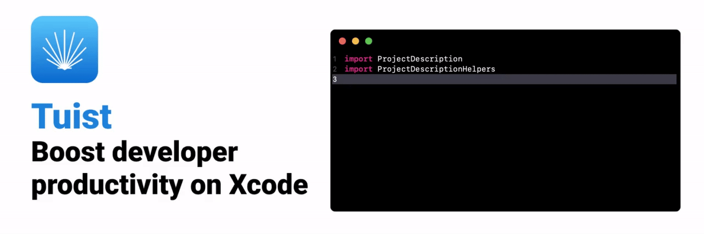
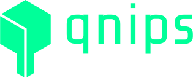

<div align="center">
  <br>
  
  
  
  
  <a href="http://twitter.com/tuistio"></a>
  <a href="https://join.slack.com/t/tuistapp/shared_invite/zt-1lqw355mp-zElRwLeoZ2EQsgGEkyaFgg"></a>
  
  
  
  
</div>

## What's Tuist 🕺

Tuist is a command line tool that helps you **generate**, **maintain** and **interact** with Xcode projects.

It's open source and written in Swift.

## Install ⬇️

### Running script (Recommended)

```shell
curl -Ls https://install.tuist.io | bash
```

## Bootstrap your first project 🌀

```bash
tuist init --platform ios
tuist generate # Generates Xcode project & workspace
tuist build # Builds your project
```

[Check out](https://docs.tuist.io) the project "Get Started" guide to learn more about Tuist and all its features.

## Sample projects 🔬

You can find some sample projects in the [fixtures folder](projects/tuist/fixtures) or the [awesome Tuist repo](https://github.com/tuist/awesome-tuist)! 🎉

## Want to contribute?

You can use our [contribution docs](https://docs.tuist.io/contributors/get-started) to get started. If you don't have a specific issue in mind, we are more than happy to help you, just ask for help in a given issue or on our [Slack](https://join.slack.com/t/tuistapp/shared_invite/zt-1lqw355mp-zElRwLeoZ2EQsgGEkyaFgg). You can find good issues for first-time contributors [here](https://github.com/tuist/tuist/issues?q=is%3Aissue+is%3Aopen+label%3A%22good+first+issue%22). We also offer [issue bounties](https://github.com/tuist/tuist/discussions/4982) for some highly-valued issues.

## Sponsors

The financial sustainability of the project is possible thanks to the ongoing contributions from our [GitHub Sponsors](https://github.com/sponsors/tuist) and [Open Collective Backers](https://opencollective.com/tuistapp). From them, we'd like to give a special mention to the following sponsors:

### Silver sponsor: [stream](https://getstream.io/chat/sdk/ios/?utm_source=github&utm_medium=github_repo_content_ad&utm_content=Developer&utm_campaign=Github_Nov2021_iOSChatSDK)

[Stream](https://getstream.io/chat/sdk/ios/?utm_source=Github&utm_medium=Github_Repo_Content_Ad&utm_content=Developer&utm_campaign=Github_Jan2022_SwiftSDK&utm_term=tuist) helps build scalable in-app chat or activity feeds in days. Product teams trust Stream to launch faster, iterate more often, and ship a better user experience.

<div >
  <a href="https://getstream.io/chat/sdk/ios/?utm_source=Github&utm_medium=Github_Repo_Content_Ad&utm_content=Developer&utm_campaign=Github_Jan2022_SwiftSDK&utm_term=tuist" target="_blank">
    <picture>
      <source 
      srcset="assets/companies/stream-white.png" 
      media="(prefers-color-scheme: dark)">
      
    </picture>
  </a>
</div>

### Bronze sponsor: [MacPaw](https://macpaw.com/)

<div>
  <a href="https://macpaw.com" target="_blank">
    <picture>
      
    </picture>
  </a>
</div>

### Bronze sponsor: [Asana](https://asana.com/)

<div>
  <a href="https://asana.com" target="_blank">
    <picture>
      
    </picture>
  </a>
</div>

## Companies using Tuist

<div align="center" style="background-color: white">
  <a href="https://play.tv2.no/" target="_blank">
    
  </a>
  <a href="https://www.depop.com/" target="_blank">
      
  </a>
  <a href="https://bendingspoons.com/" target="_blank">
    
  </a>
  <a href="https://globekeeper.com/" target="_blank">
    
  </a>
  <a href="https://getyourguide.com" target="_blank">
    
  </a>
  <a href="https://emplate.it/" target="_blank">
    
  </a>
  <a href="https://hh.ru/" target="_blank">
    
  </a>
  <a href="https://www.trendyol.com/" target="_blank">
    
  </a>
  <a href="https://angrynerds.co" target="_blank">
    
  </a>
  <a href="https://www.compass.com" target="_blank">
    
  </a>
  <a href="https://www.wefox.com" target="_blank">
    
  </a>
  <a href="https://www.hedvig.com" target="_blank">
    
  </a>
  <a href="https://www.takeoutcentral.com" target="_blank">
    
  </a>
  <a href="https://www.olx.com.br" target="_blank">
    
  </a>
  <a href="https://www.justeattakeaway.com/" target="_blank">
    
  </a>
  <a href="https://www.dodopizza.com/" target="_blank">
    
  </a>
    <a href="https://www.olimp.bet/" target="_blank">
    
  </a>
  <a href="https://vk.company/" target="_blank">
    
  </a>
  <a href="https://hd.kinopoisk.ru/" target="_blank">
    
  </a>
  <a href="https://qnips.io/" target="_blank">
    
  </a>
</div>

## Documentation 📝

Do you want to know more about what Tuist can offer you? Or perhaps want to contribute to the project and you need a starting point? You can check out the [project documentation](https://docs.tuist.io/tutorial/get-started/).

## Supported by great companies

1Password and Bugsnag support the project by giving us access to their service through an open-source program.

<div align="center">
  
  
</div>

## Contribute 👩‍💻

If you are interested in contributing to the project, our documentation has a section with resources for contributors. We recommend starting from [this page](https://docs.tuist.io/contributors/get-started).

## Core Team ✨

<table>
  <tr>
    <td align="center"><a href="https://github.com/pepibumur"><br /><sub><b>Pedro Piñera</b></sub></a><br /></td>
    <td align="center"><a href="https://github.com/fortmarek"><br /><sub><b>Marek Fořt</b></sub></a><br /></td>
    <td align="center"><a href="http://www.matrixprojects.net"><br /><sub><b>Kas</b></sub></a><br /></td>
    <td align="center"><a href="http://natanrolnik.me"><br /><sub><b>Natan Rolnik</b></sub></a><br /></td>
    <td align="center"><a href="https://github.com/andreacipriani"><br /><sub><b>Andrea Cipriani</b></sub></a><br /></td>
  </tr>
  <tr>
    <td align="center"><a href="https://github.com/ollieatkinson"><br /><sub><b>Oliver Atkinson</b></sub></a><br /></td>
    <td align="center"><a href="https://github.com/RomainBoulay"><br /><sub><b>Romain Boulay</b></sub></a><br /></td>
    <td align="center"><a href="https://github.com/laxmorek"><br /><sub><b>Kamil Harasimowicz</b></sub></a><br /></td>
    <td align="center"><a href="http://www.luispadron.com"><br /><sub><b>Luis Padron</b></sub></a></td>
    <td align="center"><a href="https://github.com/danyf90"><br /><sub><b>Daniele Formichelli</b></sub></a><br /></td>
  </tr>
  <tr>
    <td align="center"><a href="https://github.com/adellibovi"><br /><sub><b>Alfredo Delli Bovi</b></sub></a><br /></td>
  </tr>
</table>

## Contributors ✨

Thanks goes to these wonderful people:

<!-- ALL-CONTRIBUTORS-LIST:START - Do not remove or modify this section -->
<!-- prettier-ignore-start -->
<!-- markdownlint-disable -->
<table>
  <tbody>
    <tr>
      <td align="center" valign="top" width="14.28%"><a href="https://github.com/kalkwarf"><br /><sub><b>kalkwarf</b></sub></a></td>
      <td align="center" valign="top" width="14.28%"><a href="https://github.com/fortmarek"><br /><sub><b>Marek Fořt</b></sub></a></td>
      <td align="center" valign="top" width="14.28%"><a href="http://www.matrixprojects.net"><br /><sub><b>Kas</b></sub></a></td>
      <td align="center" valign="top" width="14.28%"><a href="http://natanrolnik.me"><br /><sub><b>Natan Rolnik</b></sub></a></td>
      <td align="center" valign="top" width="14.28%"><a href="https://github.com/svastven"><br /><sub><b>svastven</b></sub></a></td>
      <td align="center" valign="top" width="14.28%"><a href="http://bhuemer.github.io"><br /><sub><b>Bernhard Huemer</b></sub></a></td>
      <td align="center" valign="top" width="14.28%"><a href="https://djankowski.dev"><br /><sub><b>Daniel Jankowski</b></sub></a></td>
    </tr>
    <tr>
      <td align="center" valign="top" width="14.28%"><a href="https://github.com/facumenzella"><br /><sub><b>Facundo Menzella</b></sub></a></td>
      <td align="center" valign="top" width="14.28%"><a href="https://github.com/eito"><br /><sub><b>Eric Ito</b></sub></a></td>
      <td align="center" valign="top" width="14.28%"><a href="https://github.com/laxmorek"><br /><sub><b>Kamil Harasimowicz</b></sub></a></td>
      <td align="center" valign="top" width="14.28%"><a href="https://github.com/olejnjak"><br /><sub><b>Jakub Olejník</b></sub></a></td>
      <td align="center" valign="top" width="14.28%"><a href="https://github.com/lakpa"><br /><sub><b>ldindu</b></sub></a></td>
      <td align="center" valign="top" width="14.28%"><a href="https://github.com/gtsifrikas"><br /><sub><b>George Tsifrikas</b></sub></a></td>
      <td align="center" valign="top" width="14.28%"><a href="https://github.com/yurapriv"><br /><sub><b>Privezentsev Yura</b></sub></a></td>
    </tr>
    <tr>
      <td align="center" valign="top" width="14.28%"><a href="http://ferologics.github.io"><br /><sub><b>Fero</b></sub></a></td>
      <td align="center" valign="top" width="14.28%"><a href="https://heberti.com"><br /><sub><b>Heberti Almeida</b></sub></a></td>
      <td align="center" valign="top" width="14.28%"><a href="http://benscheirman.com"><br /><sub><b>Ben Scheirman</b></sub></a></td>
      <td align="center" valign="top" width="14.28%"><a href="https://jsorge.net"><br /><sub><b>Jared Sorge</b></sub></a></td>
      <td align="center" valign="top" width="14.28%"><a href="https://joeblau.com"><br /><sub><b>Joe Blau</b></sub></a></td>
      <td align="center" valign="top" width="14.28%"><a href="https://twitter.com/dchavezlive"><br /><sub><b>David Chavez</b></sub></a></td>
      <td align="center" valign="top" width="14.28%"><a href="https://www.linkedin.com/in/роман-подымов-72338ab0/"><br /><sub><b>Roman Podymov</b></sub></a></td>
    </tr>
    <tr>
      <td align="center" valign="top" width="14.28%"><a href="https://github.com/marcinreliga-fn"><br /><sub><b>Marcin Religa</b></sub></a></td>
      <td align="center" valign="top" width="14.28%"><a href="https://github.com/adellibovi"><br /><sub><b>Alfredo Delli Bovi</b></sub></a></td>
      <td align="center" valign="top" width="14.28%"><a href="https://github.com/Jake-Prickett"><br /><sub><b>Jake Prickett</b></sub></a></td>
      <td align="center" valign="top" width="14.28%"><a href="https://github.com/danyf90"><br /><sub><b>Daniele Formichelli</b></sub></a></td>
      <td align="center" valign="top" width="14.28%"><a href="https://www.facebook.com/PetrachkovSergey"><br /><sub><b>Sergey Petrachkov</b></sub></a></td>
      <td align="center" valign="top" width="14.28%"><a href="http://jinuman.github.io/resume"><br /><sub><b>Jinwoo, Kim</b></sub></a></td>
      <td align="center" valign="top" width="14.28%"><a href="https://github.com/thedavidharris"><br /><sub><b>David Harris</b></sub></a></td>
    </tr>
    <tr>
      <td align="center" valign="top" width="14.28%"><a href="https://github.com/DimaMishchenko"><br /><sub><b>Dmytro Mishchenko</b></sub></a></td>
      <td align="center" valign="top" width="14.28%"><a href="http://www.sampettersson.com"><br /><sub><b>Sam Pettersson</b></sub></a></td>
      <td align="center" valign="top" width="14.28%"><a href="http://www.joshholtz.com"><br /><sub><b>Josh Holtz</b></sub></a></td>
      <td align="center" valign="top" width="14.28%"><a href="http://jierong.dev"><br /><sub><b>Jierong Li</b></sub></a></td>
      <td align="center" valign="top" width="14.28%"><a href="https://twitter.com/freak4pc"><br /><sub><b>Shai Mishali</b></sub></a></td>
      <td align="center" valign="top" width="14.28%"><a href="https://twitter.com/FranzJBusch"><br /><sub><b>Franz Busch</b></sub></a></td>
      <td align="center" valign="top" width="14.28%"><a href="https://github.com/tiarnann"><br /><sub><b>Tíarnán McGrath</b></sub></a></td>
    </tr>
    <tr>
      <td align="center" valign="top" width="14.28%"><a href="https://github.com/softmaxsg"><br /><sub><b>Vitaly Chupryk</b></sub></a></td>
      <td align="center" valign="top" width="14.28%"><a href="https://github.com/rmnblm"><br /><sub><b>Roman Blum</b></sub></a></td>
      <td align="center" valign="top" width="14.28%"><a href="http://nanotek.me"><br /><sub><b>Giovanni Filaferro</b></sub></a></td>
      <td align="center" valign="top" width="14.28%"><a href="http://twitter.com/tovkal"><br /><sub><b>Andrés Pizá Bückmann</b></sub></a></td>
      <td align="center" valign="top" width="14.28%"><a href="http://coutinho.dev"><br /><sub><b>Gabriel Coutinho</b></sub></a></td>
      <td align="center" valign="top" width="14.28%"><a href="https://medium.com/@riccardocipolleschi"><br /><sub><b>Riccardo</b></sub></a></td>
      <td align="center" valign="top" width="14.28%"><a href="https://github.com/bolismauro"><br /><sub><b>Mauro Bolis</b></sub></a></td>
    </tr>
    <tr>
      <td align="center" valign="top" width="14.28%"><a href="https://twitter.com/iteractive_man"><br /><sub><b>Peter Weishapl</b></sub></a></td>
      <td align="center" valign="top" width="14.28%"><a href="http://stackoverflow.com/users/1878594/swiftycruz"><br /><sub><b>Cruz</b></sub></a></td>
      <td align="center" valign="top" width="14.28%"><a href="https://github.com/svenmuennich"><br /><sub><b>Sven Münnich</b></sub></a></td>
      <td align="center" valign="top" width="14.28%"><a href="https://github.com/santi-d"><br /><sub><b>Santiago A. Delgado</b></sub></a></td>
      <td align="center" valign="top" width="14.28%"><a href="https://wojciechkulik.pl"><br /><sub><b>Wojciech Kulik</b></sub></a></td>
      <td align="center" valign="top" width="14.28%"><a href="https://github.com/iainsmith"><br /><sub><b>Iain Smith</b></sub></a></td>
      <td align="center" valign="top" width="14.28%"><a href="https://github.com/havebeenfitz"><br /><sub><b>Max Kraev</b></sub></a></td>
    </tr>
    <tr>
      <td align="center" valign="top" width="14.28%"><a href="https://github.com/mstfy"><br /><sub><b>Mustafa Yusuf</b></sub></a></td>
      <td align="center" valign="top" width="14.28%"><a href="http://twitter.com/danielbarden"><br /><sub><b>Daniel Barden</b></sub></a></td>
      <td align="center" valign="top" width="14.28%"><a href="https://github.com/zzzkk"><br /><sub><b>Zofia Kulus</b></sub></a></td>
      <td align="center" valign="top" width="14.28%"><a href="http://randombits.org/"><br /><sub><b>David Peterson</b></sub></a></td>
      <td align="center" valign="top" width="14.28%"><a href="https://bandism.net/"><br /><sub><b>Ikko Ashimine</b></sub></a></td>
      <td align="center" valign="top" width="14.28%"><a href="https://github.com/setoelkahfi"><br /><sub><b>Seto Elkahfi / 塞托·埃尔卡菲</b></sub></a></td>
      <td align="center" valign="top" width="14.28%"><a href="https://apps4everyone.at"><br /><sub><b>apps4everyone</b></sub></a></td>
    </tr>
    <tr>
      <td align="center" valign="top" width="14.28%"><a href="https://github.com/LorDisturbia"><br /><sub><b>Lorenzo</b></sub></a></td>
      <td align="center" valign="top" width="14.28%"><a href="https://github.com/DarkoDamjanovic"><br /><sub><b>Darko Damjanovic</b></sub></a></td>
      <td align="center" valign="top" width="14.28%"><a href="https://twitter.com/MarvinNazari"><br /><sub><b>Marvin Nazari</b></sub></a></td>
      <td align="center" valign="top" width="14.28%"><a href="http://twitter.com/codeOfRobin"><br /><sub><b>Robin Malhotra</b></sub></a></td>
      <td align="center" valign="top" width="14.28%"><a href="https://github.com/astromonkee"><br /><sub><b>Astromonkee</b></sub></a></td>
      <td align="center" valign="top" width="14.28%"><a href="https://github.com/ezraberch"><br /><sub><b>ezraberch</b></sub></a></td>
      <td align="center" valign="top" width="14.28%"><a href="https://github.com/cconstable"><br /><sub><b>Christopher Constable</b></sub></a></td>
    </tr>
    <tr>
      <td align="center" valign="top" width="14.28%"><a href="https://github.com/neakor"><br /><sub><b>Yi Wang</b></sub></a></td>
      <td align="center" valign="top" width="14.28%"><a href="https://www.mustafadur.com"><br /><sub><b>Mustafa Dur</b></sub></a></td>
      <td align="center" valign="top" width="14.28%"><a href="https://github.com/lucabartoletti"><br /><sub><b>Luca Bartoletti</b></sub></a></td>
      <td align="center" valign="top" width="14.28%"><a href="https://github.com/sujata23"><br /><sub><b>Sujata Chakraborty</b></sub></a></td>
      <td align="center" valign="top" width="14.28%"><a href="http://www.viber.com"><br /><sub><b>Pavel Trafimuk</b></sub></a></td>
      <td align="center" valign="top" width="14.28%"><a href="https://alexsilva.dev/"><br /><sub><b>Alejandro Silva Fernández</b></sub></a></td>
      <td align="center" valign="top" width="14.28%"><a href="http://www.jakeadams.co"><br /><sub><b>Jake Adams</b></sub></a></td>
    </tr>
    <tr>
      <td align="center" valign="top" width="14.28%"><a href="https://github.com/wattson12"><br /><sub><b>Sam Watts</b></sub></a></td>
      <td align="center" valign="top" width="14.28%"><a href="http://erkekin.com"><br /><sub><b>Erk Ekin</b></sub></a></td>
      <td align="center" valign="top" width="14.28%"><a href="https://github.com/morozkin"><br /><sub><b>Denis Morozov</b></sub></a></td>
      <td align="center" valign="top" width="14.28%"><a href="https://github.com/orbitekk"><br /><sub><b>orbitekk</b></sub></a></td>
      <td align="center" valign="top" width="14.28%"><a href="https://blog.naver.com/wogus3602"><br /><sub><b>Park Jae Hyun</b></sub></a></td>
      <td align="center" valign="top" width="14.28%"><a href="https://github.com/regularberry"><br /><sub><b>Sean Berry</b></sub></a></td>
      <td align="center" valign="top" width="14.28%"><a href="http://hisaac.net"><br /><sub><b>Isaac Halvorson</b></sub></a></td>
    </tr>
    <tr>
      <td align="center" valign="top" width="14.28%"><a href="https://github.com/mohitsaxenaknoldus"><br /><sub><b>Mohit Saxena</b></sub></a></td>
      <td align="center" valign="top" width="14.28%"><a href="https://github.com/mikchmie"><br /><sub><b>Mikołaj Chmielewski</b></sub></a></td>
      <td align="center" valign="top" width="14.28%"><a href="https://github.com/takinwande"><br /><sub><b>Tope Akinwande</b></sub></a></td>
      <td align="center" valign="top" width="14.28%"><a href="https://www.theinkedengineer.com"><br /><sub><b>TheInkedEngineer</b></sub></a></td>
      <td align="center" valign="top" width="14.28%"><a href="http://alexanderweiss.dev"><br /><sub><b>Alexander Weiß</b></sub></a></td>
      <td align="center" valign="top" width="14.28%"><a href="https://github.com/kyungpyoda"><br /><sub><b>kyungpyoda</b></sub></a></td>
      <td align="center" valign="top" width="14.28%"><a href="http://www.villewitt.net"><br /><sub><b>Ville Witt</b></sub></a></td>
    </tr>
    <tr>
      <td align="center" valign="top" width="14.28%"><a href="https://github.com/paulsamuels"><br /><sub><b>paul.s</b></sub></a></td>
      <td align="center" valign="top" width="14.28%"><a href="https://github.com/aniltaskiran"><br /><sub><b>aniltaskiran</b></sub></a></td>
      <td align="center" valign="top" width="14.28%"><a href="https://github.com/unxavi"><br /><sub><b>Javier Vieira</b></sub></a></td>
      <td align="center" valign="top" width="14.28%"><a href="https://github.com/a-sarris"><br /><sub><b>Aris Sarris</b></sub></a></td>
      <td align="center" valign="top" width="14.28%"><a href="https://xxw9999.notion.site/xxw9999/iOS-8585a34b2886419586960c5c02b9d845"><br /><sub><b>kimxwan0319</b></sub></a></td>
      <td align="center" valign="top" width="14.28%"><a href="https://florian.codes"><br /><sub><b>Florian Fittschen</b></sub></a></td>
      <td align="center" valign="top" width="14.28%"><a href="https://github.com/jesus-mg-ios"><br /><sub><b>Jesus (iOS)</b></sub></a></td>
    </tr>
    <tr>
      <td align="center" valign="top" width="14.28%"><a href="https://github.com/nicholaskim94"><br /><sub><b>Nicholas Kim</b></sub></a></td>
      <td align="center" valign="top" width="14.28%"><a href="https://github.com/Smponias"><br /><sub><b>Alexandros Smponias</b></sub></a></td>
      <td align="center" valign="top" width="14.28%"><a href="https://github.com/mangofever"><br /><sub><b>Go</b></sub></a></td>
      <td align="center" valign="top" width="14.28%"><a href="https://github.com/AlbGarciam"><br /><sub><b>Alberto Garcia</b></sub></a></td>
      <td align="center" valign="top" width="14.28%"><a href="https://www.linkedin.com/in/andreascuderi/"><br /><sub><b>Andrea Scuderi</b></sub></a></td>
      <td align="center" valign="top" width="14.28%"><a href="http://dogoautilio.wordpress.com/"><br /><sub><b>Diogo Autilio</b></sub></a></td>
      <td align="center" valign="top" width="14.28%"><a href="https://github.com/shahzadmajeed"><br /><sub><b>Shahzad Majeed</b></sub></a></td>
    </tr>
    <tr>
      <td align="center" valign="top" width="14.28%"><a href="https://github.com/danrevah"><br /><sub><b>Dan</b></sub></a></td>
      <td align="center" valign="top" width="14.28%"><a href="https://github.com/nivanchikov"><br /><sub><b>Nikita Ivanchikov</b></sub></a></td>
      <td align="center" valign="top" width="14.28%"><a href="https://github.com/xoxo-anastasi-xoxo"><br /><sub><b>Anastasia Kazantseva</b></sub></a></td>
      <td align="center" valign="top" width="14.28%"><a href="https://twitter.com/MonocularVision"><br /><sub><b>Michael McGuire</b></sub></a></td>
      <td align="center" valign="top" width="14.28%"><a href="http://www.michaelfcollins3.me"><br /><sub><b>Michael Collins</b></sub></a></td>
      <td align="center" valign="top" width="14.28%"><a href="https://github.com/devyhan"><br /><sub><b>YoHan Cho</b></sub></a></td>
      <td align="center" valign="top" width="14.28%"><a href="https://github.com/euriasb"><br /><sub><b>euriasb</b></sub></a></td>
    </tr>
    <tr>
      <td align="center" valign="top" width="14.28%"><a href="https://github.com/MontakOleg"><br /><sub><b>MontakOleg</b></sub></a></td>
      <td align="center" valign="top" width="14.28%"><a href="https://github.com/waltflanagan"><br /><sub><b>Mike Simons</b></sub></a></td>
      <td align="center" valign="top" width="14.28%"><a href="https://github.com/oozoofrog"><br /><sub><b>oozoofrog</b></sub></a></td>
      <td align="center" valign="top" width="14.28%"><a href="https://github.com/MartinStrambach"><br /><sub><b>Martin Strambach</b></sub></a></td>
    </tr>
  </tbody>
</table>

<!-- markdownlint-restore -->
<!-- prettier-ignore-end -->

<!-- ALL-CONTRIBUTORS-LIST:END -->
