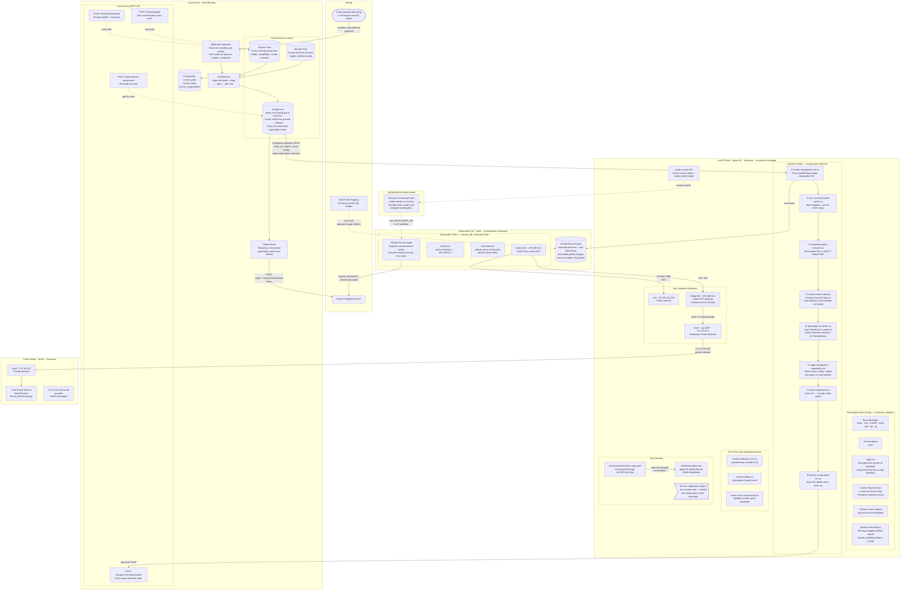

```mermaid
flowchart TB
    subgraph GitHub["GitHub"]
        Job(["CI job queued requesting<br/>a self-hosted macOS runner"])
        RegAPI["Runner Registration API"]
        OCI["GHCR OCI Registry<br/>Pre-built macOS VM images"]
    end

    subgraph Server["Tuist Server · Elixir/Phoenix"]
        Webhook["Webhook Controller<br/>Receives workflow_job events<br/>when jobs are queued, started, completed"]

        subgraph Runners["Tuist.Runners Context"]
            Pool[("Runner Pool<br/>Groups hosts by account,<br/>region, isolation mode")]
            HostRecord[("Runner Host<br/>Tracks each physical Mac:<br/>health, capabilities, Xcode versions")]
            Assignment[("Assignment<br/>Binds one GitHub job to one host.<br/>Tracks state from queued → cleanup.<br/>Owns the short-lived registration token.")]
        end

        Matcher["Job Matcher<br/>Maps job labels + repo<br/>→ pool → idle host"]
        TokenMint["Token Minter<br/>Requests a short-lived<br/>registration token from GitHub"]

        subgraph HostAPI["Host-Facing REST API"]
            APRegister["POST /hosts/register<br/>Mac authenticates, joins pool"]
            APHeartbeat["POST /hosts/:id/heartbeat<br/>Periodic health + inventory"]
            APNext["POST /hosts/:id/next-assignment<br/>Host polls for work"]
            APComplete["POST /assignments/:id/complete<br/>Host reports terminal state"]
        end

        DB[("PostgreSQL<br/>runner_pools<br/>runner_hosts<br/>runner_assignments")]
    end

    subgraph Host["macOS Host · Apple M1 · Scaleway · nix-darwin managed"]
        subgraph NixDarwin["Declarative Host Config — nix-darwin modules"]
            Pkgs["Base packages<br/>bash · curl · nushell · socat<br/>zstd · git · jq"]
            Brew["nix-homebrew<br/>aria2"]
            SOPS["sops-nix<br/>Decrypts host secrets at activation<br/>using SSH host key as age backend"]
            RelayDaemon["Cache relay daemon<br/>io.tuist.vm-cache-relay<br/>Persistent launchd service"]
            RunnerMod["GitHub runner module<br/>launchd service definition"]
            RunnerBin["github-runner-binary<br/>Nix pkg wrapping official tarball<br/>Avoids compiling Node.js locally"]
        end

        subgraph HostNet["Host Network Interfaces"]
            en0["en0 · 51.159.120.232<br/>Public internet"]
            vlan0["vlan0 · tag 1597 · 172.16.16.3<br/>Scaleway Private Network"]
            bridge100["bridge100 · 192.168.64.1<br/>vmnet NAT gateway<br/>Created on first VM boot"]
        end

        subgraph Orchestrator["Nushell Scripts — Assignment Lifecycle"]
            S1["① create-assignment-vm.nu<br/>Clone sealed base image → disposable VM"]
            S2["② run-vm-with-private-cache.nu<br/>Boot headless, wait for SSH ready"]
            S3["③ normalize-guest-network.nu<br/>Reset guest NIC to DHCP / default NAT"]
            S4["④ ensure-cache-relay.nu<br/>Kickstart launchd relay or<br/>start fallback socat if bridge isn't ready"]
            S5["⑤ bootstrap-vm-cache.nu<br/>Inject /etc/hosts in guest so<br/>cache hostname resolves to host gateway"]
            S6["⑥ stage-assignment-registration.nu<br/>Write runner config + token<br/>into guest at /var/run/tuist/"]
            S7["⑦ exec-assignment.nu<br/>lume ssh — run job inside guest"]
            S8["⑧ destroy-assignment-vm.nu<br/>Stop VM, delete clone, clean up"]
        end

        subgraph Bootstrap["One-Time Host Bootstrap Scripts"]
            BVlan["create-scaleway-vlan.nu<br/>networksetup -createVLAN"]
            BXcode["install-xcodes.nu<br/>Declarative Xcode install"]
            BCheck["check-cache-connectivity.nu<br/>Validate private cache reachable"]
        end

        XcodeVer["xcode-version file<br/>Drives runner labels +<br/>xcodes install target"]

        subgraph Secrets["Host Secrets"]
            SOPSFile["runners/secrets/‹host›.sops.yaml<br/>Encrypted with age<br/>via SSH host key"]
            XcodesEnv["/etc/tuist/xcodes.env<br/>Apple ID credentials for<br/>Xcode downloads"]
            TokenNote>"Runner registration tokens<br/>are runtime-only — minted<br/>per-assignment, never persisted"]
        end
    end

    subgraph VM["Ephemeral VM · Lume · Virtualization.framework"]
        BaseImage[("Sealed Base Images<br/>tuist-sequoia-base · tuist-tahoe-base<br/>Immutable golden images,<br/>never mutated, only cloned")]

        subgraph Clone["Disposable Clone — one per job, destroyed after"]
            GuestNet["Guest en0 · 192.168.64.x<br/>DHCP from vmnet NAT"]
            GuestHosts["/etc/hosts<br/>cache hostname → 192.168.64.1"]
            GuestReg["/var/run/tuist/<br/>github-runner-config.json<br/>github-runner.token"]
            Runner["GitHub Runner Agent<br/>Registers as ephemeral runner,<br/>executes exactly one job, then exits"]
        end
    end

    subgraph Cache["Cache Node · NixOS · Scaleway"]
        CacheApp["Tuist Cache Service<br/>Elixir/Phoenix<br/>Binary artifact storage"]
        CachePriv["ens6 · 172.16.16.4<br/>Private Network"]
        CacheRoute["172.16.16.0/22 route<br/>via ens6<br/>NixOS-managed"]
    end

    subgraph XcodeAction[".github/actions/select-xcode"]
        SelectXcode["Resolves Xcode path from<br/>.xcode-version at runtime.<br/>Handles both xcodes and<br/>standard install paths."]
    end

    %% ── Main story ──
    Job -- "workflow_job webhook<br/>(queued)" --> Webhook
    Webhook --> Matcher
    Matcher --> Assignment
    Assignment --> TokenMint
    TokenMint -- "POST /orgs/.../runners/registration-token" --> RegAPI
    Assignment -- "Assignment payload JSON:<br/>base_vm, labels, cache config,<br/>registration token, timeouts" --> S1
    Pool --> Matcher
    HostRecord --> Matcher
    Runners --> DB

    %% ── Lifecycle sequence ──
    S1 --> S2 --> S3 --> S4 --> S5 --> S6 --> S7 --> S8
    S1 -- "lume clone" --> BaseImage
    OCI -. "lume pull<br/>(periodic image refresh)" .-> BaseImage
    S8 -- "report job result" --> APComplete

    %% ── Host ↔ Server polling ──
    APRegister -. "host boot" .-> HostRecord
    APHeartbeat -. "every 30s" .-> HostRecord
    APNext -. "poll for work" .-> Assignment

    %% ── Networking: guest → cache via host relay ──
    GuestNet -- "TCP :443" --> bridge100
    bridge100 -- "socat TLS passthrough" --> vlan0
    vlan0 -- "172.16.16.0/22<br/>private network" --> CachePriv
    CachePriv --> CacheApp

    %% ── Networking: guest → public internet ──
    GuestNet -- "all other traffic<br/>NAT" --> en0

    %% ── Runner ↔ GitHub ──
    Runner -- "register ephemeral +<br/>stream job output" --> RegAPI

    %% ── Secrets ──
    SOPSFile -- "sops-nix decrypts<br/>at activation" --> XcodesEnv

    %% ── Xcode workflow integration ──
    XcodeVer -. "version source" .-> SelectXcode
    SelectXcode -. "sets DEVELOPER_DIR<br/>in CI workflow" .-> Runner
```
