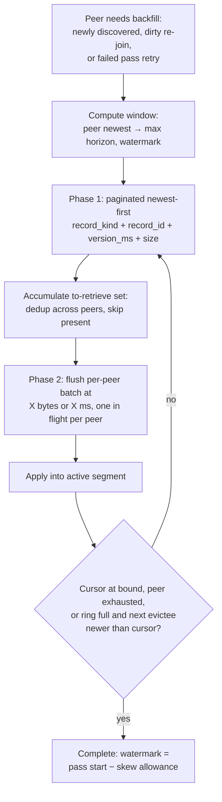

# Kura Backfill (Bootstrap Replacement)

## Problem Frame

Kura's bootstrap — how a node catches up on a peer's existing data — is the
subsystem behind every major mesh outage to date. Its interlocking mechanisms
(per-peer bootstrapped bookkeeping tied to a live membership view, bootstrap
epochs, digest anti-entropy, cross-peer fetch-gate stripes, a no-progress
watchdog, and readiness gated on completing a pass against every known peer)
patch each other's races and have produced: a readiness-gated rolling update
that killed a just-Ready pod and restarted a whole cold bootstrap; a node
losing ~93% of a multi-hour pass to a restart; CAS segment-ring eviction
thrash under multi-peer bootstrap that never converged; and silent
bootstrap-completion-discard loops.

This work replaces bootstrap with **backfill**: a deliberately simpler,
recency-first catch-up process whose contract is *recent entries are
guaranteed, completeness is best-effort* — the right contract for a cache.
Affected: Kura mesh operators (rollouts, incident load) and cache users
(node availability and hit rate while nodes join or recover).

The full design discussion with per-decision rationale lives in
`kura/docs/bootstrap-simplification.md`; this document is the planning-ready
distillation.

## Backfill Lifecycle

## Requirements

**Lifecycle**

- R1. The process is named **backfill**. A backfill walks one peer's entries
  newest → oldest with an in-memory cursor; at most one backfill per peer is
  in flight at a time. Backfill covers **every replicated record kind** —
  segmented artifacts, inline artifacts, action-cache entries, and namespace
  tombstones — not only segment blobs.
- R2. The trigger is **level-based**, re-evaluated by the existing membership
  loop (`kura/src/state.rs`, `apply_membership`): a peer *needs a backfill*
  when it is newly discovered (`discovered_peers`; initial discovery reports
  every peer as discovered, so process start needs no separate trigger), when
  it is re-discovered while a pass over it is already in flight (the peer is
  marked **dirty**; a fresh pass with a new window top starts after the
  current one ends — a flap during a pass is never silently swallowed), or
  when its previous pass **failed** (retried with bounded backoff; pairs
  claimed by the failed pass are released back to the dedup set). A peer
  removed from the membership view stops needing a backfill and its
  dirty/failed state clears; rediscovery re-triggers through the discovered
  path. Every pass — including retries — recomputes its window (R4) at pass
  start.
- R3. Backfill is a **node** state, not a peer state: the node is
  *backfilling* while any peer needs a backfill or has one in flight, and
  *done* otherwise; per-peer cursors and dirty flags are internal detail.

**Window and restart**

- R4. A backfill covers from the peer's most recent `version_ms` down to
  `max(node_backfill_horizon_version_ms, most_recent_completed_backfill_version_ms[peer])`.

  The horizon is **age-based**: each segment records the max `version_ms` of
  its contents at seal time (one integer on the persisted ring state,
  additive; segments sealed before the upgrade fall back to `created_at_ms` —
  a seal-time proxy that is accurate for live-traffic segments but
  **overstates recency for segments populated by the legacy hash-order
  bootstrap**, whose content age is scrambled; on such nodes the horizon and
  completion tests are conservative — shallower windows, earlier
  completion — until the ring turns over. See Known Limitations). Segments are ordered by that stat — data age, not ring
  position — and the horizon is the stat of the segment at the configured
  margin boundary (margin n%, default 40%, counted from the newest; under
  the existing 1:2:2 old/current/new ring ratio the default matches the
  "new" band on a warm node). Max-only is deliberate: read-path promotion
  relocates old entries into the head segment, polluting any min stat, but
  can never raise a sealed segment's max. For a cold node both window terms
  are absent and the window extends to the peer's oldest entry.
- R5. Only the requirement-R4 variables survive restarts. The cursor is not
  persisted: a restart re-joins the mesh, which triggers a fresh backfill
  (R2) over a window whose lower bound advanced only if the prior pass
  completed. Already-present entries are skipped by the presence pre-check,
  so a re-walk costs listing pages, not body transfers.

**Completion**

- R6. A backfill **completes** when: the cursor reaches the window bound; or
  the peer has no older entry; or — **for segmented-artifact retrieval
  only** — the ring is at capacity and the **next evictee's max `version_ms`
  is newer than the cursor** (the marginal-trade test: keep fetching only
  while what the cursor gains is newer than what rotation would destroy). A
  capacity completion stops segment-bound body fetches, but the listing walk
  continues to the window bound for the **non-ring record kinds** —
  action-cache entries, inline artifacts, and namespace tombstones — which
  consume no ring capacity; tombstones in particular are correctness, not
  cache content, and are never skipped. Eviction order itself is unchanged
  (earliest-sealed first); only the completion predicate consults the age
  stat. On an age-inverted cold ring the test fires the moment the ring
  fills, retaining the newest ring-worth of segmented data; on a warm
  ordered ring it fires when the cursor descends below the oldest retained
  data. Under promotion the recorded max can only overstate an evictee's
  referenced content, so the test errs toward completing early — and
  promoted entries already survive in the head, so nothing is lost.

  Completion is **drain-aware**: a pass completes only when every tuple it
  listed inside its window is locally applied, confirmed absent (R13), or
  resolved through a claim the completion waits on; a claim released by
  another pass's failure is re-claimed and fetched through this pass's own
  peer before completing. The watermark never advances over a
  listed-but-unresolved entry. A **failed** pass is not a completion: it
  does not advance the watermark and re-enters R2's retry path.
- R7. On completion, `most_recent_completed_backfill_version_ms[peer]` is set
  to `max(existing watermark, pass start point − configured clock-skew
  allowance)` — the skew allowance gives the watermark term of R4's bound
  slack the way the horizon term has it (a writer whose clock runs behind can
  stamp entries below an exact start-point watermark), and the `max` guard
  keeps the watermark monotonic when a retried older pass completes after a
  dirty-triggered newer one.

**Readiness**

- R8. A node is ready when **initial discovery has completed** and — for
  managed pods — the **first control-plane peer view has been fetched** (both
  existing gates stay; the second prevents a pod booting blind from latching
  ready with an empty ring before its peers-sync delivers the mesh), and its
  segment ring is at least X% full (segment count vs the ring's desired
  total) **or** it is no longer backfilling — where the backfilling clause
  applies only to the **initial join cycle**. Once achieved, readiness
  **latches for the process lifetime**: later re-join backfills never regress
  it, on any node, including nodes whose dataset is too small to ever reach
  X%. The orthogonal readiness inputs (writer lock, draining) survive
  unchanged alongside the latch. For the initial-cycle clause, a peer whose
  passes exhaust a **bounded failure budget** stops counting toward
  "backfilling" (retries continue in the background, surfaced via a metric)
  — one dead or protocol-incompatible peer cannot block first readiness. X is
  env-configurable; default is half the backfill margin (margin 40% → ready
  at 20% ring fullness).

**Transfer protocol**

- R9. Two phases per peer. Phase 1: paginated requests returning
  `(record_kind, record_id, version_ms, size)` tuples the peer holds,
  newest-first — `record_id` is the `artifact_id` for artifacts and the
  `namespace_id` for tombstones; tombstones are metadata-only (no phase-2
  body, no size) —
  backed by a **persistent per-entry `version_ms`-ordered secondary index
  covering all record kinds in R1** (segment blobs alone cannot serve the
  listing — action-cache entries and tombstones do not live in segments; the
  per-segment age stat is only a checkpoint reference for R4/R6). The
  action-cache snapshot index in `kura/src/reapi/snapshot.rs` is the shape,
  but it is capped and in-memory — full-dataset pagination needs the durable
  index. Phase 2: bulk-fetch only the bodies the node lacks.
- R10. Listing loops run **concurrently per peer**, each newest-first. As
  pages arrive, the node accumulates a shared to-retrieve set, discarding
  duplicates (`record_kind`, `record_id`, `version_ms`) and already-present
  entries at accumulation time. Entries are **claimed** by the batch that
  will fetch them; a failed batch releases its claims, and any in-flight
  pass that listed a released entry re-claims and fetches it through its own
  peer (see R6's drain-aware completion). An entry is **present** only when a local record for it
  carries `version_ms` greater than or equal to the listed tuple's; an older
  local version is fetched and resolved by the unchanged LWW apply path (so
  entries the mesh overwrote during an absence are refreshed, not skipped). A per-peer batch is flushed when it reaches X bytes
  **or** X ms have elapsed, with **at most one body-retrieval request in
  flight per peer**. Global recency is approximate — emergent from every
  stream being newest-first — with no cross-peer scheduler.
- R11. Bulk batches are bounded by **bytes, not count**, and spooled through
  the filesystem on both ends (sender appends records to a temp file until
  the threshold, closes, sends; receiver writes to its temp folder and
  processes from disk). The requester drives pagination via a
  `(record_kind, record_id, version_ms)` cursor. The `size` field lets batches be
  composed byte-bounded before fetching and routes oversized entries to the
  existing per-artifact download endpoint
  (`/_internal/bootstrap/artifacts/{id}`) up front — an explicit survivor of
  (or re-homed by) the legacy-endpoint retirement. Temp usage falls under
  existing tmp-budget accounting; memory is reserved for serving user
  requests.
- R12. Backfilled entries are written into the live active segment
  (`new.last()`), exactly like replication and client writes — no dedicated
  backfill segments.
- R13. **Absent-body semantics**: a peer that no longer holds a listed body
  (evicted between phases) reports it absent; the requester counts the entry
  as processed and the pass continues — the same contract as today's
  `IgnoredMissing`. Absent bodies never fail a batch or a pass.

## Success Criteria

- A rolling update or restart over a backfilling node loses no more than one
  window re-walk of listing pages — never hours of transferred bodies.
- A peer flap never regresses any node's readiness once achieved (latched
  per R8) — the 2026-07-24 readiness-gated rollout kill becomes impossible
  by construction, including for small-dataset nodes.
- A cold node whose ring is smaller than the mesh dataset converges and
  completes at capacity **retaining the newest ring-worth of entries**
  (marginal-trade completion) instead of eviction-thrashing — the 2026-07-23
  CAS-thrash class becomes impossible by construction.
- A cold node becomes ready at X% ring fullness — availability bounded by
  data-transfer time for a predictable byte volume, not by full-dataset
  completion.
- After a backfill completes at its window bound, every entry **present on
  the peer at pass start** and younger than the margin's time span is
  present locally, except entries whose bodies the peer no longer served at
  phase-2 time (R13). A capacity completion narrows the guarantee for
  **segmented artifacts** to the newest ring-worth; non-ring record kinds
  (action-cache entries, inline artifacts, tombstones) remain covered for
  the full window. Entries the peer acquires *later* keep
  their original `version_ms` and fall below the watermark, so they are
  permanently outside future windows over that peer — they arrive only via a
  pass over some peer whose window still includes them (see Known
  Limitations).
- The retired machinery is deleted, not bypassed: per-peer bootstrapped
  bookkeeping, bootstrap epochs, digest anti-entropy, fetch-gate stripes, and
  the no-progress watchdog's cursor-advance guards.

## Scope Boundaries

- **Replication is unchanged.** Outbox behavior (write-time targets,
  stale-target drops) stays as-is; backfill alone covers absence windows.
- **LWW/apply semantics are unchanged** — backfill reuses the live apply
  paths.
- **Completeness is best-effort** (the accepted drawback): entries older
  than the margin's time span may never arrive; recent ones are guaranteed
  per the qualified criterion above.
- **No age-correct eviction ordering for backfilled data**: active-segment
  placement means physical order diverges from data age; read-path promotion
  compensates for entries that are actually used, and the age stat (R4/R6)
  makes the ring rules correct despite the divergence.
- Not in scope: changing the segment file format, the ring's 1:2:2 band
  structure, eviction order, or client-facing cache protocols.

## Key Decisions

- **Age-based ring rules (max-only stat)**: the horizon and the capacity
  completion test are computed from per-segment max `version_ms`, not ring
  position — identical behavior on warm ordered rings, correct behavior on
  backfill-inverted rings. Max-only because promotion pollutes min but can
  never raise a sealed segment's max, so the completion test is conservative
  by construction.
- **Level-triggered lifecycle with a dirty flag**: restores the retry
  property the old design got from its 2-second re-check loop, without the
  per-peer bootstrapped bookkeeping — a peer needs a backfill until a pass
  over it completes, and flaps during a pass queue a fresh one.
- **Latched readiness**: readiness is monotonic per process lifetime;
  regression-by-flap is structurally impossible rather than statistically
  unlikely.
- **Per-entry durable index over segment-granular listing**: backfill must
  list action-cache entries and tombstones, which segments cannot provide;
  the index is the price of covering all record kinds, and the segment age
  stat stays a checkpoint-only reference.
- **Emergent recency over a cross-peer scheduler**: concurrent per-peer
  newest-first streams with shared dedup approximate global recency without
  a scheduler ordering the streams.
- **Drain-aware claimed dedup**: strict avoid-duplicate-fetch dedup is kept
  (entries claimed by one batch), with completion waiting on unresolved
  claims and failed claims re-fetched by the waiting pass through its own
  peer. Chosen over accepting duplicate fetches; the cost is named
  deliberately — completion acquires a cross-pass dependency and the
  no-leaked-claims invariant is correctness-critical (a leaked claim is an
  entry silently never fetched).
- **Durable index over a pass-scoped on-demand listing**: the rejected
  alternative — a file-spooled listing snapshot built at phase-1 request
  time and discarded after the pass — would avoid the upgrade-time build and
  write-path maintenance, but costs an O(dataset) scan-sort per requesting
  pass on multi-million-entry nodes, and its cursors are unstable across
  snapshot rebuilds. Durability amortizes the index across every joiner and
  re-join window and gives stable page cursors.
- **Ring-percentile horizon instead of head freshness**: the bound carries
  the margin's share of the ring's time span as structural slack; absences
  shorter than that span are always covered.
- **No cursor persistence**: restart = rejoin = fresh window; the presence
  pre-check makes re-walks cheap. Persisted state is the per-peer watermark
  map plus nothing else.
- **Active-segment placement**: zero store changes and no second open
  segment, traded against eviction-order fidelity for backfilled data.
- **File-spooled byte-bounded batches**: Bazel workloads mean hundreds of
  thousands of tiny entries; memory stays reserved for user traffic.

## Dependencies / Assumptions

- `version_ms` values are comparable across nodes (writer clocks); both
  window-bound terms now carry explicit slack (margin span; skew allowance).
- Peers hold largely overlapping datasets (the mesh replicates all writes to
  all targets); disjoint-dataset meshes weaken the recency guarantee.
- The per-segment max `version_ms` stat can be added additively to the
  persisted ring state at seal time; pre-upgrade segments use
  `created_at_ms` as the age proxy — accurate for live-traffic segments,
  recency-overstating for legacy-bootstrap-populated ones (see R4 and Known
  Limitations). Verified: `SegmentReference`
  (`kura/src/segment/reference.rs`) carries only `segment_id` +
  `created_at_ms` today.
- Verified absent: no `version_ms`-ordered index exists today — the current
  bootstrap walks the manifest keyspace in hash order — so R9's secondary
  index is new infrastructure, and it must cover artifacts, action-cache
  entries, and tombstones.

## Known Limitations

- **Bilateral discovery seam**: a peer discovers this node up to a
  membership-tick/heartbeat cadence after this node discovers it; writes the
  peer accepts in that seam are neither outbox-enqueued for this node nor
  inside the pass's window. The dirty-flag mechanism (R2) narrows but does
  not close the seam; residual holes are repaired by the next re-join pass.
  Mitigation options (e.g., a delayed follow-up pass after first discovery)
  are deferred to planning.
- **Churn-denominated slack**: the margin's slack is a share of the ring's
  time span, which shrinks under heavy write or backfill churn while the
  configured n% stays constant. A wall-clock floor for the horizon is
  deferred to planning.
- **Bootstrap-era fallback skew**: nodes whose pre-upgrade rings were filled
  by the legacy hash-order bootstrap carry `created_at_ms` fallback stats
  that read as recent while the content spans arbitrary ages. Until the ring
  turns over, their horizons are shallower and capacity completions earlier
  than intended — conservative in direction, transient in duration.
- **Later-acquired entries are permanently below the watermark**: an entry a
  peer acquires after this node's pass (e.g. via that peer's own backfill)
  keeps its original `version_ms` and can never appear in a future window
  over that peer. It arrives only through a pass over a peer whose window
  still covers it, and may never arrive if no such peer remains. The
  overlapping-datasets assumption is what keeps this rare.

## Outstanding Questions

### Resolve Before Planning

(None — all product decisions were resolved in the design discussion and the
review refinement pass.)

### Deferred to Planning

- [Affects R9][Technical] Building the per-entry `version_ms` index for
  pre-existing datasets at upgrade time (one-off index build, its cost on
  large nodes, whether it gates serving the phase-1 endpoint, and requester
  behavior against a peer with a partial index).
- [Affects R9][Technical] Index maintenance contract: pruning on segment
  eviction, LWW overwrite, and tombstone application, and its write-path
  cost.
- [Affects R9, R11, R13][Technical] Wire format of the two new endpoints
  (tuple listing, bulk bodies): framing, compression, page/batch size
  limits, absent-body annotation, and reuse of the existing bandwidth
  limiter and staging budgets.
- [Affects R1–R13][Technical] Retirement path for the legacy bootstrap
  endpoints and machinery under the one-version-skew rollout-safety rule
  (`kura/AGENTS.md`): which release ships endpoints additively, which
  deletes the old walk, and how old-version nodes' readiness behaves against
  new-version peers during the overlap.
- [Affects R4, R7, R8, R10, R11][Technical] Tunables: classify each knob
  (margin n%, readiness X%, batch byte threshold, batch flush interval,
  oversized-artifact cutoff, watermark clock-skew allowance, retry backoff
  bounds, failure budget) as compiled constant vs env-exposed — expose only
  those with a demonstrated per-mesh tuning need; name and default the
  exposed ones.
- [Affects R7][Technical] Lifecycle of the per-peer watermark map: keying,
  garbage collection for peers that permanently leave the mesh, and whether
  peer identity churn (e.g., a peer returning under the same URL after a
  data wipe) should clear the observer-side watermark.
- [Affects R4][Technical] Whether the horizon needs a wall-clock floor
  against ring-churn collapse (see Known Limitations).
- [Affects R2][Technical] Seam mitigation: whether a delayed follow-up pass
  after first discovery is worth its cost (see Known Limitations).
- [Affects R11][Needs research] Batch byte-threshold and flush-interval
  sizing against real Bazel small-artifact/action-cache profiles.

## Next Steps

→ `/ce:plan` for structured implementation planning
