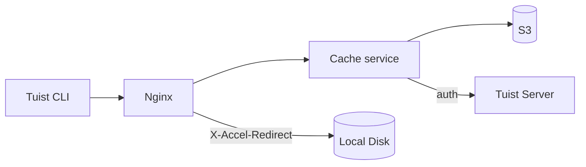
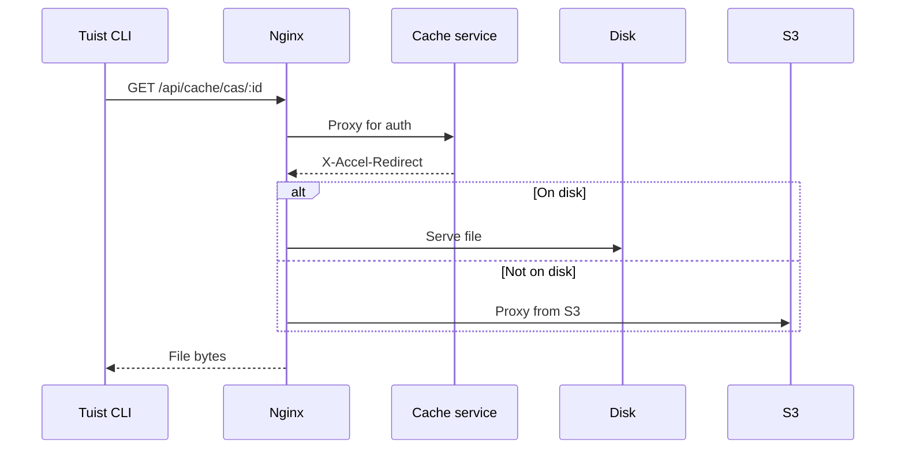
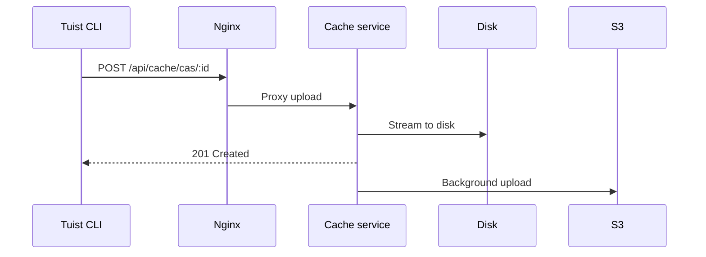

---
{
  "title": "Architecture",
  "titleTemplate": ":title | Cache | Guides | Tuist",
  "description": "Learn about the architecture of the Tuist cache service."
}
---

# بنية ذاكرة التخزين المؤقت {#cache-architecture}

:::: المعلومات
<!-- -->
تقدم هذه الصفحة نظرة عامة تقنية على بنية خدمة ذاكرة التخزين المؤقت Tuist. وهي
مخصصة في المقام الأول لمستخدمي الاستضافة الذاتية **والمساهمين في** و **** الذين
يحتاجون إلى فهم طريقة عمل الخدمة الداخلية. لا يحتاج المستخدمون العاديون الذين
يرغبون فقط في استخدام ذاكرة التخزين المؤقت إلى قراءة هذه الصفحة.
<!-- -->
:::

خدمة Tuist cache هي خدمة مستقلة توفر تخزينًا قابلًا للعنونة بالمحتوى (CAS)
لإنشاء المنتجات ومخزنًا للقيم الرئيسية لبيانات التعريف المخزنة مؤقتًا.

## نظرة عامة {#overview}

تستخدم الخدمة بنية تخزين من مستويين:

- **القرص المحلي**: التخزين الأساسي لعمليات الوصول إلى ذاكرة التخزين المؤقت ذات
  زمن الاستجابة المنخفض
- **S3**: تخزين متين يحافظ على الملفات ويسمح باستعادتها بعد إزالتها

## المكونات {#components}

### Nginx {#nginx}

يعمل Nginx كنقطة دخول ويتولى توصيل الملفات بكفاءة باستخدام `X-Accel-Redirect`:

- ** `التنزيلات**: تقوم خدمة ذاكرة التخزين المؤقت بالتحقق من صحة المصادقة، ثم
  تعرض رأس X-Accel-Redirect`. يقوم Nginx بتقديم الملف مباشرة من القرص أو
  البروكسيات من S3.
- **التحميلات**: يقوم Nginx بتوجيه الطلبات إلى خدمة التخزين المؤقت، التي تقوم
  ببث البيانات إلى القرص.

### التخزين القابل للعنونة بالمحتوى {#cas}

يتم تخزين القطع الأثرية على القرص المحلي في بنية مجلدات مجزأة:

- **المسار**: `{account}/{project}/cas/{shard1}/{shard2}/{artifact_id}`
- **تجزئة**: تشكل الأحرف الأربعة الأولى من معرف الأثر جزءًا من جزءين (على سبيل
  المثال، `ABCD1234` → `AB/CD/ABCD1234`)

### تكامل S3 {#s3}

يوفر S3 تخزينًا دائمًا:

- **تحميلات في الخلفية**: بعد الكتابة على القرص، يتم وضع العناصر في قائمة انتظار
  للتحميل إلى S3 عبر عامل في الخلفية يعمل كل دقيقة.
- **الترطيب عند الطلب**: عند فقدان عنصر محلي، يتم تلبية الطلب على الفور عبر
  عنوان URL S3 موقّع مسبقًا، بينما يتم وضع العنصر في قائمة الانتظار للتنزيل في
  الخلفية على القرص المحلي.

### إخلاء القرص {#eviction}

تدير الخدمة مساحة القرص باستخدام طريقة LRU eviction:

- يتم تتبع أوقات الوصول في SQLite
- عندما يتجاوز استخدام القرص 85٪، يتم حذف الأقدم من الملفات حتى ينخفض الاستخدام
  إلى 70٪.
- تظل القطع الأثرية في S3 بعد الإخلاء المحلي

### المصادقة {#authentication}

يقوم ذاكرة التخزين المؤقت بتفويض المصادقة إلى خادم Tuist عن طريق استدعاء نقطة
النهاية `/api/projects` وتخزين النتائج مؤقتًا (10 دقائق في حالة النجاح، و3 ثوانٍ
في حالة الفشل).

## تدفقات الطلبات {#request-flows}

### تنزيل {#download-flow}

### تحميل {#upload-flow}

## نقاط نهاية واجهة برمجة التطبيقات {#api-endpoints}

| نقطة النهاية                  | الطريقة | الوصف                           |
| ----------------------------- | ------- | ------------------------------- |
| `/up`                         | GET     | فحص الصحة                       |
| `/metrics`                    | GET     | مقاييس بروميثيوس                |
| `/api/cache/cas/:id`          | GET     | تنزيل أداة CAS                  |
| `/api/cache/cas/:id`          | نشر     | تحميل أداة CAS                  |
| `/api/cache/keyvalue/:cas_id` | GET     | احصل على إدخال القيمة الرئيسية  |
| `/api/cache/keyvalue`         | PUT     | تخزين إدخال القيمة الرئيسية     |
| `/api/cache/module/:id`       | HEAD    | تحقق من وجود أثر الوحدة النمطية |
| `/api/cache/module/:id`       | GET     | تنزيل أداة الوحدة النمطية       |
| `/api/cache/module/start`     | نشر     | ابدأ التحميل المتعدد الأجزاء    |
| `/api/cache/module/part`      | نشر     | تحميل الجزء                     |
| `/api/cache/module/complete`  | نشر     | أكمل التحميل متعدد الأجزاء      |
