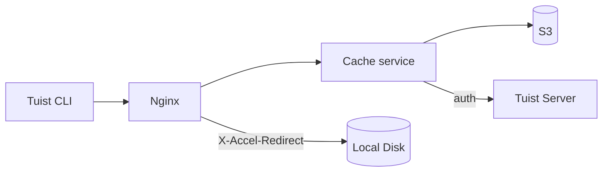
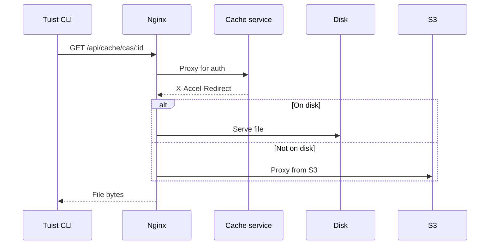
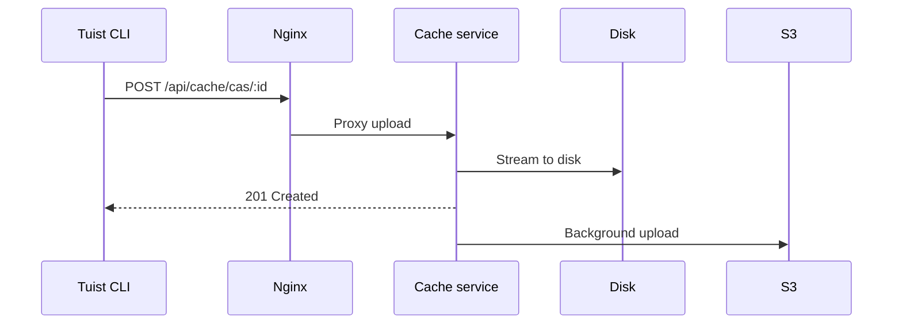

---
{
  "title": "Architecture",
  "titleTemplate": ":title | Cache | Guides | Tuist",
  "description": "Learn about the architecture of the Tuist cache service."
}
---

# بنية ذاكرة التخزين المؤقت {#cache-architecture}

:::: المعلومات
<!-- -->
تقدم هذه الصفحة نظرة عامة تقنية على بنية خدمة ذاكرة التخزين المؤقت Tuist. وهي
موجهة في المقام الأول لمستخدمي الاستضافة الذاتية لـ **** والمساهمين في ****
الذين يحتاجون إلى فهم طريقة عمل الخدمة داخليًا. لا يحتاج المستخدمون العاديون
الذين يرغبون فقط في استخدام ذاكرة التخزين المؤقت إلى قراءة هذا.
<!-- -->
:::

خدمة ذاكرة التخزين المؤقت Tuist هي خدمة مستقلة توفر تخزينًا قابلًا للعنونة
بالمحتوى (CAS) لمخرجات البناء ومخزنًا للقيم والمفاتيح لبيانات تعريف ذاكرة
التخزين المؤقت.

## نظرة عامة {#overview}

تستخدم الخدمة بنية تخزين ذات مستويين:

- **القرص المحلي**: وحدة التخزين الأساسية لعمليات الوصول إلى ذاكرة التخزين
  المؤقت ذات زمن الوصول المنخفض
- **S3**: تخزين دائم يحفظ الملفات ويسمح باستعادتها بعد إزالتها

```mermaid
flowchart LR
    CLI[Tuist CLI] --> NGINX[Nginx]
    NGINX --> APP[Cache service]
    NGINX -->|X-Accel-Redirect| DISK[(Local Disk)]
    APP --> S3[(S3)]
    APP -->|auth| SERVER[Tuist Server]
```

## المكونات {#components}

### Nginx {#nginx}

يعمل Nginx كنقطة دخول ويتولى توصيل الملفات بكفاءة باستخدام `X-Accel-Redirect`:

- **التنزيلات**: تقوم خدمة التخزين المؤقت بالتحقق من صحة المصادقة، ثم تعيد رأس
  X-Accel-Redirect` ` . يقوم Nginx بتقديم الملف مباشرة من القرص أو من بروكسيات
  S3.
- **التحميلات**: يقوم Nginx بتوجيه الطلبات إلى خدمة التخزين المؤقت، التي تقوم
  بدورها ببث البيانات إلى القرص.

### التخزين القابل للعنونة بالمحتوى {#cas}

يتم تخزين الملفات على القرص المحلي في بنية دليل مقسمة:

- **المسار**: `{account}/{project}/cas/{shard1}/{shard2}/{artifact_id}`
- **تقسيم**: تُنشئ الأحرف الأربعة الأولى من معرّف الأداة شظية من مستويين (على
  سبيل المثال، `ABCD1234` → `AB/CD/ABCD1234`)

### تكامل S3 {#s3}

يوفر S3 مساحة تخزين دائمة:

- **تحميلات الخلفية**: بعد الكتابة على القرص، يتم وضع العناصر في قائمة انتظار
  للتحميل إلى S3 عبر عامل خلفية يعمل كل دقيقة
- **الترطيب عند الطلب**: عندما يكون أحد العناصر المحلية مفقودًا، يتم تلبية الطلب
  على الفور عبر عنوان URL S3 موقّع مسبقًا، بينما يتم وضع العنصر في قائمة
  الانتظار للتنزيل في الخلفية إلى القرص المحلي

### إخلاء القرص {#eviction}

تدير الخدمة مساحة القرص باستخدام إخلاء LRU:

- يتم تتبع أوقات الوصول في SQLite
- عندما يتجاوز استخدام القرص 85٪، يتم حذف أقدم الملفات حتى ينخفض الاستخدام إلى
  70٪
- تبقى الملفات في S3 بعد الإزالة المحلية

### المصادقة {#authentication}

يقوم ذاكرة التخزين المؤقتة بتفويض المصادقة إلى خادم Tuist عن طريق استدعاء نقطة
النهاية `/api/projects` وتخزين النتائج مؤقتًا (10 دقائق في حالة النجاح، و3 ثوانٍ
في حالة الفشل).

## تدفقات الطلبات {#request-flows}

### تنزيل {#download-flow}

```mermaid
sequenceDiagram
    participant CLI as Tuist CLI
    participant N as Nginx
    participant A as Cache service
    participant D as Disk
    participant S as S3

    CLI->>N: GET /api/cache/cas/:id
    N->>A: Proxy for auth
    A-->>N: X-Accel-Redirect
    alt On disk
        N->>D: Serve file
    else Not on disk
        N->>S: Proxy from S3
    end
    N-->>CLI: File bytes
```

### تحميل {#upload-flow}

```mermaid
sequenceDiagram
    participant CLI as Tuist CLI
    participant N as Nginx
    participant A as Cache service
    participant D as Disk
    participant S as S3

    CLI->>N: POST /api/cache/cas/:id
    N->>A: Proxy upload
    A->>D: Stream to disk
    A-->>CLI: 201 Created
    A->>S: Background upload
```

## نقاط نهاية واجهة برمجة التطبيقات {#api-endpoints}

| نقطة النهاية                  | الطريقة | الوصف                            |
| ----------------------------- | ------- | -------------------------------- |
| `/up`                         | GET     | فحص الصحة                        |
| `/metrics`                    | GET     | مقاييس Prometheus                |
| `/api/cache/cas/:id`          | GET     | تنزيل ملف CAS                    |
| `/api/cache/cas/:id`          | POST    | تحميل ملف CAS                    |
| `/api/cache/keyvalue/:cas_id` | GET     | الحصول على إدخال القيمة-المفتاح  |
| `/api/cache/keyvalue`         | PUT     | تخزين إدخال المفتاح والقيمة      |
| `/api/cache/module/:id`       | HEAD    | تحقق من وجود عنصر الوحدة النمطية |
| `/api/cache/module/:id`       | GET     | تنزيل ملف الوحدة النمطية         |
| `/api/cache/module/start`     | POST    | ابدأ التحميل متعدد الأجزاء       |
| `/api/cache/module/part`      | POST    | تحميل الجزء                      |
| `/api/cache/module/complete`  | POST    | إكمال التحميل متعدد الأجزاء      |
