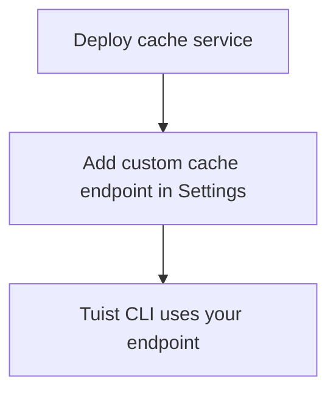

---
{
  "title": "Self-hosting",
  "titleTemplate": ":title | Cache | Guides | Tuist",
  "description": "Learn how to self-host the Tuist cache service."
}
---

# ذاكرة التخزين المؤقتة ذاتية الاستضافة {#self-host-cache}

يمكن استضافة خدمة Tuist cache بشكل مستقل لتوفير ذاكرة تخزين مؤقتة ثنائية خاصة
لفريقك. وهذا مفيد للغاية للمؤسسات التي لديها ملفات كبيرة وتقوم بعمليات إنشاء
متكررة، حيث يؤدي وضع ذاكرة التخزين المؤقتة بالقرب من البنية التحتية لـ CI إلى
تقليل زمن الاستجابة وتحسين كفاءة ذاكرة التخزين المؤقتة. من خلال تقليل المسافة
بين وكلاء الإنشاء وذاكرة التخزين المؤقتة، تضمن أن لا تؤثر أعباء الشبكة على مزايا
السرعة التي توفرها ذاكرة التخزين المؤقتة.

:::: المعلومات
<!-- -->
يتطلب استضافة عقد التخزين المؤقت ذاتيًا خطة **Enterprise**.

يمكنك توصيل عقد التخزين المؤقت ذاتية الاستضافة إما بخادم Tuist المستضاف
(`https://tuist.dev`) أو بخادم Tuist ذاتي الاستضافة. يتطلب استضافة خادم Tuist
بنفسك ترخيص خادم منفصل. راجع
<LocalizedLink href="/guides/server/self-host/install">دليل استضافة الخادم
بنفسك</LocalizedLink>.
<!-- -->
:::

## المتطلبات الأساسية {#prerequisites}

- Docker و Docker Compose
- سلة تخزين متوافقة مع S3
- مثيل خادم Tuist قيد التشغيل (مستضاف أو مستضاف ذاتيًا)

## النشر {#deployment}

يتم توزيع خدمة ذاكرة التخزين المؤقت كصورة Docker على
[ghcr.io/tuist/cache](https://ghcr.io/tuist/cache). نوفر ملفات تكوين مرجعية في
[دليل ذاكرة التخزين المؤقت](https://github.com/tuist/tuist/tree/main/cache).

:::: إكرامية
<!-- -->
نحن نوفر إعداد Docker Compose لأنه يمثل أساسًا مناسبًا للتقييم وعمليات النشر
الصغيرة. يمكنك استخدامه كمرجع وتكييفه مع نموذج النشر المفضل لديك (Kubernetes،
Docker الخام، إلخ).
<!-- -->
:::

### ملفات التكوين {#config-files}

```bash
curl -O https://raw.githubusercontent.com/tuist/tuist/main/cache/docker-compose.yml
mkdir -p docker
curl -o docker/nginx.conf https://raw.githubusercontent.com/tuist/tuist/main/cache/docker/nginx.conf
```

### متغيرات البيئة {#environment-variables}

أنشئ ملف `.env` مع التكوين الخاص بك.

:::: إكرامية
<!-- -->
تم إنشاء الخدمة باستخدام Elixir/Phoenix، لذا تستخدم بعض المتغيرات البادئة PHX_`
` . يمكنك التعامل معها على أنها تكوين خدمة قياسي.
<!-- -->
:::

```env
# Secret key used to sign and encrypt data. Minimum 64 characters.
# Generate with: openssl rand -base64 64
SECRET_KEY_BASE=YOUR_SECRET_KEY_BASE

# Public hostname or IP address where your cache service will be reachable.
PUBLIC_HOST=cache.example.com

# URL of the Tuist server used for authentication (REQUIRED).
# - Hosted: https://tuist.dev
# - Self-hosted: https://your-tuist-server.example.com
SERVER_URL=https://tuist.dev

# S3 Storage configuration
S3_BUCKET=your-cache-bucket
S3_HOST=s3.us-east-1.amazonaws.com
S3_ACCESS_KEY_ID=your-access-key
S3_SECRET_ACCESS_KEY=your-secret-key
S3_REGION=us-east-1

# CAS storage (required for non-compose deployments)
DATA_DIR=/data
```

| متغير                             | مطلوب | افتراضي                   | الوصف                                                                                               |
| --------------------------------- | ----- | ------------------------- | --------------------------------------------------------------------------------------------------- |
| `SECRET_KEY_BASE`                 | نعم   |                           | مفتاح سري يستخدم لتوقيع وتشفير البيانات (64 حرفًا على الأقل).                                       |
| `PUBLIC_HOST`                     | نعم   |                           | اسم المضيف العام أو عنوان IP لخدمة ذاكرة التخزين المؤقت الخاصة بك. يُستخدم لإنشاء عناوين URL مطلقة. |
| `SERVER_URL`                      | نعم   |                           | عنوان URL لخادم Tuist الخاص بك للمصادقة. القيمة الافتراضية هي `https://tuist.dev`                   |
| `DATA_DIR`                        | نعم   |                           | الدليل الذي يتم فيه تخزين ملفات CAS على القرص. يستخدم إعداد Docker Compose المقدم `/data`.          |
| `S3_BUCKET`                       | نعم   |                           | اسم سلة S3.                                                                                         |
| `S3_HOST`                         | نعم   |                           | اسم مضيف نقطة نهاية S3.                                                                             |
| `S3_ACCESS_KEY_ID`                | نعم   |                           | مفتاح الوصول S3.                                                                                    |
| `S3_SECRET_ACCESS_KEY`            | نعم   |                           | مفتاح سري S3.                                                                                       |
| `S3_REGION`                       | نعم   |                           | منطقة S3.                                                                                           |
| `CAS_DISK_HIGH_WATERMARK_PERCENT` | لا    | `85`                      | نسبة استخدام القرص التي تؤدي إلى إخلاء LRU.                                                         |
| `CAS_DISK_TARGET_PERCENT`         | لا    | `70`                      | استخدام القرص المستهدف بعد الإخلاء.                                                                 |
| `PHX_SOCKET_PATH`                 | لا    | `/run/cache/cache.sock`   | المسار الذي تنشئ فيه الخدمة مقبس Unix الخاص بها (عند التمكين).                                      |
| `PHX_SOCKET_LINK`                 | لا    | `/run/cache/current.sock` | مسار الارتباط الرمزي الذي يستخدمه Nginx للاتصال بالخدمة.                                            |

### ابدأ الخدمة {#start-service}

```bash
docker compose up -d
```

### تحقق من النشر {#verify}

```bash
curl http://localhost/up
```

## تكوين نقطة نهاية ذاكرة التخزين المؤقت {#configure-endpoint}

بعد نشر خدمة ذاكرة التخزين المؤقت، قم بتسجيلها في إعدادات مؤسسة خادم Tuist:

1. انتقل إلى صفحة إعدادات **** الخاصة بمؤسستك.
2. ابحث عن **نقاط نهاية ذاكرة التخزين المؤقت المخصصة قسم**
3. أضف عنوان URL لخدمة ذاكرة التخزين المؤقت (على سبيل المثال،
   `https://cache.example.com`)

<!-- TODO: Add screenshot of organization settings page showing Custom cache endpoints section -->



بمجرد التهيئة، سيستخدم Tuist CLI ذاكرة التخزين المؤقتة المستضافة ذاتيًا.

## المجلدات {#volumes}

يستخدم تكوين Docker Compose ثلاثة مجلدات:

| الحجم          | الغرض                                  |
| -------------- | -------------------------------------- |
| `cas_data`     | تخزين الأثر الثنائي                    |
| `sqlite_data`  | الوصول إلى البيانات الوصفية لإخلاء LRU |
| `cache_socket` | مقبس Unix للاتصال بخدمة Nginx          |

## فحوصات صحية {#health-checks}

- `GET /up` — يُرجع 200 عندما يكون سليمًا
- `GET /metrics` — مقاييس Prometheus

## المراقبة {#monitoring}

تكشف خدمة ذاكرة التخزين المؤقت عن المقاييس المتوافقة مع Prometheus على
`/metrics`.

إذا كنت تستخدم Grafana، يمكنك استيراد [لوحة المعلومات
المرجعية](https://raw.githubusercontent.com/tuist/tuist/refs/heads/main/cache/priv/grafana_dashboards/cache_service.json).

## الترقية {#upgrading}

```bash
docker compose pull
docker compose up -d
```

تقوم الخدمة بتشغيل عمليات ترحيل قاعدة البيانات تلقائيًا عند بدء التشغيل.

## استكشاف الأخطاء وإصلاحها {#استكشاف الأخطاء وإصلاحها}

### لا يتم استخدام ذاكرة التخزين المؤقت {#troubleshooting-caching}

إذا كنت تتوقع التخزين المؤقت ولكنك تلاحظ فشلًا متكررًا في التخزين المؤقت (على
سبيل المثال، يقوم CLI بتحميل نفس العناصر بشكل متكرر، أو لا يتم التنزيل أبدًا)،
فاتبع الخطوات التالية:

1. تحقق من أن نقطة نهاية ذاكرة التخزين المؤقتة المخصصة قد تم تكوينها بشكل صحيح
   في إعدادات مؤسستك.
2. تأكد من مصادقة Tuist CLI عن طريق تشغيل `tuist auth login`.
3. تحقق من سجلات خدمة ذاكرة التخزين المؤقت بحثًا عن أي أخطاء: `docker compose
   logs cache`.

### عدم تطابق مسار المقبس {#troubleshooting-socket}

إذا رأيت أخطاء رفض الاتصال:

- تأكد من أن `PHX_SOCKET_LINK` يشير إلى مسار المقبس المُعد في nginx.conf
  (الافتراضي: `/run/cache/current.sock`)
- تحقق من أن `PHX_SOCKET_PATH` و `PHX_SOCKET_LINK` محددان بشكل صحيح في
  docker-compose.yml
- تحقق من أن وحدة التخزين `cache_socket` مركبة في كلا الحاويتين
