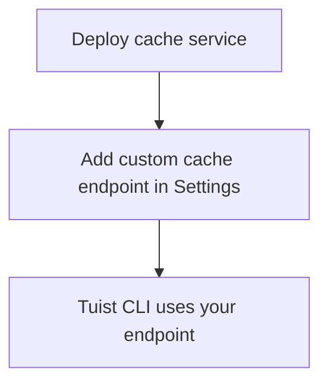

---
{
  "title": "Self-hosting",
  "titleTemplate": ":title | Cache | Guides | Tuist",
  "description": "Learn how to self-host the Tuist cache service."
}
---

# ذاكرة التخزين المؤقت ذاتية الاستضافة {#self-host-cache}

يمكن استضافة خدمة ذاكرة التخزين المؤقت Tuist ذاتيًا لتوفير ذاكرة تخزين مؤقت
ثنائية خاصة لفريقك. وهذا مفيد للغاية للمؤسسات التي لديها عناصر كبيرة وعمليات
إنشاء متكررة، حيث يؤدي وضع ذاكرة التخزين المؤقت بالقرب من البنية التحتية للتكامل
المستمر (CI) إلى تقليل زمن الاستجابة وتحسين كفاءة ذاكرة التخزين المؤقت. ومن خلال
تقليل المسافة بين وكلاء الإنشاء وذاكرة التخزين المؤقت، فإنك تضمن ألا تؤدي أعباء
الشبكة إلى إبطال مزايا السرعة التي توفرها ذاكرة التخزين المؤقت.

:::: المعلومات
<!-- -->
تتطلب عقد التخزين المؤقت ذاتية الاستضافة خطة **Enterprise**.

يمكنك توصيل عقد التخزين المؤقت ذاتية الاستضافة إما بخادم Tuist المستضاف
(`https://tuist.dev`) أو بخادم Tuist ذاتي الاستضافة. تتطلب الاستضافة الذاتية
لخادم Tuist نفسه ترخيص خادم منفصل. راجع
<LocalizedLink href="/guides/server/self-host/install">دليل الاستضافة الذاتية
للخادم</LocalizedLink>.
<!-- -->
:::

## المتطلبات الأساسية {#prerequisites}

- Docker و Docker Compose
- حاوية تخزين متوافقة مع S3
- مثيل خادم Tuist قيد التشغيل (مستضاف أو ذاتي الاستضافة)

## النشر {#deployment}

يتم توزيع خدمة التخزين المؤقت كصورة Docker على
[ghcr.io/tuist/cache](https://ghcr.io/tuist/cache). نوفر ملفات التكوين المرجعية
في [دليل التخزين المؤقت](https://github.com/tuist/tuist/tree/main/cache).

:::: إكرامية
<!-- -->
نحن نوفر إعداد Docker Compose لأنه يمثل أساسًا مناسبًا للتقييم وعمليات النشر
الصغيرة. يمكنك استخدامه كمرجع وتكييفه مع نموذج النشر المفضل لديك (Kubernetes،
Docker الخام، إلخ).
<!-- -->
:::

### ملفات التكوين {#config-files}

```bash
curl -O https://raw.githubusercontent.com/tuist/tuist/main/cache/docker-compose.yml
mkdir -p docker
curl -o docker/nginx.conf https://raw.githubusercontent.com/tuist/tuist/main/cache/docker/nginx.conf
```

### متغيرات البيئة {#environment-variables}

أنشئ ملف `.env` مع إعداداتك.

:::: إكرامية
<!-- -->
تم إنشاء الخدمة باستخدام Elixir/Phoenix، لذا تستخدم بعض المتغيرات البادئة
`PHX_`. يمكنك التعامل معها على أنها تكوين قياسي للخدمة.
<!-- -->
:::

```env
# Secret key used to sign and encrypt data. Minimum 64 characters.
# Generate with: openssl rand -base64 64
SECRET_KEY_BASE=YOUR_SECRET_KEY_BASE

# Public hostname or IP address where your cache service will be reachable.
PUBLIC_HOST=cache.example.com

# URL of the Tuist server used for authentication (REQUIRED).
# - Hosted: https://tuist.dev
# - Self-hosted: https://your-tuist-server.example.com
SERVER_URL=https://tuist.dev

# S3 Storage configuration
S3_BUCKET=your-cache-bucket
S3_HOST=s3.us-east-1.amazonaws.com
S3_ACCESS_KEY_ID=your-access-key
S3_SECRET_ACCESS_KEY=your-secret-key
S3_REGION=us-east-1

# CAS storage (required for non-compose deployments)
DATA_DIR=/data
```

| المتغير                           | مطلوب | افتراضي                   | الوصف                                                                                         |
| --------------------------------- | ----- | ------------------------- | --------------------------------------------------------------------------------------------- |
| `SECRET_KEY_BASE`                 | نعم   |                           | مفتاح سري يستخدم لتوقيع البيانات وتشفيرها (64 حرفًا على الأقل).                               |
| `PUBLIC_HOST`                     | نعم   |                           | اسم المضيف العام أو عنوان IP لخدمة التخزين المؤقت الخاصة بك. يُستخدم لإنشاء عناوين URL مطلقة. |
| `SERVER_URL`                      | نعم   |                           | عنوان URL لخادم Tuist الخاص بك للمصادقة. العنوان الافتراضي هو `https://tuist.dev`             |
| `DATA_DIR`                        | نعم   |                           | الدليل الذي يتم فيه تخزين عناصر CAS على القرص. يستخدم إعداد Docker Compose المقدم `/data`.    |
| `S3_BUCKET`                       | نعم   |                           | اسم دلو S3.                                                                                   |
| `S3_HOST`                         | نعم   |                           | اسم مضيف نقطة نهاية S3.                                                                       |
| `S3_ACCESS_KEY_ID`                | نعم   |                           | مفتاح الوصول S3.                                                                              |
| `S3_SECRET_ACCESS_KEY`            | نعم   |                           | مفتاح سري S3.                                                                                 |
| `S3_REGION`                       | نعم   |                           | منطقة S3.                                                                                     |
| `CAS_DISK_HIGH_WATERMARK_PERCENT` | لا    | `85`                      | نسبة استخدام القرص التي تؤدي إلى إزالة LRU.                                                   |
| `CAS_DISK_TARGET_PERCENT`         | لا    | `70`                      | استخدام القرص المستهدف بعد الإخلاء.                                                           |
| `PHX_SOCKET_PATH`                 | لا    | `/run/cache/cache.sock`   | المسار الذي تنشئ فيه الخدمة مقبس Unix الخاص بها (عند تمكينه).                                 |
| `PHX_SOCKET_LINK`                 | لا    | `/run/cache/current.sock` | مسار الرابط الرمزي الذي يستخدمه Nginx للاتصال بالخدمة.                                        |

### ابدأ الخدمة {#start-service}

```bash
docker compose up -d
```

### تحقق من النشر {#verify}

```bash
curl http://localhost/up
```

## تكوين نقطة نهاية ذاكرة التخزين المؤقت {#configure-endpoint}

بعد نشر خدمة ذاكرة التخزين المؤقت، قم بتسجيلها في إعدادات مؤسسة خادم Tuist:

1. انتقل إلى صفحة إعدادات " **" الخاصة بمؤسستك**
2. ابحث عن قسم "نهايات ذاكرة التخزين المؤقت المخصصة" ( **) في قسم "نهايات ذاكرة
   التخزين المؤقت" (** )
3. أضف عنوان URL لخدمة التخزين المؤقت (على سبيل المثال،
   `https://cache.example.com`)

<!-- TODO: Add screenshot of organization settings page showing Custom cache endpoints section -->


```mermaid
graph TD
  A[Deploy cache service] --> B[Add custom cache endpoint in Settings]
  B --> C[Tuist CLI uses your endpoint]
```

بمجرد التهيئة، سيستخدم Tuist CLI ذاكرة التخزين المؤقت الخاصة بك.

## المجلدات {#volumes}

يستخدم تكوين Docker Compose ثلاثة مجلدات:

| الحجم          | الغرض                                       |
| -------------- | ------------------------------------------- |
| `cas_data`     | تخزين الأثر الثنائي                         |
| `sqlite_data`  | الوصول إلى بيانات التعريف الخاصة بإزالة LRU |
| `cache_socket` | مقبس Unix للاتصال بين Nginx والخدمة         |

## فحوصات الصحة {#health-checks}

- `GET /up` — يُرجع 200 عند صحة الطلب
- `GET /metrics` — مقاييس Prometheus

## المراقبة {#monitoring}

تعرض خدمة التخزين المؤقت المقاييس المتوافقة مع Prometheus على `/metrics`.

إذا كنت تستخدم Grafana، يمكنك استيراد [لوحة التحكم
المرجعية](https://raw.githubusercontent.com/tuist/tuist/refs/heads/main/cache/priv/grafana_dashboards/cache_service.json).

## التحديث {#upgrading}

```bash
docker compose pull
docker compose up -d
```

تقوم الخدمة بتشغيل عمليات ترحيل قاعدة البيانات تلقائيًا عند بدء التشغيل.

## استكشاف الأخطاء وإصلاحها {#استكشاف الأخطاء وإصلاحها}

### لا يتم استخدام ذاكرة التخزين المؤقت {#troubleshooting-caching}

إذا كنت تتوقع التخزين المؤقت ولكنك تلاحظ فقدانًا متكررًا للذاكرة المؤقتة (على
سبيل المثال، تقوم واجهة سطر الأوامر (CLI) بتحميل نفس العناصر مرارًا وتكرارًا، أو
لا يتم التنزيل أبدًا)، فاتبع الخطوات التالية:

1. تحقق من أن نقطة نهاية ذاكرة التخزين المؤقتة المخصصة قد تم تكوينها بشكل صحيح
   في إعدادات مؤسستك.
2. تأكد من مصادقة Tuist CLI الخاص بك عن طريق تشغيل `tuist auth login`.
3. تحقق من سجلات خدمة ذاكرة التخزين المؤقت بحثًا عن أي أخطاء: `docker compose
   logs cache`.

### عدم تطابق مسار المقبس {#troubleshooting-socket}

إذا ظهرت لك أخطاء رفض الاتصال:

- تأكد من أن `PHX_SOCKET_LINK` يشير إلى مسار المأخذ الذي تم تكوينه في nginx.conf
  (الافتراضي: `/run/cache/current.sock`)
- تحقق من أن `PHX_SOCKET_PATH` و `PHX_SOCKET_LINK` قد تم تعيينهما بشكل صحيح في
  docker-compose.yml
- تحقق من أن وحدة التخزين `cache_socket` مثبتة في كلا الحاويتين
