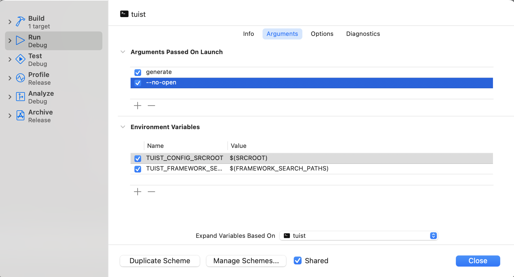
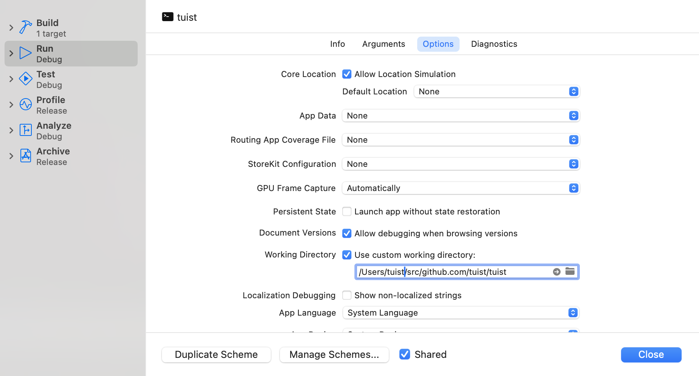

# Get started

If you have experience building apps for Apple platforms, like iOS, adding code to Tuist shouldn’t be much different. There are two differences compared to developing apps that are worth mentioning:

- **The interactions with CLIs happen through the terminal.** The user executes Tuist, which performs the desired task, and then returns successfully or with a status code. During the execution, the user can be notified by sending output information to the standard output and standard error. There are no gestures, or graphical interactions, just the user intent.

- **There’s no runloop that keeps the process alive waiting for input**, like it happens in an iOS app when the app receives system or user events. CLIs run in its process and finishes when the work is done. Asynchronous work can be done using system APIs like [DispatchQueue](https://developer.apple.com/documentation/dispatch/dispatchqueue) or [structured concurrency](https://developer.apple.com/tutorials/app-dev-training/managing-structured-concurrency), but need to make sure the process is running while the asynchronous work is being executed. Otherwise, the process will terminate the asynchronous work.

If you don’t have any experience with Swift, we recommend [Apple’s official book](https://docs.swift.org/swift-book/) to get familiar with the language and the most used elements from the Foundation’s API.

## Minimum requirements

To contribute to Tuist, minimum requirements are:

- macOS 14.0+
- Xcode 15.0+

## Set up the project locally

To start working on the project, we can follow the steps below:

- Clone the repository by running: `git clone git@github.com:tuist/tuist.git`
- [Install](https://mise.jdx.dev/getting-started.html) Mise to provision the development environment.
- Run `mise install` to install the system dependencies needed by Tuist
- Run `tuist install` to install the external dependencies needed by Tuist
- (Optional) Run `tuist auth` to get access to the [Tuist Cache](/guides/develop/build/cache)
- Run `tuist generate` to generate the Tuist Xcode project using Tuist itself

**The generated project opens automatically**. If you need to open again without generating it, run open `Tuist.xcworkspace` (or use Finder).

> [!NOTE] XED .
> If you try to open the project using `xed .`, it will open the package, and not the project generated by Tuist. We recommend using the Tuist-generated project to dog-food the tool.

## Edit the project

If you needed to edit the project, for example to add dependencies or adjust targets, you can use the [`tuist edit` command](/guides/develop/projects/editing). This is barely used, but it's good to know that it exists.

## Run Tuist

### From Xcode

To run `tuist` from the generated Xcode project, edit the `tuist` scheme, and set the arguments that you'd like to pass to the command. For example, to run the `tuist generate` command, you can set the arguments to `generate --no-open` to prevent the project from opening after the generation.



You'll also have to set the working directory to the root of the project being generated. You can do that either by using the `--path` argument, which all the commands accept, or configuring the working directory in the scheme as shown below:



> [!WARNING] PROJECTDESCRIPTION COMPILATION
> The `tuist` CLI depends on the `ProjectDescription` framework's presence in the built products directory. If `tuist` fails to run because it can't find the `ProjectDescription` framework, build the `Tuist-Workspace` scheme first.

### From the terminal

Although `tuist` provides a `tuist run` it does not support CLIs yet. Therefore, you'll have to use the Swift Package Manager to run the tool. To do that, you can run the following command:

```bash
swift build --product ProjectDescription
swift run tuist generate --path /path/to/project --no-open
```

