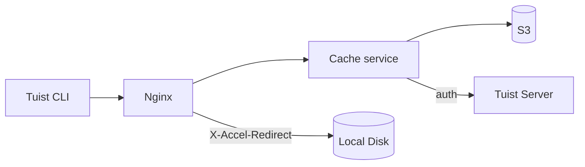
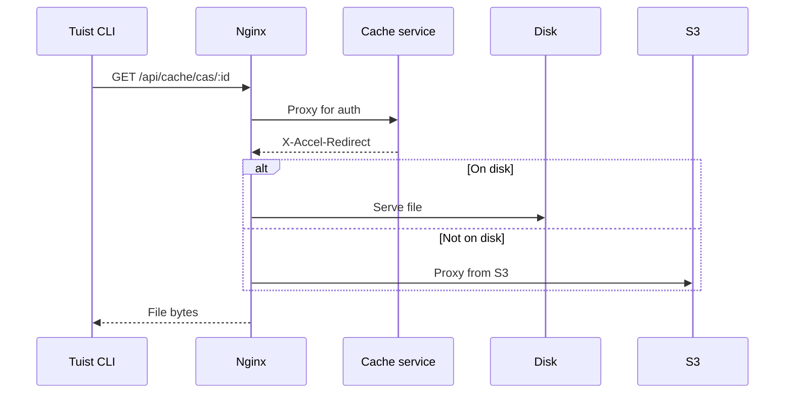
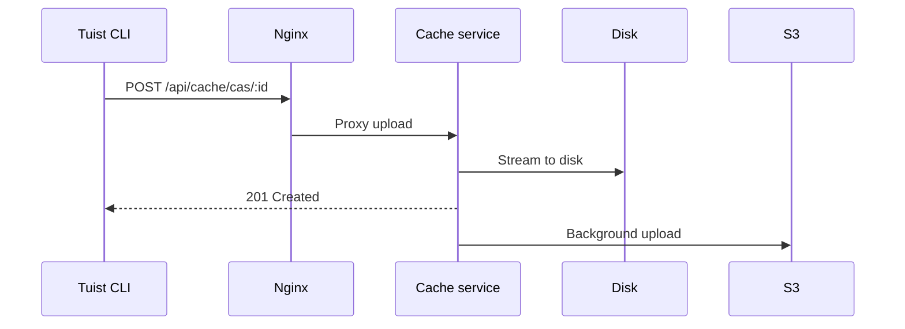

---
{
  "title": "Architecture",
  "titleTemplate": ":title | Cache | Guides | Tuist",
  "description": "Learn about the architecture of the Tuist cache service."
}
---

# Cache Architecture {#cache-architecture}

::: info
This page provides a technical overview of the Tuist cache service architecture. It is primarily intended for **self-hosting users** and **contributors** who need to understand the internal workings of the service. General users who only want to use the cache do not need to read this.
:::

The Tuist cache service is a standalone service that provides Content Addressable Storage (CAS) for build artifacts and a key-value store for cache metadata.

## Overview {#overview}

The service uses a two-tier storage architecture:

- **Local disk**: Primary storage for low-latency cache hits
- **S3**: Durable storage that persists artifacts and allows recovery after eviction

## Components {#components}

### Nginx {#nginx}

Nginx serves as the entry point and handles efficient file delivery using `X-Accel-Redirect`:

- **Downloads**: The cache service validates authentication, then returns an `X-Accel-Redirect` header. Nginx serves the file directly from disk or proxies from S3.
- **Uploads**: Nginx proxies requests to the cache service, which streams data to disk.

### Content Addressable Storage {#cas}

Artifacts are stored on local disk in a sharded directory structure:

- **Path**: `{account}/{project}/cas/{shard1}/{shard2}/{artifact_id}`
- **Sharding**: First four characters of the artifact ID create a two-level shard (e.g., `ABCD1234` → `AB/CD/ABCD1234`)

### S3 Integration {#s3}

S3 provides durable storage:

- **Background uploads**: After writing to disk, artifacts are queued for upload to S3 via a background worker that runs every minute
- **On-demand hydration**: When a local artifact is missing, the request is served immediately via a presigned S3 URL while the artifact is queued for background download to local disk

### Disk Eviction {#eviction}

The service manages disk space using LRU eviction:

- Access times are tracked in SQLite
- When disk usage exceeds 85%, the oldest artifacts are deleted until usage drops to 70%
- Artifacts remain in S3 after local eviction

### Authentication {#authentication}

The cache delegates authentication to the Tuist server by calling the `/api/projects` endpoint and caching results (10 minutes for success, 3 seconds for failure).

## Request Flows {#request-flows}

### Download {#download-flow}

### Upload {#upload-flow}

## API Endpoints {#api-endpoints}

| Endpoint | Method | Description |
|----------|--------|-------------|
| `/up` | GET | Health check |
| `/metrics` | GET | Prometheus metrics |
| `/api/cache/cas/:id` | GET | Download CAS artifact |
| `/api/cache/cas/:id` | POST | Upload CAS artifact |
| `/api/cache/keyvalue/:cas_id` | GET | Get key-value entry |
| `/api/cache/keyvalue` | PUT | Store key-value entry |
| `/api/cache/module/:id` | HEAD | Check if module artifact exists |
| `/api/cache/module/:id` | GET | Download module artifact |
| `/api/cache/module/start` | POST | Start multipart upload |
| `/api/cache/module/part` | POST | Upload part |
| `/api/cache/module/complete` | POST | Complete multipart upload |
