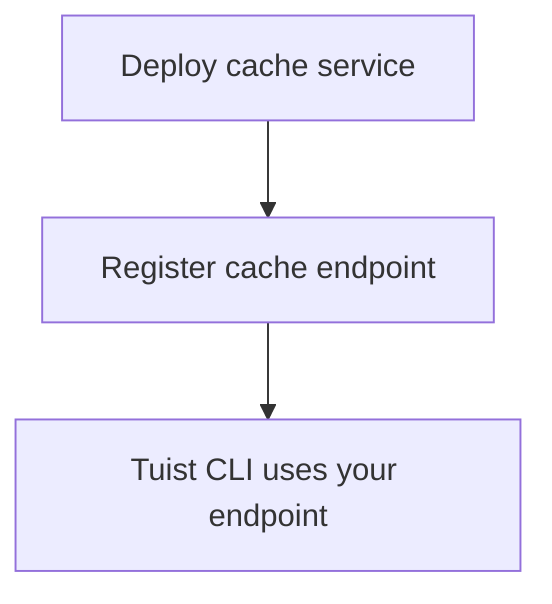

---
{
  "title": "Self-hosting",
  "titleTemplate": ":title | Cache | Guides | Tuist",
  "description": "Learn how to self-host the Tuist cache service."
}
---

# Self-host Cache {#self-host-cache}

The Tuist cache service can be self-hosted to provide a private binary cache for your team. This is most useful for organizations with large artifacts and frequent builds, where placing the cache closer to your CI infrastructure reduces latency and improves cache efficiency. By minimizing the distance between your build agents and the cache, you ensure that network overhead doesn't negate the speed benefits of caching.

::: info
<!-- -->
Self-hosting cache nodes requires an **Enterprise plan**.

You can connect self-hosted cache nodes to either the hosted Tuist server (`https://tuist.dev`) or a self-hosted Tuist server. Self-hosting the Tuist server itself requires a separate server license. See the <LocalizedLink href="/guides/server/self-host/install">server self-hosting guide</LocalizedLink>.
<!-- -->
:::

## Prerequisites {#prerequisites}

- Docker and Docker Compose
- S3-compatible storage bucket
- A running Tuist server instance (hosted or self-hosted)

## Deployment {#deployment}

The cache service is distributed as a Docker image at [ghcr.io/tuist/cache](https://ghcr.io/tuist/cache). We provide reference configuration files in the [cache directory](https://github.com/tuist/tuist/tree/main/cache).

::: tip
<!-- -->
We provide a Docker Compose setup because it's a convenient baseline for evaluation and small deployments. You can use it as a reference and adapt it to your preferred deployment model (Kubernetes, raw Docker, etc.).
<!-- -->
:::

### Configuration files {#config-files}

```bash
curl -O https://raw.githubusercontent.com/tuist/tuist/main/cache/docker-compose.yml
mkdir -p docker
curl -o docker/nginx.conf https://raw.githubusercontent.com/tuist/tuist/main/cache/docker/nginx.conf
```

### Environment variables {#environment-variables}

Create a `.env` file with your configuration.

::: tip
<!-- -->
The service is built with Elixir/Phoenix, so some variables use the `PHX_` prefix. You can treat these as standard service configuration.
<!-- -->
:::

```env
# Secret key used to sign and encrypt data. Minimum 64 characters.
# Generate with: openssl rand -base64 64
SECRET_KEY_BASE=YOUR_SECRET_KEY_BASE

# Public hostname or IP address where your cache service will be reachable.
PUBLIC_HOST=cache.example.com

# URL of the Tuist server used for authentication (REQUIRED).
# - Hosted: https://tuist.dev
# - Self-hosted: https://your-tuist-server.example.com
SERVER_URL=https://tuist.dev

# S3 Storage configuration
S3_BUCKET=your-cache-bucket
S3_HOST=s3.us-east-1.amazonaws.com
S3_ACCESS_KEY_ID=your-access-key
S3_SECRET_ACCESS_KEY=your-secret-key
S3_REGION=us-east-1

# CAS storage (required for non-compose deployments)
DATA_DIR=/data
```

| Variable | Required | Default | Description |
|----------|----------|---------|-------------|
| `SECRET_KEY_BASE` | Yes | | Secret key used to sign and encrypt data (minimum 64 characters). |
| `PUBLIC_HOST` | Yes | | Public hostname or IP address of your cache service. Used to generate absolute URLs. |
| `SERVER_URL` | Yes | | URL of your Tuist server for authentication. Defaults to `https://tuist.dev` |
| `DATA_DIR` | Yes | | Directory where CAS artifacts are stored on disk. The provided Docker Compose setup uses `/data`. |
| `S3_BUCKET` | Yes | | S3 bucket name. |
| `S3_HOST` | Yes | | S3 endpoint hostname. |
| `S3_ACCESS_KEY_ID` | Yes | | S3 access key. |
| `S3_SECRET_ACCESS_KEY` | Yes | | S3 secret key. |
| `S3_REGION` | Yes | | S3 region. |
| `CAS_DISK_HIGH_WATERMARK_PERCENT` | No | `85` | Disk usage percentage that triggers LRU eviction. |
| `CAS_DISK_TARGET_PERCENT` | No | `70` | Target disk usage after eviction. |
| `PHX_SOCKET_PATH` | No | `/run/cache/cache.sock` | Path where the service creates its Unix socket (when enabled). |
| `PHX_SOCKET_LINK` | No | `/run/cache/current.sock` | Symlink path that Nginx uses to connect to the service. |

### Start the service {#start-service}

```bash
docker compose up -d
```

### Verify the deployment {#verify}

```bash
curl http://localhost/up
```

## Configure the cache endpoint {#configure-endpoint}

After deploying the cache service, register it with your Tuist server:

- **Hosted Tuist server** (`https://tuist.dev`):
  1. Navigate to your organization's **Settings** page.
  2. Find the **Custom cache endpoints** section.
  3. Add your cache service URL (for example, `https://cache.example.com`).

- **Self-hosted Tuist server**:
  1. Set `TUIST_CACHE_ENDPOINTS` to a comma-separated list of cache node URLs (for example, `https://cache-1.example.com,https://cache-2.example.com`).
  2. Restart the Tuist server to apply the configuration.

<!-- TODO: Add screenshot of organization settings page showing Custom cache endpoints section -->



Once configured, the Tuist CLI will use your self-hosted cache.

## Volumes {#volumes}

The Docker Compose configuration uses three volumes:

| Volume | Purpose |
|--------|---------|
| `cas_data` | Binary artifact storage |
| `sqlite_data` | Access metadata for LRU eviction |
| `cache_socket` | Unix socket for Nginx-service communication |

## Health checks {#health-checks}

- `GET /up` — Returns 200 when healthy
- `GET /metrics` — Prometheus metrics

## Monitoring {#monitoring}

The cache service exposes Prometheus-compatible metrics at `/metrics`.

If you use Grafana, you can import the [reference dashboard](https://raw.githubusercontent.com/tuist/tuist/refs/heads/main/cache/priv/grafana_dashboards/cache_service.json).

## Upgrading {#upgrading}

```bash
docker compose pull
docker compose up -d
```

The service runs database migrations automatically on startup.

## Troubleshooting {#troubleshooting}

### Cache not being used {#troubleshooting-caching}

If you expect caching but are seeing consistent cache misses (for example, the CLI is repeatedly uploading the same artifacts, or downloads never happen), follow these steps:

1. Verify the custom cache endpoint is correctly configured in your organization settings.
2. Ensure your Tuist CLI is authenticated by running `tuist auth login`.
3. Check the cache service logs for any errors: `docker compose logs cache`.

### Socket path mismatch {#troubleshooting-socket}

If you see connection refused errors:

- Ensure `PHX_SOCKET_LINK` points to the socket path configured in nginx.conf (default: `/run/cache/current.sock`)
- Verify `PHX_SOCKET_PATH` and `PHX_SOCKET_LINK` are both set correctly in docker-compose.yml
- Verify the `cache_socket` volume is mounted in both containers
