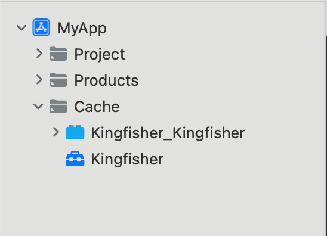

# Optimize workflows

Because Tuist knows your project through your description and the insights it collects, it can optimize your workflows to make them more efficient. Let's see some examples.

## Smart test runs

Let's run `tuist test` again. You'll notice the following message:

```bash
There are no tests to run, finishing early
```

Tuist detected that you didn't change anything in your project since last time you ran the tests, and therefore re-running the tests is not needed. And the best of all is that this works across different machines and CI environments.

## Cache

If you clean build the project, which you usually do on CI or after cleaning the global cache in the hope of fixing cryptic compilation issues, you have to compile the whole project from scratch. When the project becomes large, this can take a long time.

Tuist solves that by re-using binaries from previous builds. Run the following command:

```bash
tuist cache
```

The command will build and share all the cacheable targets in your project in a local and remote cache. After it completes, try generating the project:

```bash
tuist generate
```

You'll notice your project groups includes a new group `Cache` containing the binaries from the cache.



If you push your changes upstream to a remote repository, other developers can clone the project, and run the following commands:

```bash
tuist install
tuist auth
tuist generate
```

And they'll suddenly get a project with the dependencies as binaries.

## Optimizations on CI

If want to access those optimizations on CI, 
you'll have to generate a project-scoped token to authenticate requests in the CI environment.

```bash
tuist project tokens create my-handle/MyApp
```

Then expose the token as an environment variable `TUIST_CONFIG_TOKEN` in your CI environment. The presence of the token will automatically enable the optimizations and insights.

> [!IMPORTANT] CI ENVIRONMENT DETECTION
> Tuist only uses the token when it detects it's running on a CI environment. If your CI environment is not detected, you can force the token usage by setting the environment variable `CI` to `1`.