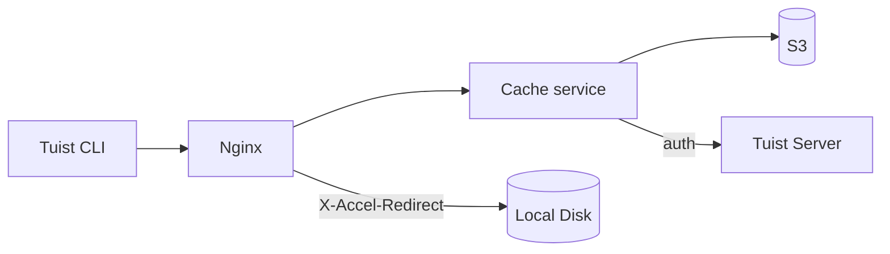
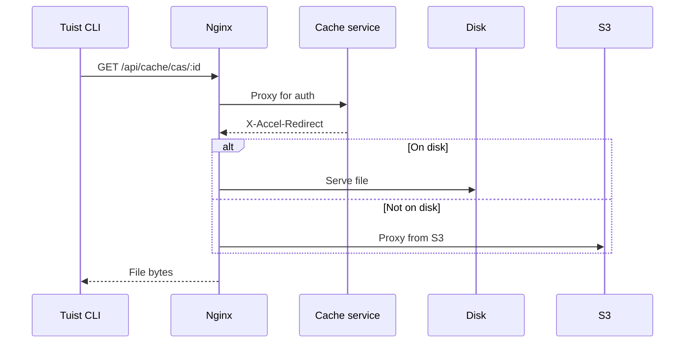
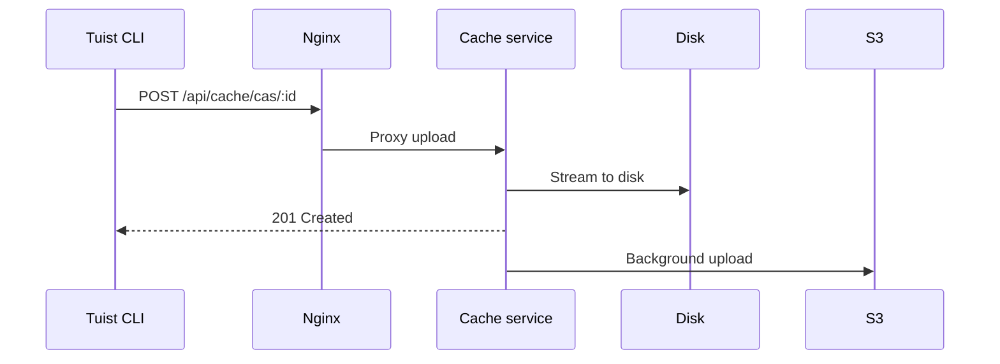

---
{
  "title": "Architecture",
  "titleTemplate": ":title | Cache | Guides | Tuist",
  "description": "Learn about the architecture of the Tuist cache service."
}
---

# Arquitectura de caché {#cache-architecture}

::: info
<!-- -->
Esta página ofrece una descripción técnica general de la arquitectura del
servicio de caché de Tuist. Está dirigida principalmente a los usuarios de
autoalojamiento de **, los colaboradores de** y **, y los colaboradores de** que
necesitan comprender el funcionamiento interno del servicio. Los usuarios
generales que solo desean utilizar la caché no necesitan leer esto.
<!-- -->
:::

El servicio de caché de Tuist es un servicio independiente que proporciona
almacenamiento direccionable por contenido (CAS) para artefactos de compilación
y un almacén de claves-valores para metadatos de caché.

## Resumen {#overview}

El servicio utiliza una arquitectura de almacenamiento de dos niveles:

- **Disco local**: almacenamiento primario para accesos a caché de baja
  latencia.
- **S3**: almacenamiento duradero que conserva los artefactos y permite la
  recuperación tras la expulsión.

## Componentes {#components}

### Nginx {#nginx}

Nginx sirve como punto de entrada y gestiona la entrega eficiente de archivos
utilizando `X-Accel-Redirect`:

- **Descargas**: El servicio de caché valida la autenticación y, a continuación,
  devuelve un encabezado `X-Accel-Redirect`. Nginx sirve el archivo directamente
  desde el disco o los proxies desde S3.
- **Cargas**: Nginx proxy las solicitudes al servicio de caché, que transmite
  los datos al disco.

### Almacenamiento direccionable por contenido. {#cas}

Los artefactos se almacenan en el disco local en una estructura de directorios
fragmentada:

- **Ruta**: `{cuenta}/{proyecto}/cas/{shard1}/{shard2}/{artifact_id}`
- **Fragmentación**: Los cuatro primeros caracteres del ID del artefacto crean
  una fragmentación de dos niveles (por ejemplo, `ABCD1234` → `AB/CD/ABCD1234`).

### Integración S3 {#s3}

S3 proporciona almacenamiento duradero:

- **Cargas en segundo plano**: Después de escribir en el disco, los artefactos
  se ponen en cola para su carga en S3 a través de un trabajador en segundo
  plano que se ejecuta cada minuto.
- **Hidratación bajo demanda**: cuando falta un artefacto local, la solicitud se
  atiende inmediatamente a través de una URL S3 presignada, mientras que el
  artefacto se pone en cola para su descarga en segundo plano en el disco local.

### Expulsión del disco {#eviction}

El servicio gestiona el espacio en disco utilizando la expulsión LRU:

- Los tiempos de acceso se registran en SQLite.
- Cuando el uso del disco supera el 85 %, se eliminan los artefactos más
  antiguos hasta que el uso desciende al 70 %.
- Los artefactos permanecen en S3 después de la expulsión local.

### Autenticación {#authentication}

La caché delega la autenticación al servidor Tuist llamando al punto final
`/api/projects` y almacenando los resultados en caché (10 minutos si se realiza
correctamente, 3 segundos si falla).

## Flujos de solicitudes {#request-flows}

### Descargar {#download-flow}

### Subir {#upload-flow}

## Puntos finales de la API {#api-endpoints}

| Punto final                   | Método   | Descripción                                  |
| ----------------------------- | -------- | -------------------------------------------- |
| `/up`                         | OBTENER  | Comprobación de estado                       |
| `/metrics`                    | OBTENER  | Métricas de Prometheus                       |
| `/api/cache/cas/:id`          | OBTENER  | Descargar artefacto CAS                      |
| `/api/cache/cas/:id`          | PUBLICAR | Subir artefacto CAS                          |
| `/api/cache/keyvalue/:cas_id` | OBTENER  | Obtener entrada clave-valor                  |
| `/api/cache/keyvalue`         | PUT      | Almacenar entradas clave-valor.              |
| `/api/cache/module/:id`       | HEAD     | Comprueba si existe el artefacto del módulo. |
| `/api/cache/module/:id`       | OBTENER  | Descargar artefacto del módulo               |
| `/api/cache/module/start`     | PUBLICAR | Iniciar carga multiparte                     |
| `/api/cache/module/part`      | PUBLICAR | Subir parte                                  |
| `/api/cache/module/complete`  | PUBLICAR | Carga completa de varias partes.             |
