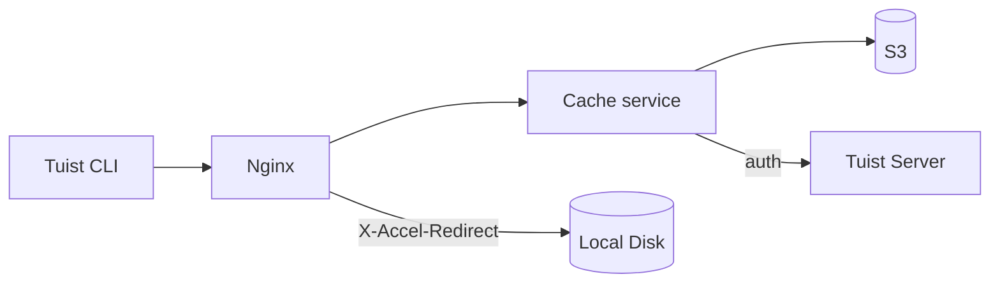
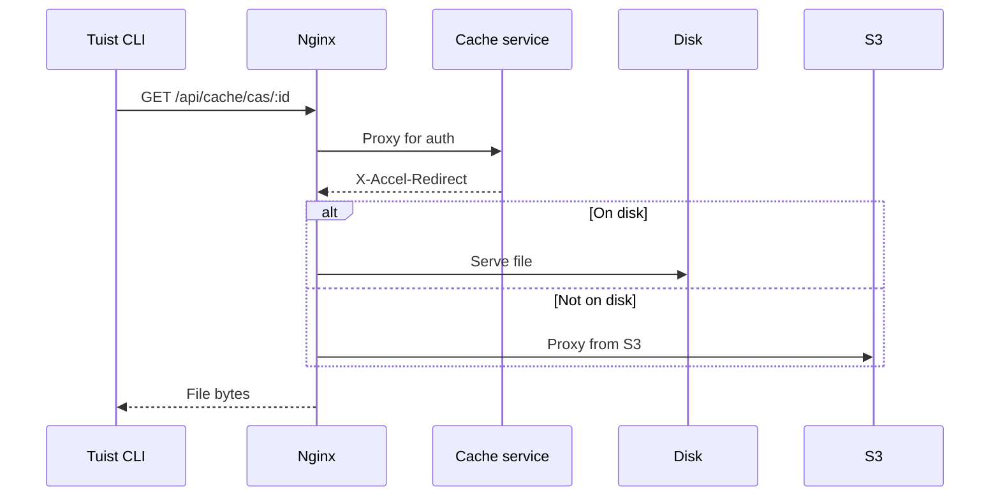
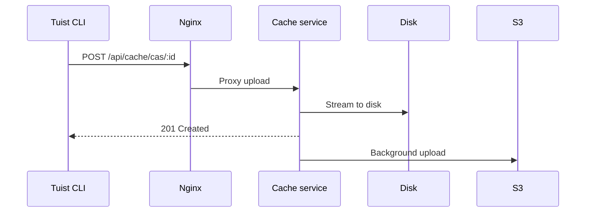

---
{
  "title": "Architecture",
  "titleTemplate": ":title | Cache | Guides | Tuist",
  "description": "Learn about the architecture of the Tuist cache service."
}
---

# Arquitectura de caché {#cache-architecture}

::: info
<!-- -->
Esta página ofrece una descripción técnica general de la arquitectura del
servicio de caché de Tuist. Está dirigida principalmente a los usuarios que
alojan **por su cuenta** y a los colaboradores de **** que necesitan comprender
el funcionamiento interno del servicio. Los usuarios generales que solo deseen
utilizar la caché no necesitan leer esto.
<!-- -->
:::

El servicio de caché de Tuist es un servicio independiente que proporciona
almacenamiento direccionable por contenido (CAS) para artefactos de compilación
y un almacén de clave-valor para metadatos de caché.

## Resumen {#overview}

El servicio utiliza una arquitectura de almacenamiento de dos niveles:

- **Disco local**: Almacenamiento principal para aciertos de caché de baja
  latencia
- **S3**: Almacenamiento duradero que conserva los artefactos y permite su
  recuperación tras su eliminación

```mermaid
flowchart LR
    CLI[Tuist CLI] --> NGINX[Nginx]
    NGINX --> APP[Cache service]
    NGINX -->|X-Accel-Redirect| DISK[(Local Disk)]
    APP --> S3[(S3)]
    APP -->|auth| SERVER[Tuist Server]
```

## Componentes {#components}

### Nginx {#nginx}

Nginx actúa como punto de entrada y gestiona la entrega eficiente de archivos
utilizando `X-Accel-Redirect`:

- **Descargas**: El servicio de caché valida la autenticación y, a continuación,
  devuelve un encabezado `X-Accel-Redirect`. Nginx sirve el archivo directamente
  desde el disco o a través de un proxy desde S3.
- **Cargas**: Nginx redirige las solicitudes al servicio de caché, que transmite
  los datos al disco.

### Almacenamiento direccionable por contenido {#cas}

Los artefactos se almacenan en el disco local en una estructura de directorios
fragmentada:

- **Ruta**: `{cuenta}/{proyecto}/cas/{shard1}/{shard2}/{artifact_id}`
- **Fragmentación**: Los cuatro primeros caracteres del ID del artefacto crean
  un fragmento de dos niveles (p. ej., `ABCD1234` → `AB/CD/ABCD1234`)

### Integración con S3 {#s3}

S3 ofrece almacenamiento duradero:

- **Cargas en segundo plano**: Tras escribirse en el disco, los artefactos se
  ponen en cola para su carga a S3 a través de un proceso en segundo plano que
  se ejecuta cada minuto
- **Hidratación bajo demanda**: Cuando falta un artefacto local, la solicitud se
  atiende inmediatamente a través de una URL de S3 prefirmada, mientras que el
  artefacto se pone en cola para su descarga en segundo plano al disco local

### Desalojo de disco {#eviction}

El servicio gestiona el espacio en disco mediante la expulsión LRU:

- Los tiempos de acceso se registran en SQLite
- Cuando el uso del disco supera el 85 %, se eliminan los artefactos más
  antiguos hasta que el uso descienda al 70 %.
- Los artefactos permanecen en S3 tras la expulsión local

### Autenticación {#authentication}

La caché delega la autenticación al servidor de Tuist llamando al punto final
`/api/projects` y almacenando los resultados en caché (10 minutos en caso de
éxito, 3 segundos en caso de fallo).

## Flujos de solicitud {#request-flows}

### Descargar {#download-flow}

```mermaid
sequenceDiagram
    participant CLI as Tuist CLI
    participant N as Nginx
    participant A as Cache service
    participant D as Disk
    participant S as S3

    CLI->>N: GET /api/cache/cas/:id
    N->>A: Proxy for auth
    A-->>N: X-Accel-Redirect
    alt On disk
        N->>D: Serve file
    else Not on disk
        N->>S: Proxy from S3
    end
    N-->>CLI: File bytes
```

### Subir {#upload-flow}

```mermaid
sequenceDiagram
    participant CLI as Tuist CLI
    participant N as Nginx
    participant A as Cache service
    participant D as Disk
    participant S as S3

    CLI->>N: POST /api/cache/cas/:id
    N->>A: Proxy upload
    A->>D: Stream to disk
    A-->>CLI: 201 Created
    A->>S: Background upload
```

## Puntos finales de la API {#api-endpoints}

| Punto final                   | Método | Descripción                                 |
| ----------------------------- | ------ | ------------------------------------------- |
| `/up`                         | GET    | Revisión de calidad                         |
| `/metrics`                    | GET    | Métricas de Prometheus                      |
| `/api/cache/cas/:id`          | GET    | Descargar artefacto CAS                     |
| `/api/cache/cas/:id`          | POST   | Subir artefacto CAS                         |
| `/api/cache/keyvalue/:cas_id` | GET    | Obtener entrada clave-valor                 |
| `/api/cache/keyvalue`         | PUT    | Almacenar entrada clave-valor               |
| `/api/cache/module/:id`       | HEAD   | Comprueba si existe el artefacto del módulo |
| `/api/cache/module/:id`       | GET    | Descargar artefacto del módulo              |
| `/api/cache/module/start`     | POST   | Iniciar carga multiparte                    |
| `/api/cache/module/part`      | POST   | Subir parte                                 |
| `/api/cache/module/complete`  | POST   | Completar la carga de varios archivos       |
