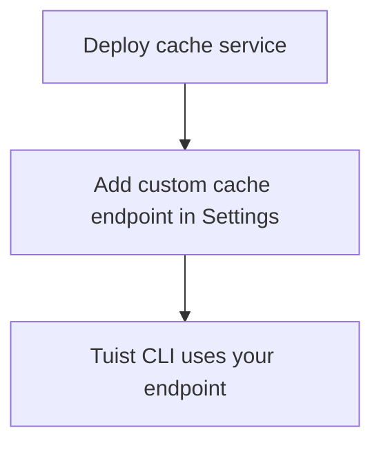

---
{
  "title": "Self-hosting",
  "titleTemplate": ":title | Cache | Guides | Tuist",
  "description": "Learn how to self-host the Tuist cache service."
}
---

# Caché autohospedada. {#self-host-cache}

El servicio de caché de Tuist se puede alojar de forma autónoma para
proporcionar una caché binaria privada a tu equipo. Esto resulta muy útil para
organizaciones con artefactos de gran tamaño y compilaciones frecuentes, en las
que colocar la caché más cerca de tu infraestructura de CI reduce la latencia y
mejora la eficiencia de la caché. Al minimizar la distancia entre tus agentes de
compilación y la caché, te aseguras de que la sobrecarga de la red no anule las
ventajas de velocidad del almacenamiento en caché.

::: info
<!-- -->
El autoalojamiento de nodos de caché requiere un plan Enterprise de **** .

Puede conectar nodos de caché autohospedados al servidor Tuist alojado
(`https://tuist.dev`) o a un servidor Tuist autohospedado. El autohospedaje del
servidor Tuist requiere una licencia de servidor independiente. Consulte la
<LocalizedLink href="/guides/server/self-host/install">guía de autohospedaje del
servidor</LocalizedLink>.
<!-- -->
:::

## Requisitos previos {#prerequisites}

- Docker y Docker Compose
- Bucket de almacenamiento compatible con S3.
- Una instancia del servidor Tuist en ejecución (alojada o autohospedada).

## Despliegue {#deployment}

El servicio de caché se distribuye como una imagen Docker en
[ghcr.io/tuist/cache](https://ghcr.io/tuist/cache). Proporcionamos archivos de
configuración de referencia en el [directorio de
caché](https://github.com/tuist/tuist/tree/main/cache).

::: consejo
<!-- -->
Proporcionamos una configuración de Docker Compose porque es una base
conveniente para la evaluación y las implementaciones pequeñas. Puede utilizarla
como referencia y adaptarla a su modelo de implementación preferido (Kubernetes,
Docker sin procesar, etc.).
<!-- -->
:::

### Archivos de configuración {#config-files}

```bash
curl -O https://raw.githubusercontent.com/tuist/tuist/main/cache/docker-compose.yml
mkdir -p docker
curl -o docker/nginx.conf https://raw.githubusercontent.com/tuist/tuist/main/cache/docker/nginx.conf
```

### Variables de entorno {#environment-variables}

Crea un archivo `.env` con tu configuración.

::: consejo
<!-- -->
El servicio está creado con Elixir/Phoenix, por lo que algunas variables
utilizan el prefijo `PHX_`. Puede tratarlas como una configuración de servicio
estándar.
<!-- -->
:::

```env
# Secret key used to sign and encrypt data. Minimum 64 characters.
# Generate with: openssl rand -base64 64
SECRET_KEY_BASE=YOUR_SECRET_KEY_BASE

# Public hostname or IP address where your cache service will be reachable.
PUBLIC_HOST=cache.example.com

# URL of the Tuist server used for authentication (REQUIRED).
# - Hosted: https://tuist.dev
# - Self-hosted: https://your-tuist-server.example.com
SERVER_URL=https://tuist.dev

# S3 Storage configuration
S3_BUCKET=your-cache-bucket
S3_HOST=s3.us-east-1.amazonaws.com
S3_ACCESS_KEY_ID=your-access-key
S3_SECRET_ACCESS_KEY=your-secret-key
S3_REGION=us-east-1

# CAS storage (required for non-compose deployments)
DATA_DIR=/data
```

| Variable                          | Requerido | Por defecto               | Descripción                                                                                                                     |
| --------------------------------- | --------- | ------------------------- | ------------------------------------------------------------------------------------------------------------------------------- |
| `SECRET_KEY_BASE`                 | Sí        |                           | Clave secreta utilizada para firmar y cifrar datos (mínimo 64 caracteres).                                                      |
| `PUBLIC_HOST`                     | Sí        |                           | Nombre de host público o dirección IP de su servicio de caché. Se utiliza para generar URL absolutas.                           |
| `SERVER_URL`                      | Sí        |                           | URL de tu servidor Tuist para la autenticación. El valor predeterminado es `https://tuist.dev`                                  |
| `DATA_DIR`                        | Sí        |                           | Directorio donde se almacenan los artefactos CAS en el disco. La configuración de Docker Compose proporcionada utiliza `/data`. |
| `S3_BUCKET`                       | Sí        |                           | Nombre del bucket S3.                                                                                                           |
| `S3_HOST`                         | Sí        |                           | Nombre de host del punto final S3.                                                                                              |
| `S3_ACCESS_KEY_ID`                | Sí        |                           | Clave de acceso S3.                                                                                                             |
| `S3_SECRET_ACCESS_KEY`            | Sí        |                           | Clave secreta S3.                                                                                                               |
| `S3_REGION`                       | Sí        |                           | Región S3.                                                                                                                      |
| `CAS_DISK_HIGH_WATERMARK_PERCENT` | No        | `85`                      | Porcentaje de uso del disco que activa la expulsión LRU.                                                                        |
| `CAS_DISK_TARGET_PERCENT`         | No        | `70`                      | Uso del disco de destino tras la expulsión.                                                                                     |
| `PHX_SOCKET_PATH`                 | No        | `/run/cache/cache.sock`   | Ruta en la que el servicio crea su socket Unix (cuando está habilitado).                                                        |
| `PHX_SOCKET_LINK`                 | No        | `/run/cache/current.sock` | Ruta del enlace simbólico que Nginx utiliza para conectarse al servicio.                                                        |

### Inicie el servicio. {#start-service}

```bash
docker compose up -d
```

### Verifica la implementación. {#verify}

```bash
curl http://localhost/up
```

## Configurar el punto final de la caché {#configure-endpoint}

Después de implementar el servicio de caché, regístralo en la configuración de
la organización de tu servidor Tuist:

1. Navega a la página **Settings** de tu organización.
2. Busca la sección « **» (Puntos finales de caché personalizados) en «** »
   (Configuración de caché).
3. Añade la URL de tu servicio de caché (por ejemplo,
   `https://cache.example.com`).

<!-- TODO: Add screenshot of organization settings page showing Custom cache endpoints section -->



Una vez configurado, el CLI de Tuist utilizará tu caché autohospedada.

## Volúmenes {#volumes}

La configuración de Docker Compose utiliza tres volúmenes:

| Volumen        | Propósito                                                   |
| -------------- | ----------------------------------------------------------- |
| `cas_data`     | Almacenamiento de artefactos binarios.                      |
| `sqlite_data`  | Acceder a los metadatos para la expulsión LRU.              |
| `cache_socket` | Socket Unix para la comunicación entre Nginx y el servicio. |

## Comprobaciones de salud {#health-checks}

- `GET /up` — Devuelve 200 cuando está en buen estado.
- `GET /metrics` — Métricas de Prometheus

## Supervisión {#monitoring}

El servicio de caché expone métricas compatibles con Prometheus en `/metrics`.

Si utilizas Grafana, puedes importar el [panel de
referencia](https://raw.githubusercontent.com/tuist/tuist/refs/heads/main/cache/priv/grafana_dashboards/cache_service.json).

## Actualización {#upgrading}

```bash
docker compose pull
docker compose up -d
```

El servicio ejecuta migraciones de bases de datos automáticamente al iniciarse.

## Solución de problemas {#troubleshooting}

### La caché no se está utilizando. {#troubleshooting-caching}

Si espera que se produzca el almacenamiento en caché, pero observa fallos
constantes en la caché (por ejemplo, la CLI carga repetidamente los mismos
artefactos o las descargas nunca se producen), siga estos pasos:

1. Comprueba que el punto final de la caché personalizada esté configurado
   correctamente en los ajustes de tu organización.
2. Asegúrate de que tu CLI de Tuist está autenticada ejecutando `tuist auth
   login`.
3. Comprueba los registros del servicio de caché para ver si hay algún error:
   `docker compose logs cache`.

### La ruta del socket no coincide. {#troubleshooting-socket}

Si ves errores de conexión rechazada:

- Asegúrate de que `PHX_SOCKET_LINK` apunta a la ruta del socket configurada en
  nginx.conf (por defecto: `/run/cache/current.sock`)
- Verifica que `PHX_SOCKET_PATH` y `PHX_SOCKET_LINK` estén configurados
  correctamente en docker-compose.yml.
- Verifique que el volumen `cache_socket` esté montado en ambos contenedores.
