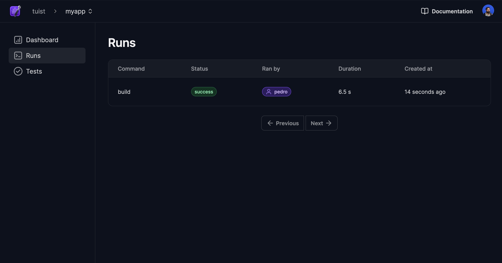

# Gather insights

Tuist can integrate with a server to extend its capabilities. One of those capabilities is gathering insights about your project and builds. All you need is to have an account with a project in the server. 

First of all, you'll need to authenticate by running:

```bash
tuist auth
```

## Create a project

You can then create a project by running:

```bash
tuist project create MyApp -o my-handle

# Tuist project tuist/myapp was successfully created 🎉
```

Copy `tuist/myapp`, which represents the full handle of the project.

## Connect projects

After creating the project on the server, you'll have to connect it to your local project. Run `tuist edit`, and create a `Config.swift` file under Tuist with the following content:

```swift
import ProjectDescription

let config = Config(cloud: .cloud(projectId: "tuist/myapp"))
```

Where `projectId` is the full handle of the project you copied earlier.

Voilà! You're now ready to gather insights about your project and builds. Run `tuist test` to run the tests reporting the results to the server.




Having data from your projects and builds is crucial in making informed decisions.
Tuist will continue to extend its capabilities, and you'll benefit from them without having to change your project configuration. Magic, right? 🪄