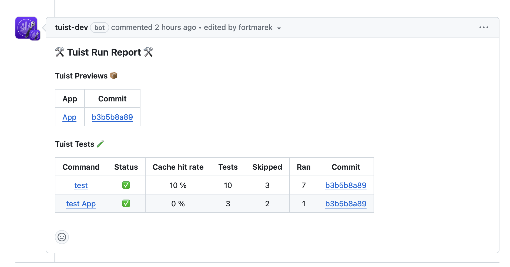

# Connect tools

One of Tuist's principles is: we meet developers where they are. And that means we do our best to integrate with other tools that you use day-to-day.

## Git hosts

Git repositories are the centerpiece of the vast majority of software projects out there. We integrate with your Git host to provide Tuist insights right in your pull requests or to save you some configuration such as syncing your default branch.

### GitHub

Install the GitHub app [here](https://github.com/marketplace/tuist). Once installed, you will need to tell Tuist the URL of your repository, such as:

```sh
tuist project update tuist/tuist --repository-url https://github.com/tuist/tuist
```

### Features

#### Pull or merge request comments

> [!IMPORTANT] REQUIREMENTS
> To get automatic Tuist comments, you need to ensure your [CI is authenticated](./continuous-integration#authentication)

We automatically post comments on your pull or merge request for selected Tuist commands:
- `tuist test`: Includes [Test](../test) overview and a link to the Tuist dashboard when you need to dig deeper.
- `tuist share`: When you share your app in your CI workflow, the comment includes a [Preview](../../share/previews) link.




