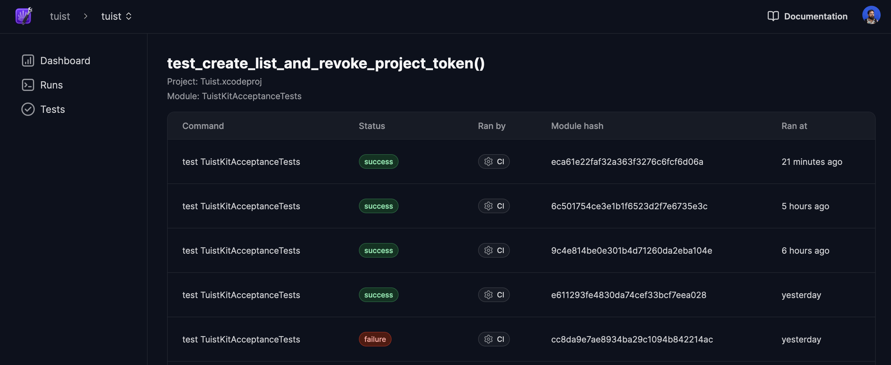

# Test flakiness

> [!IMPORTANT] REQUIRES AN ACCOUNT
> You need to be authenticated and have and [a project set up](/guides/quick-start/gather-insights) to persist and analyze test results across runs.

It's common in test suite to have flaky tests. Those are tests that sometimes pass and sometimes fail, even though the code under test hasn't changed. Flaky tests are a problem because **they reduce the trust in the test suite and make it harder to detect real regressions.** Moreover, they might slow down the development process because developers might need to rerun the tests multiple times until they pass.

Luckily, Tuist provides a solution to detect flay tests.

## Detecting flakiness

When running tests with [`tuist test`](/guides/develop/test), Tuist persists the result of each test case along with a unique hash that identifies the test state. The unique hash changes if either the module containing the test or any of its dependencies change. Thanks to the unique hash and the results, Tuist can determine if a test is flaky. A test case is flaky if it has yielded different results for the same hash.

In the project dashboard, you can see a list of flaky tests along with the test runs whose result bundles you can download to investigate the flakiness. For example, the image below shows a test case, `test_create_list_and_revoke_project_token`, that has been flagged as flaky:

