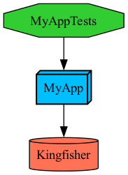

# Add dependencies

It's common for projects to depend on third-party libraries to provide additional functionality. To do so, run the following command to have the best experience editing your project:

```bash
tuist edit
```

An Xcode project will open containing your project files. Edit the `Package.swift` and add the 

```swift
// swift-tools-version: 5.9
import PackageDescription

#if TUIST
    import ProjectDescription

    let packageSettings = PackageSettings(
        // Customize the product types for specific package product
        // Default is .staticFramework
        // productTypes: ["Alamofire": .framework,] 
        productTypes: [:]
    )
#endif

let package = Package(
    name: "MyApp",
    dependencies: [
        // Add your own dependencies here:
        // .package(url: "https://github.com/Alamofire/Alamofire", from: "5.0.0"),
        // You can read more about dependencies here: https://docs.tuist.io/documentation/tuist/dependencies
        .package(url: "https://github.com/onevcat/Kingfisher", .upToNextMajor(from: "7.12.0")) // [!code ++]
    ]
)
```

Then edit the application target in your project to declare `Kingfisher` as a dependency:

```swift
import ProjectDescription

let project = Project(
    name: "MyApp",
    targets: [
        .target(
            name: "MyApp",
            destinations: .iOS,
            product: .app,
            bundleId: "io.tuist.MyApp",
            infoPlist: .extendingDefault(
                with: [
                    "UILaunchStoryboardName": "LaunchScreen.storyboard",
                ]
            ),
            sources: ["MyApp/Sources/**"],
            resources: ["MyApp/Resources/**"],
            dependencies: [
                .external(name: "Kingfisher") // [!code ++]
            ]
        ),
        .target(
            name: "MyAppTests",
            destinations: .iOS,
            product: .unitTests,
            bundleId: "io.tuist.MyAppTests",
            infoPlist: .default,
            sources: ["MyApp/Tests/**"],
            resources: [],
            dependencies: [.target(name: "MyApp")]
        ),
    ]
)
```

Then run `tuist install` to resolve and pull the dependencies using the [Swift Package Manager](https://www.swift.org/documentation/package-manager/).

> [!NOTE] SPM AS A DEPENDENCY RESOLVER
> Tuist recommended approach to dependencies uses the Swift Package Manager (SPM) only to resolve dependencies. Tuist then converts them into Xcode projects and targets for maximum configurability and control.

## Visualize the project

You can visualize the project structure by running:

```bash
tuist graph
```

The command will output and open a `graph.png` file in the project's directory:



## Use the dependency

Run `tuist generate` to open the project in Xcode, and make the following changes to the `ContentView.swift` file:

```swift
import SwiftUI
import Kingfisher // [!code ++]

public struct ContentView: View {
    public init() {}

    public var body: some View {
        Text("Hello, World!") // [!code --]
            .padding() // [!code --]
        KFImage(URL(string: "https://cloud.tuist.io/images/tuist_logo_32x32@2x.png")!) // [!code ++]
    }
}


struct ContentView_Previews: PreviewProvider {
    static var previews: some View {
        ContentView()
    }
}
```

Run the app from Xcode, and you should see the image loaded from the URL.