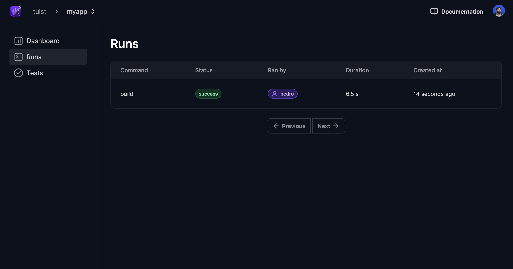

# Gather insights

Tuist can integrate with a server to extend its capabilities. One of those capabilities is gathering insights about your project and builds. All you need is to have an account with a project in the server. 

First of all, you'll need to authenticate by running:

```bash
tuist auth
```

## Create an organization (optional)

Unless you work on a personal project, you will need to create a Tuist organization, so that all your teammates get access to the new Tuist project. Run the following to create one:
```bash
tuist organization create MyOrganization
```

You will then need to invite your teammates:
```bash
tuist organization invite MyOrganization teammate1@org.com
tuist organization invite MyOrganization teammate2@org.com
```

Alternatively, you can use Google single sign-on (SSO):
```bash
tuist organization update --provider google --organization-id org.com
```

That way, anyone in your Google organization automatically gets access to projects created in your Tuist organization.

## Create a project

You can then create a project by running:

```bash
tuist project create MyOrganization/MyApp

# Tuist project MyOrganization/MyApp was successfully created 🎉
```

If you are creating a personal project, replace `MyOrganization` with your personal handle.

Copy `MyOrganization/MyApp`, which represents the full handle of the project.

## Connect projects

After creating the project on the server, you'll have to connect it to your local project. Run `tuist edit` and edit the `Config.swift` file to include the full handle of the project:

```swift
import ProjectDescription

let config = Config(fullHandle: "my-handle/MyApp")
```

Voilà! You're now ready to gather insights about your project and builds. Run `tuist test` to run the tests reporting the results to the server.

> [!NOTE]
> Tuist enqueues the results locally and tries to send them without blocking the command. Therefore, they might not be sent immediately after the command finishes. In CI, the results are sent immediately.




Having data from your projects and builds is crucial in making informed decisions.
Tuist will continue to extend its capabilities, and you'll benefit from them without having to change your project configuration. Magic, right? 🪄