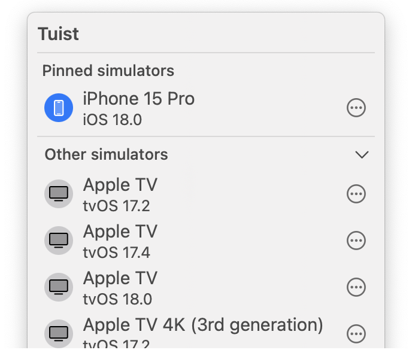

# Previews


When building an app, you may want to share it with others to get feedback.
Traditionally, this is something that teams do by building, signing, and pushing their apps to platforms like Apple's [TestFlight](https://developer.apple.com/testflight/).
However, this process can be cumbersome and slow, especially when you're just looking for quick feedback from a colleague or a friend.

To make this process more streamlined, Tuist provides a way to generate and share previews of your apps with anyone.

> [!IMPORTANT] ONLY SIMULATOR ARCHITECTURES ARE CURRENTLY SUPPORTED
> We only support simulator architectures for previews at the moment. Support for devices will come in the future.

:::code-group
```bash [Tuist Project]
tuist build App # Build the app first
tuist share App
```
```bash [Xcode Project]
xcodebuild -scheme App -project App.xcodeproj -configuration Debug
tuist share App --configuration Debug --platform iOS
```
:::

The command will generate a link that you can share with anyone to run the app. All they'll need to do is to run the command below:

```bash
tuist run {url}
```

> [!IMPORTANT] PREVIEWS' VISIBILITY
> Only people with access to the organization the project belongs to can access the previews. We plan to add support for expiring links.

## Tuist macOS app

<div style="display: flex; flex-direction: column; align-items: center;">
    
    <h1>Tuist</h1>
    <a href="https://cloud.tuist.io/download" style="text-decoration: none;">Download</a>
    
</div>

To make running Tuist Previews even easier, we developed a Tuist macOS menu bar app. Instead of running Previews via the Tuist CLI, you can [download](https://cloud.tuist.io/download) the macOS app. When you open a Preview link in the browser, the app will automatically launch on your currently selected device.

> [!IMPORTANT] REQUIREMENTS
> To download Previews, you need to first authenticate with the `tuist auth` command.
> In the future, you will be able to authenticate directly in the app.
>
> Additionally, you need to have Xcode locally installed.