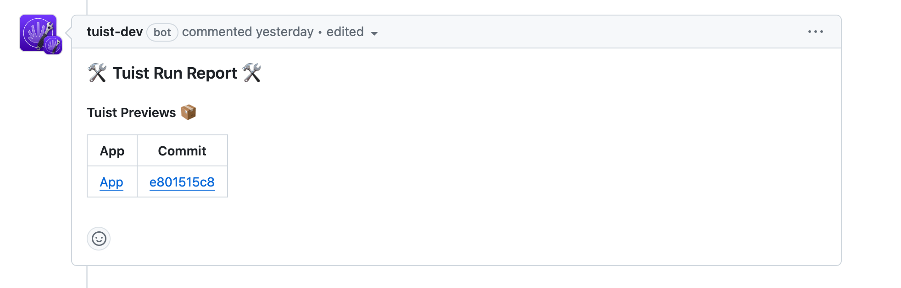

# Previews

> [!IMPORTANT] XCODEPROJ-COMPATIBLE
> This feature is compatible with raw Xcode projects.

> [!IMPORTANT] REMOTE PROJECT REQUIRED
> This feature requires a [remote project](/server/introduction/accounts-and-projects#projects).


When building an app, you may want to share it with others to get feedback.
Traditionally, this is something that teams do by building, signing, and pushing their apps to platforms like Apple's [TestFlight](https://developer.apple.com/testflight/).
However, this process can be cumbersome and slow, especially when you're just looking for quick feedback from a colleague or a friend.

To make this process more streamlined, Tuist provides a way to generate and share previews of your apps with anyone.

> [!IMPORTANT] DEVICE BUILDS NEED TO BE SIGNED
> When building for device, it is currently your responsibility to ensure the app is signed correctly. We plan to streamline this in the future.

:::code-group
```bash [Tuist Project]
tuist build App # Build the app for the simulator
tuist build App -- -destination 'generic/platform=iOS' # Build the app for the device
tuist share App
```
```bash [Xcode Project]
xcodebuild -scheme App -project App.xcodeproj -configuration Debug # Build the app for the simulator
xcodebuild -scheme App -project App.xcodeproj -configuration Debug -destination 'generic/platform=iOS' # Build the app for the device
tuist share App --configuration Debug --platforms iOS
```
:::

The command will generate a link that you can share with anyone to run the app – either on a simulator or an actual device. All they'll need to do is to run the command below:

```bash
tuist run {url}
tuist run {url} --device "My iPhone" # Run the app on a specific device
```

> [!IMPORTANT] PREVIEWS' VISIBILITY
> Only people with access to the organization the project belongs to can access the previews. We plan to add support for expiring links.

## Tuist macOS app

<div style="display: flex; flex-direction: column; align-items: center;">
    
    <h1>Tuist</h1>
    <a href="https://cloud.tuist.io/download" style="text-decoration: none;">Download</a>
    
</div>

To make running Tuist Previews even easier, we developed a Tuist macOS menu bar app. Instead of running Previews via the Tuist CLI, you can [download](https://cloud.tuist.io/download) the macOS app. When you open a Preview link in the browser, the app will automatically launch on your currently selected device.

> [!IMPORTANT] REQUIREMENTS
> To download Previews, you need to first authenticate with the `tuist auth` command.
> In the future, you will be able to authenticate directly in the app.
>
> Additionally, you need to have Xcode locally installed.

## Pull/merge request comments

> [!IMPORTANT] INTEGRATION WITH GIT PLATFORM REQUIRED
> To get automatic pull/merge request comments, integrate your [remote project](/server/introduction/accounts-and-projects#projects) with a [Git platform](/server/introduction/integrations#git-platforms).

Testing new functionality should be a part of any code review. But having to build an app locally adds unnecessary friction, often leading to developers skipping testing functionality on their device at all. But *what if each pull request contained a link to the build that would automatically run the app on a device you selected in the Tuist macOS app?*

Once your Tuist project is connected with your Git platform such as [GitHub](https://github.com), add a [`tuist share MyApp`](/cli/share) to your CI workflow. Tuist will then post a Preview link directly in your pull requests:

