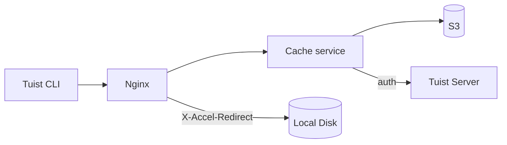
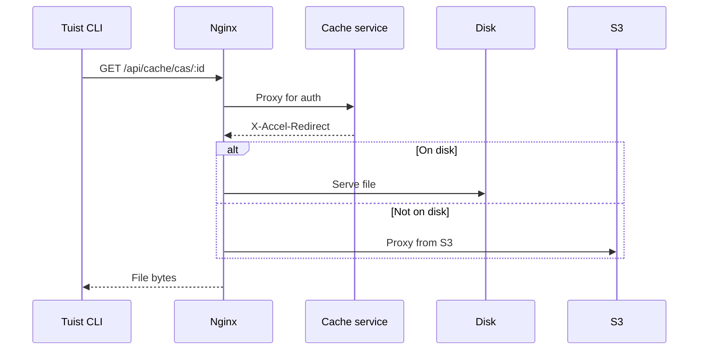
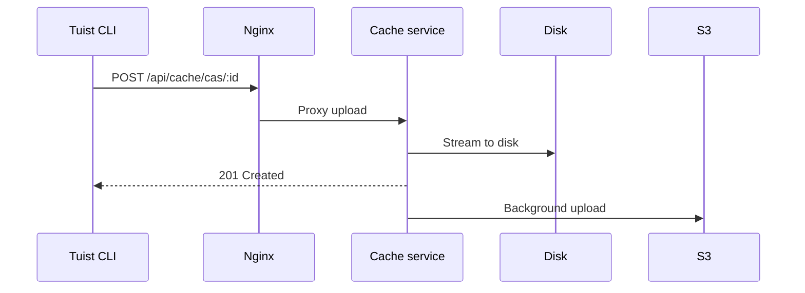

---
{
  "title": "Architecture",
  "titleTemplate": ":title | Cache | Guides | Tuist",
  "description": "Learn about the architecture of the Tuist cache service."
}
---

# キャッシュアーキテクチャ{#cache-architecture}

::: info
<!-- -->
このページはTuistキャッシュサービスの技術的概要を説明します。主に**のセルフホスティングユーザー（** ）および**のコントリビューター（**
）がサービスの内部動作を理解する必要がある場合に想定されています。キャッシュを利用するだけの一般ユーザーは読む必要はありません。
<!-- -->
:::

Tuistキャッシュサービスは、ビルド成果物向けのコンテンツアドレス可能ストレージ（CAS）と、キャッシュメタデータ向けのキーバリューストアを提供するスタンドアロンサービスです。

## 概要{#overview}

本サービスは二層ストレージアーキテクチャを採用しています：

- **ローカルディスク**: 低遅延キャッシュヒットのためのプライマリストレージ
- **S3**: アーティファクトを永続的に保存し、削除後の復元を可能にする耐久性のあるストレージ

## コンポーネント{#components}

### Nginx{#nginx}

Nginxはエントリポイントとして機能し、`X-Accel-Redirect` を使用して効率的なファイル配信を処理します。

- **ダウンロード**: キャッシュサービスは認証を検証した後、`X-Accel-Redirect`
  ヘッダーを返します。Nginxはファイルをディスクから直接提供するか、S3からプロキシします。
- **アップロード**: Nginxはリクエストをキャッシュサービスにプロキシし、キャッシュサービスはデータをディスクにストリーミングします。

### コンテンツアドレス可能ストレージ{#cas}

アーティファクトはローカルディスク上に、分割されたディレクトリ構造で保存されます：

- **パス**:`{account}/{project}/cas/{shard1}/{shard2}/{artifact_id}`
- **** のシャード化：アーティファクトIDの先頭4文字で2階層のシャードを生成（例： ABCD1234 → AB/CD/ABCD1234 ）`` ``

### S3 統合{#s3}

S3は耐久性のあるストレージを提供します：

- **バックグラウンドアップロード**:
  ディスクへの書き込み後、アーティファクトは毎分実行されるバックグラウンドワーカーを介してS3へのアップロード用にキューイングされます
- **オンデマンドハイドレーション**:
  ローカルアーティファクトが存在しない場合、アーティファクトがバックグラウンドでローカルディスクにダウンロードされる間、事前署名済みS3
  URLを介してリクエストが即座に処理される

### ディスクエヴィクション{#eviction}

本サービスはLRUエヴィクション方式でディスク領域を管理します：

- アクセス時間はSQLiteで追跡されます
- ディスク使用率が85%を超えた場合、使用率が70%まで低下するまで最も古いアーティファクトが削除される
- ローカルでの削除後もアーティファクトはS3に残る

### 認証{#authentication}

キャッシュは、`/api/projects`
エンドポイントを呼び出し、結果をキャッシュすることで認証をTuistサーバーに委譲します（成功時は10分間、失敗時は3秒間キャッシュ）。

## リクエストフロー{#request-flows}

### ダウンロード{#download-flow}

### アップロード{#upload-flow}

## APIエンドポイント{#api-endpoints}

| エンドポイント                       | 方法   | 説明                    |
| ----------------------------- | ---- | --------------------- |
| `/up`                         | GET  | ヘルスチェック               |
| `/metrics`                    | GET  | プロメテウス メトリクス          |
| `/api/cache/cas/:id`          | GET  | CASアーティファクトをダウンロード    |
| `/api/cache/cas/:id`          | POST | CASアーティファクトをアップロード    |
| `/api/cache/keyvalue/:cas_id` | GET  | キーと値のエントリを取得する        |
| `/api/cache/keyvalue`         | PUT  | キーと値のエントリを保存する        |
| `/api/cache/module/:id`       | HEAD | モジュールアーティファクトの存在を確認する |
| `/api/cache/module/:id`       | GET  | モジュールアーティファクトをダウンロード  |
| `/api/cache/module/start`     | POST | マルチパートアップロードを開始       |
| `/api/cache/module/part`      | POST | アップロード部分              |
| `/api/cache/module/complete`  | POST | マルチパートアップロードを完了する     |
