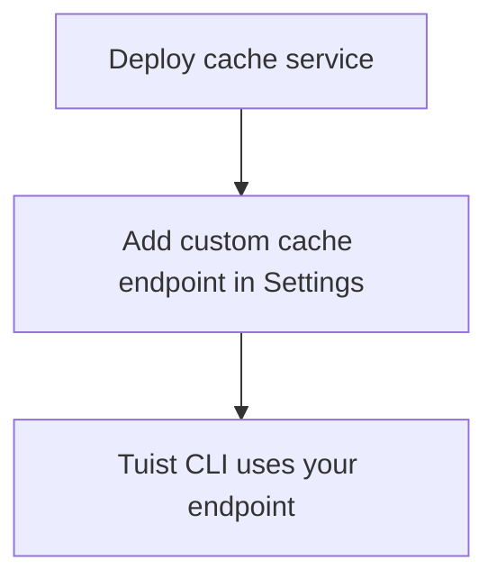

---
{
  "title": "Self-hosting",
  "titleTemplate": ":title | Cache | Guides | Tuist",
  "description": "Learn how to self-host the Tuist cache service."
}
---

# セルフホストキャッシュ{#self-host-cache}

Tuistキャッシュサービスは、チーム専用のプライベートバイナリキャッシュを提供するために自社ホスティングが可能です。これは、大規模なアーティファクトと頻繁なビルドを行う組織において特に有用です。CIインフラに近い場所にキャッシュを配置することで、レイテンシを低減しキャッシュ効率を向上させます。ビルドエージェントとキャッシュ間の距離を最小化することで、ネットワークオーバーヘッドがキャッシュの速度メリットを相殺しないようにします。

::: info
<!-- -->
キャッシュノードのセルフホスティングには、**のEnterpriseプランが必要です。**

セルフホスト型キャッシュノードは、ホスト型Tuistサーバー（`https://tuist.dev`
）またはセルフホスト型Tuistサーバーのいずれかに接続できます。Tuistサーバー自体をセルフホストするには、別途サーバーライセンスが必要です。<LocalizedLink href="/guides/server/self-host/install">サーバーのセルフホスティングガイド</LocalizedLink>を参照してください。
<!-- -->
:::

## 前提条件{#prerequisites}

- Docker と Docker Compose
- S3互換ストレージバケット
- 稼働中のTuistサーバーインスタンス（ホスト型またはセルフホスト型）

## デプロイメント{#deployment}。

キャッシュサービスはDockerイメージとして[ghcr.io/tuist/cache](https://ghcr.io/tuist/cache)で配布されています。参照用設定ファイルは[cacheディレクトリ](https://github.com/tuist/tuist/tree/main/cache)に用意しています。

::: チップ
<!-- -->
評価や小規模なデプロイメントの便利な基盤として、Docker
Composeによるセットアップを提供しています。これを参照として、お好みのデプロイメントモデル（Kubernetes、生のDockerなど）に適合させてご利用ください。
<!-- -->
:::

### 設定ファイル{#config-files}

```bash
curl -O https://raw.githubusercontent.com/tuist/tuist/main/cache/docker-compose.yml
mkdir -p docker
curl -o docker/nginx.conf https://raw.githubusercontent.com/tuist/tuist/main/cache/docker/nginx.conf
```

### 環境変数{#environment-variables}

`設定ファイルとして `.env` を作成してください。`` ` に設定を記述してください。

::: チップ
<!-- -->
本サービスはElixir/Phoenixで構築されているため、一部の変数には`PHX_`
というプレフィックスが使用されています。これらは標準的なサービス設定として扱ってください。
<!-- -->
:::

```env
# Secret key used to sign and encrypt data. Minimum 64 characters.
# Generate with: openssl rand -base64 64
SECRET_KEY_BASE=YOUR_SECRET_KEY_BASE

# Public hostname or IP address where your cache service will be reachable.
PUBLIC_HOST=cache.example.com

# URL of the Tuist server used for authentication (REQUIRED).
# - Hosted: https://tuist.dev
# - Self-hosted: https://your-tuist-server.example.com
SERVER_URL=https://tuist.dev

# S3 Storage configuration
S3_BUCKET=your-cache-bucket
S3_HOST=s3.us-east-1.amazonaws.com
S3_ACCESS_KEY_ID=your-access-key
S3_SECRET_ACCESS_KEY=your-secret-key
S3_REGION=us-east-1

# CAS storage (required for non-compose deployments)
DATA_DIR=/data
```

| 変数                                | 必須  | デフォルト                     | 説明                                                                      |
| --------------------------------- | --- | ------------------------- | ----------------------------------------------------------------------- |
| `SECRET_KEY_BASE`                 | はい  |                           | データを署名および暗号化するために使用される秘密鍵（最低64文字）。                                      |
| `PUBLIC_HOST`                     | はい  |                           | キャッシュサービスの公開ホスト名またはIPアドレス。絶対URLを生成するために使用されます。                          |
| `SERVER_URL`                      | はい  |                           | 認証用のTuistサーバーのURL。デフォルトは`です。https://tuist.dev`                          |
| `DATA_DIR`                        | はい  |                           | CASアーティファクトがディスク上に保存されるディレクトリ。提供されているDocker Compose設定では、`/data` を使用します。 |
| `S3_BUCKET`                       | はい  |                           | S3 バケット名。                                                               |
| `S3_HOST`                         | はい  |                           | S3エンドポイントのホスト名。                                                         |
| `S3_ACCESS_KEY_ID`                | はい  |                           | S3アクセスキー。                                                               |
| `S3_SECRET_ACCESS_KEY`            | はい  |                           | S3シークレットキー。                                                             |
| `S3_REGION`                       | はい  |                           | S3リージョン。                                                                |
| `CAS_DISK_HIGH_WATERMARK_PERCENT` | いいえ | `85`                      | LRU除去をトリガーするディスク使用率の割合。                                                 |
| `CAS_DISK_TARGET_PERCENT`         | いいえ | `70`                      | エヴィクション後のターゲットディスク使用量。                                                  |
| `PHX_SOCKET_PATH`                 | いいえ | `/run/cache/cache.sock`   | サービスがUnixソケットを作成するパス（有効化時）。                                             |
| `PHX_SOCKET_LINK`                 | いいえ | `/run/cache/current.sock` | Nginxがサービスに接続するために使用するシンボリックリンクのパス。                                     |

### サービスを開始する{#start-service}

```bash
docker compose up -d
```

### デプロイメントを確認する{#verify}

```bash
curl http://localhost/up
```

## キャッシュエンドポイントの設定{#configure-endpoint}

キャッシュサービスをデプロイした後、Tuistサーバーの組織設定に登録してください：

1. 組織の「**設定」ページに移動してください：**
2. **のカスタムキャッシュエンドポイントに関するセクション** を参照
3. キャッシュサービスのURLを追加してください（例：`、https://cache.example.com、` ）

<!-- TODO: Add screenshot of organization settings page showing Custom cache endpoints section -->



設定が完了すると、Tuist CLIは自己ホスト型キャッシュを使用します。

## 巻{#volumes}

Docker Compose 構成では、3つのボリュームを使用します：

| Volume         | 目的                     |
| -------------- | ---------------------- |
| `cas_data`     | バイナリアーティファクトストレージ      |
| `sqlite_data`  | LRU 除去のためのメタデータへのアクセス  |
| `cache_socket` | Nginxサービス間の通信用Unixソケット |

## ヘルスチェック{#health-checks}

- `GET /up` — 正常時に200を返す
- `GET /metrics` — Prometheus metrics

## 監視{#monitoring}

キャッシュサービスは、Prometheus互換のメトリクスを`/metrics` で公開しています。

Grafanaをご利用の場合、[リファレンスダッシュボード](https://raw.githubusercontent.com/tuist/tuist/refs/heads/main/cache/priv/grafana_dashboards/cache_service.json)をインポートできます。

## アップグレード{#upgrading}

```bash
docker compose pull
docker compose up -d
```

サービスは起動時にデータベース移行を自動的に実行します。

## トラブルシューティング{#troubleshooting}

### キャッシュが使用されていない{#troubleshooting-caching}

キャッシュが機能しているはずなのに一貫してキャッシュミスが発生する場合（例:
CLIが同じアーティファクトを繰り返しアップロードする、またはダウンロードが全く行われない）、以下の手順を実行してください:

1. 組織設定でカスタムキャッシュエンドポイントが正しく設定されていることを確認してください。
2. Tuist CLIの認証を実行するには、`tuist auth login` を実行してください。
3. キャッシュサービスのログにエラーがないか確認してください：`docker compose logs cache`

### ソケットパスの不一致{#troubleshooting-socket}

接続拒否エラーが表示された場合：

- `PHX_SOCKET_LINK` が nginx.conf
  で設定されたソケットパスを指すことを確認してください（デフォルト:`/run/cache/current.sock` ）
- docker-compose.yml 内で、`、PHX_SOCKET_PATH` 、および`、PHX_SOCKET_LINK`
  が正しく設定されていることを確認してください。
- `cache_socket` のボリュームが両方のコンテナにマウントされていることを確認してください
