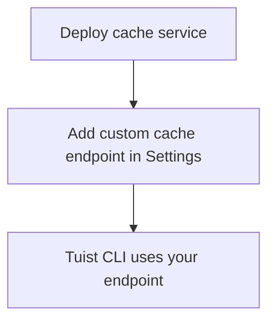

---
{
  "title": "Self-hosting",
  "titleTemplate": ":title | Cache | Guides | Tuist",
  "description": "Learn how to self-host the Tuist cache service."
}
---

# セルフホストキャッシュ{#self-host-cache}

Tuistキャッシュサービスは、チーム専用のプライベートバイナリキャッシュを提供するために自社ホストで運用可能です。これは、大規模なアーティファクトや頻繁なビルドを行う組織において特に有用です。キャッシュをCIインフラストラクチャの近くに配置することで、レイテンシを低減し、キャッシュの効率を向上させることができます。ビルドエージェントとキャッシュ間の距離を最小限に抑えることで、ネットワークのオーバーヘッドによってキャッシュの速度上のメリットが相殺されるのを防ぐことができます。

::: info
<!-- -->
キャッシュノードをセルフホスティングするには、**Enterpriseプランが必要です** 。

セルフホスト型のキャッシュノードは、ホスト型Tuistサーバー（`https://tuist.dev`
）またはセルフホスト型のTuistサーバーのいずれかに接続できます。Tuistサーバー自体をセルフホストするには、別途サーバーライセンスが必要です。<LocalizedLink href="/guides/server/self-host/install">サーバーのセルフホスティングガイド</LocalizedLink>を参照してください。
<!-- -->
:::

## 前提条件{#prerequisites}

- Docker と Docker Compose
- S3互換のストレージバケット
- 実行中の Tuist サーバーインスタンス（ホスト型またはセルフホスト型）

## デプロイメント{#deployment}。

キャッシュサービスは、[ghcr.io/tuist/cache](https://ghcr.io/tuist/cache) で Docker
イメージとして配布されています。[cache ディレクトリ](https://github.com/tuist/tuist/tree/main/cache)
にリファレンス設定ファイルを用意しています。

::: チップ
<!-- -->
評価や小規模なデプロイに便利なベースラインとして、Docker
Composeの設定を提供しています。これを参考に、お好みのデプロイモデル（Kubernetes、通常のDockerなど）に合わせて調整してください。
<!-- -->
:::

### 設定ファイル{#config-files}

```bash
curl -O https://raw.githubusercontent.com/tuist/tuist/main/cache/docker-compose.yml
mkdir -p docker
curl -o docker/nginx.conf https://raw.githubusercontent.com/tuist/tuist/main/cache/docker/nginx.conf
```

### 環境変数{#environment-variables}

設定を記述した ``.env` および `` ` ファイルを作成してください。

::: チップ
<!-- -->
本サービスはElixir/Phoenixで構築されているため、一部の変数には`のプレフィックス「PHX_」`
が使用されています。これらは標準的なサービス設定として扱ってください。
<!-- -->
:::

```env
# Secret key used to sign and encrypt data. Minimum 64 characters.
# Generate with: openssl rand -base64 64
SECRET_KEY_BASE=YOUR_SECRET_KEY_BASE

# Public hostname or IP address where your cache service will be reachable.
PUBLIC_HOST=cache.example.com

# URL of the Tuist server used for authentication (REQUIRED).
# - Hosted: https://tuist.dev
# - Self-hosted: https://your-tuist-server.example.com
SERVER_URL=https://tuist.dev

# S3 Storage configuration
S3_BUCKET=your-cache-bucket
S3_HOST=s3.us-east-1.amazonaws.com
S3_ACCESS_KEY_ID=your-access-key
S3_SECRET_ACCESS_KEY=your-secret-key
S3_REGION=us-east-1

# CAS storage (required for non-compose deployments)
DATA_DIR=/data
```

| 変数                                | 必須  | デフォルト                     | 説明                                                                        |
| --------------------------------- | --- | ------------------------- | ------------------------------------------------------------------------- |
| `SECRET_KEY_BASE`                 | はい  |                           | データの署名および暗号化に使用される秘密鍵（64文字以上）。                                            |
| `PUBLIC_HOST`                     | はい  |                           | キャッシュサービスの公開ホスト名またはIPアドレス。絶対URLを生成するために使用されます。                            |
| `SERVER_URL`                      | はい  |                           | 認証用のTuistサーバーのURL。デフォルトは`https://tuist.dev`                               |
| `DATA_DIR`                        | はい  |                           | ディスク上にCASアーティファクトが保存されるディレクトリ。提供されているDocker Compose設定では、`/data` を使用しています。 |
| `S3_BUCKET`                       | はい  |                           | S3 バケット名。                                                                 |
| `S3_HOST`                         | はい  |                           | S3エンドポイントのホスト名。                                                           |
| `S3_ACCESS_KEY_ID`                | はい  |                           | S3 アクセスキー。                                                                |
| `S3_SECRET_ACCESS_KEY`            | はい  |                           | S3 シークレットキー。                                                              |
| `S3_REGION`                       | はい  |                           | S3リージョン。                                                                  |
| `CAS_DISK_HIGH_WATERMARK_PERCENT` | いいえ | `85`                      | LRUエヴィクションをトリガーするディスク使用率。                                                 |
| `CAS_DISK_TARGET_PERCENT`         | いいえ | `70`                      | エヴィクション後のターゲットディスク使用量。                                                    |
| `PHX_SOCKET_PATH`                 | いいえ | `/run/cache/cache.sock`   | サービスがUnixソケットを作成するパス（有効化されている場合）。                                         |
| `PHX_SOCKET_LINK`                 | いいえ | `/run/cache/current.sock` | Nginxがサービスに接続するために使用するシンボリックリンクのパス。                                       |

### サービスの開始{#start-service}

```bash
docker compose up -d
```

### デプロイメントを確認する{#verify}

```bash
curl http://localhost/up
```

## キャッシュエンドポイントを設定する{#configure-endpoint}

キャッシュサービスをデプロイした後、Tuistサーバーの組織設定で登録してください：

1. 組織の「**設定」ページ（** ）に移動してください
2. **の「カスタムキャッシュエンドポイント」セクション（** ）を参照してください
3. キャッシュサービスのURLを入力してください（例：`、https://cache.example.com、` ）

<!-- TODO: Add screenshot of organization settings page showing Custom cache endpoints section -->


```mermaid
graph TD
  A[Deploy cache service] --> B[Add custom cache endpoint in Settings]
  B --> C[Tuist CLI uses your endpoint]
```

設定が完了すると、Tuist CLIはセルフホスト型キャッシュを使用するようになります。

## 巻数{#volumes}

Docker Composeの設定では、3つのボリュームを使用しています：

| 巻数             | 目的                      |
| -------------- | ----------------------- |
| `cas_data`     | バイナリアーティファクトの保存         |
| `sqlite_data`  | LRUエヴィクションのメタデータにアクセスする |
| `cache_socket` | Nginxとサービスの通信用Unixソケット  |

## ヘルスチェック{#health-checks}

- `GET /up` — 正常な場合は200を返す
- `GET /metrics` — Prometheus メトリクス

## モニタリング{#monitoring}

キャッシュサービスは、`/metrics` で、Prometheus互換のメトリクスを公開しています。

Grafanaをご利用の場合は、[参照用ダッシュボード](https://raw.githubusercontent.com/tuist/tuist/refs/heads/main/cache/priv/grafana_dashboards/cache_service.json)をインポートできます。

## アップグレード{#upgrading}

```bash
docker compose pull
docker compose up -d
```

このサービスは起動時にデータベースのマイグレーションを自動的に実行します。

## トラブルシューティング{#troubleshooting}

### キャッシュが使用されていません{#troubleshooting-caching}

キャッシュが機能しているはずなのに、一貫してキャッシュミスが発生している場合（たとえば、CLIが同じアーティファクトを繰り返しアップロードしている、またはダウンロードがまったく行われないなど）、以下の手順に従ってください：

1. 組織設定でカスタムキャッシュエンドポイントが正しく設定されていることを確認してください。
2. `tuist auth login` を実行して、Tuist CLI が認証されていることを確認してください。
3. キャッシュサービスのログにエラーがないか確認してください：`docker compose logs cache` 。

### ソケットパスの不一致{#troubleshooting-socket}

「接続拒否」エラーが表示された場合は：

- `PHX_SOCKET_LINK` が、nginx.conf
  で設定されたソケットパスを指していることを確認してください（デフォルト：`/run/cache/current.sock` ）
- docker-compose.yml 内で、`、PHX_SOCKET_PATH` 、および`、PHX_SOCKET_LINK`
  が正しく設定されていることを確認してください。
- `のcache_socketおよび` ボリュームが両方のコンテナにマウントされていることを確認してください
