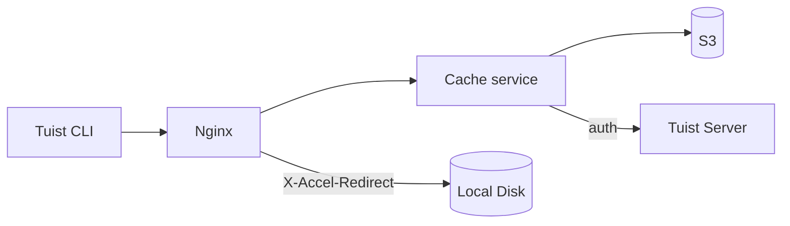
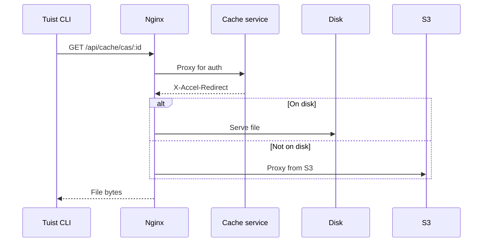
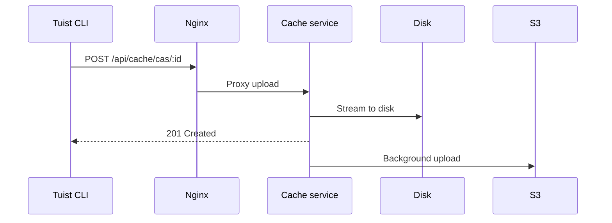

---
{
  "title": "Architecture",
  "titleTemplate": ":title | Cache | Guides | Tuist",
  "description": "Learn about the architecture of the Tuist cache service."
}
---

# 캐시 아키텍처 {#cache-architecture}

::: info Mise란?
<!-- -->
이 페이지는 Tuist 캐시 서비스 아키텍처에 대한 기술적 개요를 제공합니다. 주로 서비스의 내부 작동을 이해해야 하는 **셀프 호스팅
사용자**와 **기여자** 를 대상으로 합니다. 캐시만 사용하려는 일반 사용자는 이 문서를 읽을 필요가 없습니다.
<!-- -->
:::

Tuist 캐시 서비스는 빌드 아티팩트를 위한 CAS(콘텐츠 주소 지정 가능 스토리지)와 캐시 메타데이터를 위한 키-값 저장소를 제공하는 독립
실행형 서비스입니다.

## 개요 {#overview}

이 서비스는 2계층 스토리지 아키텍처를 사용합니다:

- **로컬 디스크**: 지연 시간이 짧은 캐시 히트를 위한 기본 스토리지
- **S3**: 아티팩트를 보존하고 로컬 제거 후 복구가 가능한 내구성 있는 스토리지

## 구성 요소 {#components}

### Nginx {#nginx}

Nginx는 주소 제공 역할을 하며 `X-Accel-Redirect`를 사용하여 효율적인 파일 전송을 처리합니다:

- **다운로드**: 캐시 서비스는 인증의 유효성을 검사한 다음 `X-Accel-Redirect` 헤더를 반환합니다. Nginx는 디스크 또는
  S3의 프록시에서 직접 파일을 제공합니다.
- **업로드**: Nginx는 요청을 데이터를 디스크로 스트리밍하는 캐시 서비스로 전달합니다.

### Content Addressable Storage {#cas}

아티팩트는 분리 저장된 디렉토리 구조로 로컬 디스크에 저장됩니다:

- **경로**: `{account}/{project}/cas/{shard1}/{shard2}/{artifact_id}`
- **샤딩**: 아티팩트 ID의 처음 네 글자는 2단계 샤드를 생성합니다(예: `ABCD1234` → `AB/CD/ABCD1234`)

### S3 통합 {#s3}

S3는 내구성 있는 저장 공간을 제공합니다:

- **백그라운드 업로드**: 디스크에 쓴 후 아티팩트는 매분마다 실행되는 백그라운드 워커를 통해 S3에 업로드하기 위해 대기열에 대기합니다
- **내장 데이터 공급**: 로컬 아티팩트가 누락된 경우, 아티팩트가 로컬 디스크에 백그라운드 다운로드를 위해 대기하는 동안 미리 지정된 S3
  URL을 통해 요청이 즉시 제공됩니다

### 디스크 축출 {#eviction}

이 서비스는 LRU 축출을 사용하여 디스크 공간을 관리합니다:

- 액세스 시간은 SQLite에서 추적 됩니다
- 디스크 사용량이 85%를 초과하면 사용량이 70%로 떨어질 때까지 가장 오래된 아티팩트가 삭제됩니다
- 로컬에서 삭제된 후에도 아티팩트는 S3에 남아 있습니다

### 인증 {#authentication}

캐시는 `/api/projects` 주소를 호출하여 인증을 Tuist 서버에 위임하고 결과를 캐싱합니다(성공 시 10분, 실패 시 3초).

## 요청 흐름 {#request-flows}

### 다운로드 {#download-flow}

### 업로드 {#upload-flow}

## API 주소 {#api-endpoints}

| 주소                            | Method | 설명                |
| ----------------------------- | ------ | ----------------- |
| `/up`                         | GET    | 상태 확인             |
| `/metrics`                    | GET    | 프로메테우스 지표         |
| `/api/cache/cas/:id`          | GET    | CAS 아티팩트 다운로드     |
| `/api/cache/cas/:id`          | POST   | CAS 아티팩트 업로드      |
| `/api/cache/keyvalue/:cas_id` | GET    | 키-값 입력 가져오기       |
| `/api/cache/keyvalue`         | PUT    | 키-값 입력 저장         |
| `/api/cache/module/:id`       | HEAD   | 모듈 아티팩트가 존재하는지 확인 |
| `/api/cache/module/:id`       | GET    | 모듈 아티팩트 다운로드      |
| `/api/cache/module/start`     | POST   | Multipart 업로드 시작  |
| `/api/cache/module/part`      | POST   | 부품 업로드            |
| `/api/cache/module/complete`  | POST   | Multipart 업로드 완료  |
