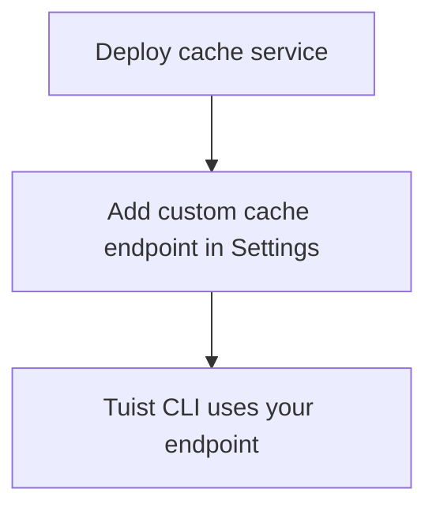

---
{
  "title": "Self-hosting",
  "titleTemplate": ":title | Cache | Guides | Tuist",
  "description": "Learn how to self-host the Tuist cache service."
}
---

# 셀프 호스트 캐시 {#self-host-cache}

Tuist 캐시 서비스는 자체 호스팅하여 팀에 비공개 바이너리 캐시를 제공할 수 있습니다. 이는 아티팩트가 크고 빌드가 빈번한 조직에 가장
유용하며, 캐시를 CI 인프라에 더 가깝게 배치하면 지연 시간을 줄이고 캐시 효율성을 개선할 수 있습니다. 빌드 에이전트와 캐시 사이의 거리를
최소화하면 네트워크 과부하가 캐싱의 속도 이점을 무효화하지 않도록 할 수 있습니다.

::: info Mise란?
<!-- -->
자체 구축한 캐시 노드를 사용하려면 **엔터프라이즈 요금제**가 필요합니다.

자체 구축한 캐시 노드를 호스팅된 Tuist 서버(`https://tuist.dev`) 또는 자체 호스팅된 Tuist 서버에 연결할 수
있습니다. Tuist 서버 자체를 자체 구축하려면 별도의 서버 라이선스가 필요합니다.
<LocalizedLink href="/guides/server/self-host/install">서버 셀프 호스팅
가이드</LocalizedLink>를 참조하세요.
<!-- -->
:::

## 필수 조건 {#prerequisites}

- 도커 및 도커 컴포즈
- S3 호환 스토리지 버킷
- 실행 중인 Tuist 서버 인스턴스(호스팅 또는 자체 호스팅)

## 배포 {#deployment}

캐시 서비스는 [ghcr.io/tuist/cache](https://ghcr.io/tuist/cache)에서 Docker 이미지로 배포되기
때문에 [cache 디렉터리](https://github.com/tuist/tuist/tree/main/cache)에 참조 구성 파일을 제공해
드립니다.

::: tip
<!-- -->
평가 및 소규모 배포를 위한 편리한 기준이 되는 Docker Compose 설정을 제공합니다. 이를 참조로 사용하여 선호하는 배포
모델(Kubernetes, 원시 Docker 등)에 맞게 적용할 수 있습니다.
<!-- -->
:::

### 구성 파일 {#config-files}

```bash
curl -O https://raw.githubusercontent.com/tuist/tuist/main/cache/docker-compose.yml
mkdir -p docker
curl -o docker/nginx.conf https://raw.githubusercontent.com/tuist/tuist/main/cache/docker/nginx.conf
```

### 환경 변수 {#environment-variables}

설정이 포함된 `.env` 파일을 생성하세요.

::: tip
<!-- -->
이 서비스는 Elixir/Phoenix로 빌드 되었으므로 일부 변수는 `PHX_` 접두사를 사용합니다. 이를 표준 서비스 설정으로 취급할 수
있습니다.
<!-- -->
:::

```env
# Secret key used to sign and encrypt data. Minimum 64 characters.
# Generate with: openssl rand -base64 64
SECRET_KEY_BASE=YOUR_SECRET_KEY_BASE

# Public hostname or IP address where your cache service will be reachable.
PUBLIC_HOST=cache.example.com

# URL of the Tuist server used for authentication (REQUIRED).
# - Hosted: https://tuist.dev
# - Self-hosted: https://your-tuist-server.example.com
SERVER_URL=https://tuist.dev

# S3 Storage configuration
S3_BUCKET=your-cache-bucket
S3_HOST=s3.us-east-1.amazonaws.com
S3_ACCESS_KEY_ID=your-access-key
S3_SECRET_ACCESS_KEY=your-secret-key
S3_REGION=us-east-1

# CAS storage (required for non-compose deployments)
DATA_DIR=/data
```

| 변수                                | 필수  | 기본 값                      | 설명                                                                 |
| --------------------------------- | --- | ------------------------- | ------------------------------------------------------------------ |
| `SECRET_KEY_BASE`                 | 예   |                           | 데이터 서명 및 암호화에 사용되는 비밀 키(최소 64자)입니다.                                |
| `PUBLIC_HOST`                     | 예   |                           | 캐시 서비스의 공개 호스트명 또는 IP 주소입니다. 절대 URL을 생성하는 데 사용됩니다.                 |
| `SERVER_URL`                      | 예   |                           | 인증을 위한 Tuist 서버의 URL입니다. 기본 값은 `https://tuist.dev`                 |
| `DATA_DIR`                        | 예   |                           | CAS 아티팩트가 디스크에 저장되는 디렉터리입니다. 제공된 Docker Compose 설정은 `/cas`를 사용합니다. |
| `S3_BUCKET`                       | 예   |                           | S3 버킷 이름.                                                          |
| `S3_HOST`                         | 예   |                           | S3 주소의 호스트 이름.                                                     |
| `S3_ACCESS_KEY_ID`                | 예   |                           | S3 접근 키.                                                           |
| `S3_SECRET_ACCESS_KEY`            | 예   |                           | S3 비밀 키.                                                           |
| `S3_REGION`                       | 예   |                           | S3 지역.                                                             |
| `CAS_DISK_HIGH_WATERMARK_PERCENT` | 아니요 | `85`                      | LRU 축출을 실행하는 디스크 사용량 비율입니다.                                        |
| `CAS_DISK_TARGET_PERCENT`         | 아니요 | `70`                      | 축출 후 대상 디스크 사용량 입니다.                                               |
| `PHX_SOCKET_PATH`                 | 아니요 | `/run/cache/cache.sock`   | 서비스가 유닉스 소켓을 생성하는 경로(활성화된 경우)입니다.                                  |
| `PHX_SOCKET_LINK`                 | 아니요 | `/run/cache/current.sock` | Nginx가 서비스에 연결하는 데 사용하는 심볼릭 링크 경로입니다.                              |

### 서비스 시작 {#start-service}

```bash
docker compose up -d
```

### 배포 확인 {#verify}

```bash
curl http://localhost/up
```

## 캐시 주소 설정 {#configure-endpoint}

캐시 서비스를 배포한 후 Tuist 서버 조직 설정에 등록하세요:

1. 조직의 **설정** 페이지로 이동하세요
2. **사용자 지정 캐시 주소** 섹션 찾기
3. 캐시 서비스 URL을 추가하세요(예: `https://cache.example.com`)

<!-- TODO: Add screenshot of organization settings page showing Custom cache endpoints section -->



설정이 완료되면 Tuist CLI는 자체 구축한 캐시를 사용합니다.

## 볼륨 {#volumes}

Docker Compose 설정은 세 개의 볼륨을 사용합니다:

| 볼륨             | 목적                       |
| -------------- | ------------------------ |
| `cas_data`     | 바이너리 아티팩트 스토리지           |
| `sqlite_data`  | LRU 축출를 위한 메타데이터에 접근하세요  |
| `cache_socket` | Nginx 서비스 통신을 위한 Unix 소켓 |

## 서비스 상태 확인 {#health-checks}

- `GET /up` - 정상일 때 200을 반환합니다
- `GET /metrics` - 모니터링 지표

## 모니터링 {#monitoring}

캐시 서비스는 `/metrics`에서 프로메테우스 호환 지표을 내보냅니다.

Grafana를 사용하는 경우 [참조
대시보드](https://raw.githubusercontent.com/tuist/tuist/refs/heads/main/cache/priv/grafana_dashboards/cache_service.json)를
가져올 수 있습니다.

## 업그레이드 {#upgrading}

```bash
docker compose pull
docker compose up -d
```

이 서비스는 시작 시 데이터베이스 마이그레이션을 자동으로 실행합니다.

## 문제 해결 {#troubleshooting}

### 사용되지 않고 있는 캐시 {#troubleshooting-caching}

캐싱이 예상되지만 캐시가 지속적으로 누락되는 경우(예: CLI가 동일한 아티팩트를 반복적으로 업로드하거나 다운로드가 전혀 이루어지지 않는
경우), 다음 단계를 따라하세요:

1. 조직 설정에서 사용자 지정 캐시 주소가 올바르게 구성되었는지 확인하세요.
2. `tuist auth login`을 실행하여 Tuist CLI가 인증되었는지 확인하세요.
3. 다음 명령어로 캐시 서비스 로그에서 오류가 있는지 확인하세요: `docker compose logs cache`.

### 소켓 경로 불일치 {#troubleshooting-socket}

연결이 거부된 오류가 표시되는 경우:

- `PHX_SOCKET_LINK`가 nginx.conf에 구성된 소켓 경로를 가리키는지 확인합니다(기본 값:
  `/run/cache/current.sock`)
- `PHX_SOCKET_PATH` 및 `PHX_SOCKET_LINK` 가 모두 docker-compose.yml에서 올바르게 설정되었는지
  확인하세요
- `cache_socket` 볼륨이 두 컨테이너에 모두 마운트 되었는지 확인하세요
