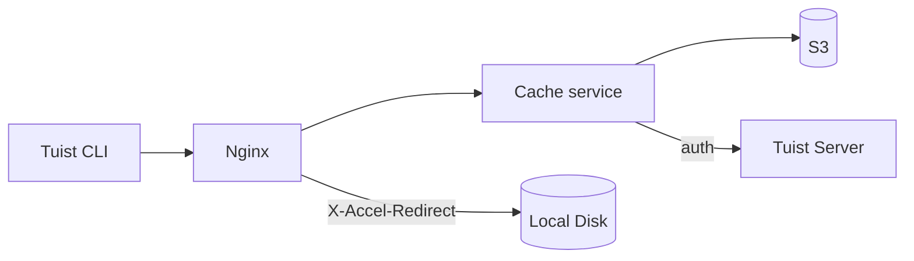
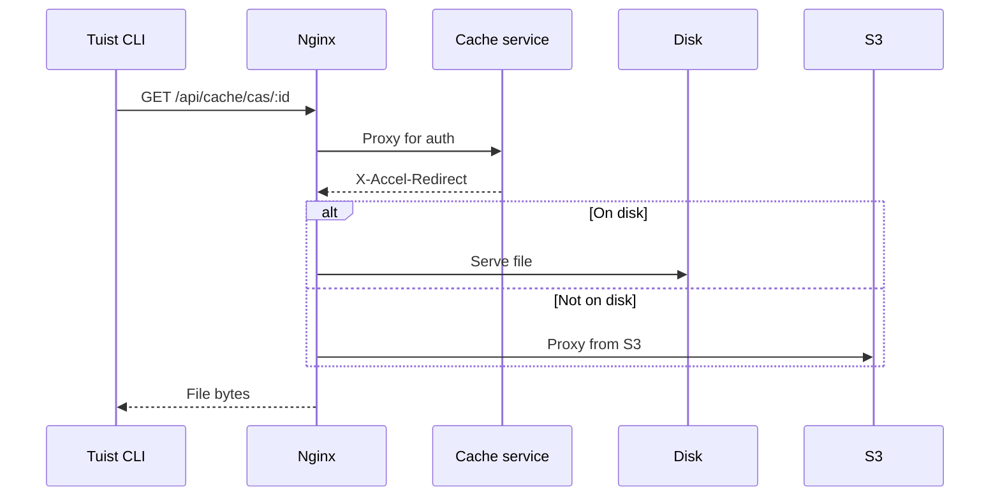
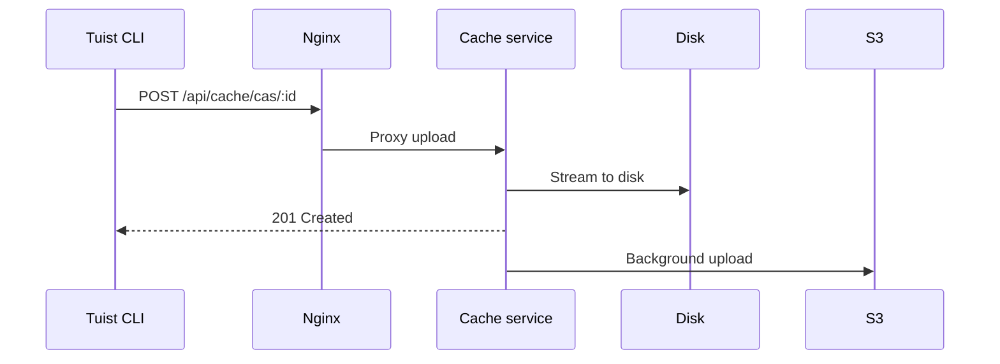

---
{
  "title": "Architecture",
  "titleTemplate": ":title | Cache | Guides | Tuist",
  "description": "Learn about the architecture of the Tuist cache service."
}
---

# Architektura pamięci podręcznej {#cache-architecture}

:: info
<!-- -->
Ta strona zawiera techniczny opis architektury usługi pamięci podręcznej Tuist.
Jest ona przeznaczona przede wszystkim dla użytkowników korzystających z
własnego hostingu **, współpracowników** i **oraz**, którzy muszą zrozumieć
wewnętrzne działanie usługi. Zwykli użytkownicy, którzy chcą tylko korzystać z
pamięci podręcznej, nie muszą tego czytać.
<!-- -->
:::

Usługa pamięci podręcznej Tuist to samodzielna usługa, która zapewnia pamięć
adresowalną według zawartości (CAS) dla artefaktów kompilacji oraz magazyn
kluczy-wartości dla metadanych pamięci podręcznej.

## Przegląd {#overview}

Usługa wykorzystuje dwupoziomową architekturę pamięci masowej:

- **Dysk lokalny**: podstawowa pamięć masowa dla trafień w pamięci podręcznej o
  niskim opóźnieniu
- **S3**: Trwałe miejsce przechowywania, które zachowuje artefakty i umożliwia
  odzyskanie danych po usunięciu.

## Komponenty {#components}

### Nginx {#nginx}

Nginx służy jako punkt wejścia i zapewnia wydajne dostarczanie plików przy
użyciu `X-Accel-Redirect`:

- **Pobieranie**: Usługa pamięci podręcznej weryfikuje uwierzytelnienie, a
  następnie zwraca nagłówek `X-Accel-Redirect`. Nginx obsługuje plik
  bezpośrednio z dysku lub serwerów proxy z S3.
- **Przesyłanie plików**: Nginx przekazuje żądania do usługi pamięci podręcznej,
  która przesyła dane strumieniowo na dysk.

### Pamięć adresowalna zawartością {#cas}

Artefakty są przechowywane na dysku lokalnym w strukturze katalogów podzielonych
na fragmenty:

- **Ścieżka**: `{account}/{project}/cas/{shard1}/{shard2}/{artifact_id}`
- **Fragmentacja**: Pierwsze cztery znaki identyfikatora artefaktu tworzą
  dwupoziomowy fragment (np. `ABCD1234` → `AB/CD/ABCD1234`)

### Integracja S3 {#s3}

S3 zapewnia trwałą pamięć masową:

- **Przesyłanie w tle**: Po zapisaniu na dysku artefakty są umieszczane w
  kolejce do przesłania do S3 za pośrednictwem procesu działającego w tle, który
  uruchamia się co minutę.
- **Hydratacja na żądanie**: Gdy brakuje lokalnego artefaktu, żądanie jest
  obsługiwane natychmiast za pośrednictwem wstępnie podpisanego adresu URL S3,
  podczas gdy artefakt jest umieszczany w kolejce do pobrania w tle na dysk
  lokalny.

### Wyrzucenie z dysku {#eviction}

Usługa zarządza przestrzenią dyskową przy użyciu algorytmu LRU:

- Czas dostępu jest śledzony w SQLite.
- Gdy wykorzystanie dysku przekroczy 85%, najstarsze artefakty są usuwane, aż
  wykorzystanie spadnie do 70%.
- Artefakty pozostają w S3 po lokalnym usunięciu.

### Uwierzytelnianie {#authentication}

Pamięć podręczna przekazuje uwierzytelnianie do serwera Tuist, wywołując punkt
końcowy `/api/projects` i buforując wyniki (10 minut w przypadku powodzenia, 3
sekundy w przypadku niepowodzenia).

## Przebieg wniosków {#request-flows}

### Pobierz {#download-flow}

### Prześlij {#upload-flow}

## Punkty końcowe API {#api-endpoints}

| Punkt końcowy                 | Metoda | Opis                                   |
| ----------------------------- | ------ | -------------------------------------- |
| `/up`                         | GET    | Kontrola poprawności                   |
| `/metrics`                    | GET    | Metryki Prometeusza                    |
| `/api/cache/cas/:id`          | GET    | Pobierz artefakt CAS                   |
| `/api/cache/cas/:id`          | POST   | Prześlij artefakt CAS                  |
| `/api/cache/keyvalue/:cas_id` | GET    | Pobierz wpis klucz-wartość             |
| `/api/cache/keyvalue`         | PUT    | Zapisz wpis klucz-wartość.             |
| `/api/cache/module/:id`       | HEAD   | Sprawdź, czy artefakt modułu istnieje. |
| `/api/cache/module/:id`       | GET    | Pobierz artefakt modułu                |
| `/api/cache/module/start`     | POST   | Rozpocznij przesyłanie wielu części    |
| `/api/cache/module/part`      | POST   | Prześlij część                         |
| `/api/cache/module/complete`  | POST   | Zakończ przesyłanie wielu części       |
