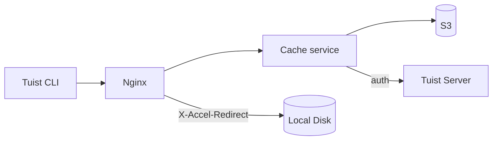
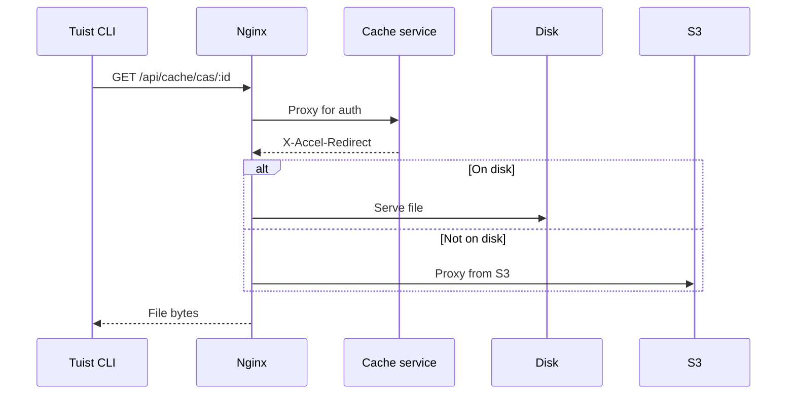
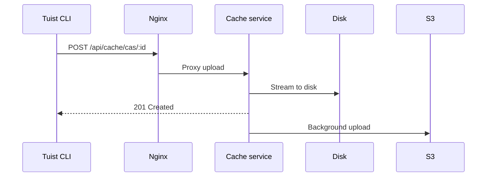

---
{
  "title": "Architecture",
  "titleTemplate": ":title | Cache | Guides | Tuist",
  "description": "Learn about the architecture of the Tuist cache service."
}
---

# Architektura pamięci podręcznej {#cache-architecture}

:: info
<!-- -->
Ta strona zawiera techniczny przegląd architektury usługi pamięci podręcznej
Tuist. Jest ona przeznaczona przede wszystkim dla użytkowników korzystających z
własnego hostingu **oraz współpracowników** i **** , którzy muszą zrozumieć
wewnętrzne działanie usługi. Zwykli użytkownicy, którzy chcą jedynie korzystać z
pamięci podręcznej, nie muszą tego czytać.
<!-- -->
:::

Usługa pamięci podręcznej Tuist to samodzielna usługa zapewniająca pamięć
adresowalną według treści (CAS) dla artefaktów kompilacji oraz magazyn
kluczy-wartości dla metadanych pamięci podręcznej.

## Przegląd {#overview}

Usługa wykorzystuje dwupoziomową architekturę pamięci masowej:

- **Dysk lokalny**: Główna pamięć masowa dla trafień w pamięci podręcznej o
  niskim opóźnieniu
- **S3**: Trwała pamięć masowa, która przechowuje artefakty i umożliwia
  odzyskanie danych po usunięciu

```mermaid
flowchart LR
    CLI[Tuist CLI] --> NGINX[Nginx]
    NGINX --> APP[Cache service]
    NGINX -->|X-Accel-Redirect| DISK[(Local Disk)]
    APP --> S3[(S3)]
    APP -->|auth| SERVER[Tuist Server]
```

## Komponenty {#components}

### Nginx {#nginx}

Nginx służy jako punkt wejścia i obsługuje wydajne dostarczanie plików przy
użyciu `X-Accel-Redirect`:

- **Pobieranie**: Usługa pamięci podręcznej weryfikuje uwierzytelnienie, a
  następnie zwraca nagłówek `X-Accel-Redirect`. Nginx obsługuje plik
  bezpośrednio z dysku lub za pośrednictwem serwera proxy z S3.
- **Przesyłanie plików**: Nginx przekazuje żądania do usługi pamięci podręcznej,
  która przesyła dane strumieniowo na dysk.

### Pamięć adresowalna według zawartości {#cas}

Artefakty są przechowywane na dysku lokalnym w rozdzielonej strukturze
katalogów:

- **Ścieżka**: `{account}/{project}/cas/{shard1}/{shard2}/{artifact_id}`
- **Podział na fragmenty (**): Pierwsze cztery znaki identyfikatora artefaktu
  tworzą dwupoziomowy fragment (np. `ABCD1234` → `AB/CD/ABCD1234`)

### Integracja z S3 {#s3}

S3 zapewnia trwałą pamięć masową:

- **Przesyłanie w tle**: Po zapisaniu na dysku artefakty są umieszczane w
  kolejce do przesłania do S3 za pośrednictwem procesu działającego w tle, który
  uruchamia się co minutę
- **Hydratacja na żądanie**: Gdy brakuje lokalnego artefaktu, żądanie jest
  obsługiwane natychmiast za pośrednictwem wstępnie podpisanego adresu URL S3,
  podczas gdy artefakt jest umieszczany w kolejce do pobrania w tle na dysk
  lokalny

### Wyrzucanie dysków {#eviction}

Usługa zarządza przestrzenią dyskową przy użyciu algorytmu LRU:

- Czasy dostępu są śledzone w SQLite
- Gdy wykorzystanie dysku przekroczy 85%, najstarsze artefakty są usuwane, aż
  wykorzystanie spadnie do 70%.
- Artefakty pozostają w S3 po lokalnym usunięciu

### Uwierzytelnianie {#authentication}

Pamięć podręczna przekazuje uwierzytelnianie do serwera Tuist poprzez wywołanie
punktu końcowego `/api/projects` i buforowanie wyników (10 minut w przypadku
powodzenia, 3 sekundy w przypadku niepowodzenia).

## Przebieg żądania {#request-flows}

### Pobierz {#download-flow}

```mermaid
sequenceDiagram
    participant CLI as Tuist CLI
    participant N as Nginx
    participant A as Cache service
    participant D as Disk
    participant S as S3

    CLI->>N: GET /api/cache/cas/:id
    N->>A: Proxy for auth
    A-->>N: X-Accel-Redirect
    alt On disk
        N->>D: Serve file
    else Not on disk
        N->>S: Proxy from S3
    end
    N-->>CLI: File bytes
```

### Prześlij {#upload-flow}

```mermaid
sequenceDiagram
    participant CLI as Tuist CLI
    participant N as Nginx
    participant A as Cache service
    participant D as Disk
    participant S as S3

    CLI->>N: POST /api/cache/cas/:id
    N->>A: Proxy upload
    A->>D: Stream to disk
    A-->>CLI: 201 Created
    A->>S: Background upload
```

## Punkty końcowe API {#api-endpoints}

| Punkt końcowy                 | Metoda | Opis                                  |
| ----------------------------- | ------ | ------------------------------------- |
| `/up`                         | GET    | Sprawdzenie poprawności               |
| `/metrics`                    | GET    | Metryki Prometheus                    |
| `/api/cache/cas/:id`          | GET    | Pobierz artefakt CAS                  |
| `/api/cache/cas/:id`          | POST   | Prześlij artefakt CAS                 |
| `/api/cache/keyvalue/:cas_id` | GET    | Pobierz wpis klucz-wartość            |
| `/api/cache/keyvalue`         | PUT    | Zapisz wpis klucz-wartość             |
| `/api/cache/module/:id`       | HEAD   | Sprawdź, czy artefakt modułu istnieje |
| `/api/cache/module/:id`       | GET    | Pobierz artefakt modułu               |
| `/api/cache/module/start`     | POST   | Rozpocznij przesyłanie wieloczęściowe |
| `/api/cache/module/part`      | POST   | Prześlij część                        |
| `/api/cache/module/complete`  | POST   | Zakończ przesyłanie wieloczęściowe    |
