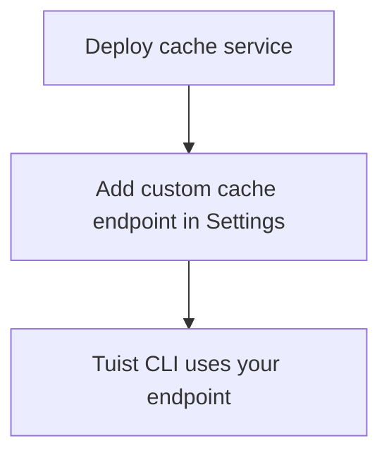

---
{
  "title": "Self-hosting",
  "titleTemplate": ":title | Cache | Guides | Tuist",
  "description": "Learn how to self-host the Tuist cache service."
}
---

# Własny serwer pamięci podręcznej {#self-host-cache}

Usługa pamięci podręcznej Tuist może być hostowana samodzielnie, aby zapewnić
prywatną pamięć podręczną plików binarnych dla Twojego zespołu. Jest to
najbardziej przydatne w przypadku organizacji posiadających duże artefakty i
często tworzących kompilacje, gdzie umieszczenie pamięci podręcznej bliżej
infrastruktury CI zmniejsza opóźnienia i poprawia wydajność pamięci podręcznej.
Minimalizując odległość między agentami kompilacji a pamięcią podręczną,
zapewniasz, że obciążenie sieci nie zniweluje korzyści płynących z szybkości
buforowania.

:: info
<!-- -->
Samodzielne hostowanie węzłów pamięci podręcznej wymaga planu **Enterprise**.

Możesz połączyć samodzielnie hostowane węzły pamięci podręcznej z hostowanym
serwerem Tuist (`https://tuist.dev`) lub samodzielnie hostowanym serwerem Tuist.
Samodzielne hostowanie serwera Tuist wymaga oddzielnej licencji serwerowej.
Zapoznaj się z
<LocalizedLink href="/guides/server/self-host/install">przewodnikiem dotyczącym
samodzielnego hostowania serwera</LocalizedLink>.
<!-- -->
:::

## Wymagania wstępne {#prerequisites}

- Docker i Docker Compose
- Bucket pamięci masowej zgodny z S3
- Działająca instancja serwera Tuist (hostowana lub samodzielnie hostowana)

## Wdrożenie {#deployment}

Usługa pamięci podręcznej jest dystrybuowana jako obraz Docker pod adresem
[ghcr.io/tuist/cache](https://ghcr.io/tuist/cache). Pliki konfiguracyjne
referencyjne udostępniamy w [katalogu
cache](https://github.com/tuist/tuist/tree/main/cache).

::: napiwek
<!-- -->
Zapewniamy konfigurację Docker Compose, ponieważ stanowi ona wygodną podstawę do
oceny i niewielkich wdrożeń. Możesz ją wykorzystać jako punkt odniesienia i
dostosować do preferowanego modelu wdrożenia (Kubernetes, surowy Docker itp.).
<!-- -->
:::

### Pliki konfiguracyjne {#config-files}

```bash
curl -O https://raw.githubusercontent.com/tuist/tuist/main/cache/docker-compose.yml
mkdir -p docker
curl -o docker/nginx.conf https://raw.githubusercontent.com/tuist/tuist/main/cache/docker/nginx.conf
```

### Zmienne środowiskowe {#environment-variables}

Utwórz plik `.env` z własną konfiguracją.

::: napiwek
<!-- -->
Usługa została zbudowana przy użyciu Elixir/Phoenix, więc niektóre zmienne
używają przedrostka `PHX_`. Można je traktować jako standardową konfigurację
usługi.
<!-- -->
:::

```env
# Secret key used to sign and encrypt data. Minimum 64 characters.
# Generate with: openssl rand -base64 64
SECRET_KEY_BASE=YOUR_SECRET_KEY_BASE

# Public hostname or IP address where your cache service will be reachable.
PUBLIC_HOST=cache.example.com

# URL of the Tuist server used for authentication (REQUIRED).
# - Hosted: https://tuist.dev
# - Self-hosted: https://your-tuist-server.example.com
SERVER_URL=https://tuist.dev

# S3 Storage configuration
S3_BUCKET=your-cache-bucket
S3_HOST=s3.us-east-1.amazonaws.com
S3_ACCESS_KEY_ID=your-access-key
S3_SECRET_ACCESS_KEY=your-secret-key
S3_REGION=us-east-1

# CAS storage (required for non-compose deployments)
DATA_DIR=/data
```

| Zmienna                           | Wymagane | Domyślne                  | Opis                                                                                                                     |
| --------------------------------- | -------- | ------------------------- | ------------------------------------------------------------------------------------------------------------------------ |
| `SECRET_KEY_BASE`                 | Tak      |                           | Tajny klucz używany do podpisywania i szyfrowania danych (minimum 64 znaki).                                             |
| `PUBLIC_HOST`                     | Tak      |                           | Publiczna nazwa hosta lub adres IP usługi pamięci podręcznej. Służy do generowania bezwzględnych adresów URL.            |
| `SERVER_URL`                      | Tak      |                           | Adres URL serwera Tuist do uwierzytelniania. Domyślnie `https://tuist.dev`                                               |
| `DATA_DIR`                        | Tak      |                           | Katalog, w którym artefakty CAS są przechowywane na dysku. Dostarczona konfiguracja Docker Compose wykorzystuje `/data`. |
| `S3_BUCKET`                       | Tak      |                           | Nazwa zasobnika S3.                                                                                                      |
| `S3_HOST`                         | Tak      |                           | Nazwa hosta punktu końcowego S3.                                                                                         |
| `S3_ACCESS_KEY_ID`                | Tak      |                           | Klucz dostępu S3.                                                                                                        |
| `S3_SECRET_ACCESS_KEY`            | Tak      |                           | Sekretny klucz S3.                                                                                                       |
| `S3_REGION`                       | Tak      |                           | Region S3.                                                                                                               |
| `CAS_DISK_HIGH_WATERMARK_PERCENT` | Nie      | `85`                      | Procent wykorzystania dysku, który powoduje usunięcie LRU.                                                               |
| `CAS_DISK_TARGET_PERCENT`         | Nie      | `70`                      | Docelowe wykorzystanie dysku po usunięciu.                                                                               |
| `PHX_SOCKET_PATH`                 | Nie      | `/run/cache/cache.sock`   | Ścieżka, w której usługa tworzy gniazdo Unix (jeśli jest włączone).                                                      |
| `PHX_SOCKET_LINK`                 | Nie      | `/run/cache/current.sock` | Ścieżka dowiązania symbolicznego używana przez Nginx do połączenia się z usługą.                                         |

### Rozpocznij usługę {#start-service}

```bash
docker compose up -d
```

### Sprawdź wdrożenie. {#verify}

```bash
curl http://localhost/up
```

## Skonfiguruj punkt końcowy pamięci podręcznej {#configure-endpoint}

Po wdrożeniu usługi pamięci podręcznej zarejestruj ją w ustawieniach organizacji
serwera Tuist:

1. Przejdź do strony ustawień **organizacji**.
2. Znajdź sekcję „ **” (Punkty końcowe niestandardowej pamięci podręcznej) „** ”
   (Punkty końcowe niestandardowej pamięci podręcznej).
3. Dodaj adres URL swojej usługi pamięci podręcznej (na przykład
   `https://cache.example.com`)

<!-- TODO: Add screenshot of organization settings page showing Custom cache endpoints section -->



Po skonfigurowaniu Tuist CLI będzie korzystać z Twojej własnej pamięci
podręcznej.

## Tom {#volumes}

Konfiguracja Docker Compose wykorzystuje trzy woluminy:

| Tom            | Cel                                               |
| -------------- | ------------------------------------------------- |
| `cas_data`     | Binarne przechowywanie artefaktów                 |
| `sqlite_data`  | Dostęp do metadanych dotyczących usuwania LRU     |
| `cache_socket` | Gniazdo Unix do komunikacji między usługami Nginx |

## Kontrole stanu zdrowia {#health-checks}

- `GET /up` — zwraca 200, gdy wszystko działa poprawnie
- `GET /metrics` — Metryki Prometheus

## Monitorowanie {#monitoring}

Usługa pamięci podręcznej udostępnia metryki zgodne z Prometheusem pod adresem
`/metrics`.

Jeśli korzystasz z Grafana, możesz zaimportować [pulpit
referencyjny](https://raw.githubusercontent.com/tuist/tuist/refs/heads/main/cache/priv/grafana_dashboards/cache_service.json).

## Aktualizacja {#upgrading}

```bash
docker compose pull
docker compose up -d
```

Usługa automatycznie uruchamia migracje baz danych podczas startu.

## Rozwiązywanie problemów {#troubleshooting}

### Pamięć podręczna nie jest używana {#troubleshooting-caching}

Jeśli spodziewasz się buforowania, ale obserwujesz ciągłe braki w pamięci
podręcznej (na przykład CLI wielokrotnie przesyła te same artefakty lub
pobieranie nigdy nie następuje), wykonaj następujące czynności:

1. Sprawdź, czy niestandardowy punkt końcowy pamięci podręcznej jest poprawnie
   skonfigurowany w ustawieniach organizacji.
2. Upewnij się, że Twoje Tuist CLI jest uwierzytelnione, uruchamiając `tuist
   auth login`.
3. Sprawdź logi usługi cache pod kątem błędów: `docker compose logs cache`.

### Niezgodność ścieżki gniazda {#troubleshooting-socket}

Jeśli widzisz błędy odmowy połączenia:

- Upewnij się, że `PHX_SOCKET_LINK` wskazuje ścieżkę gniazda skonfigurowaną w
  nginx.conf (domyślnie: `/run/cache/current.sock`)
- Sprawdź, czy `PHX_SOCKET_PATH` oraz `PHX_SOCKET_LINK` są poprawnie ustawione w
  pliku docker-compose.yml.
- Sprawdź, czy wolumin `cache_socket` jest zamontowany w obu kontenerach.
