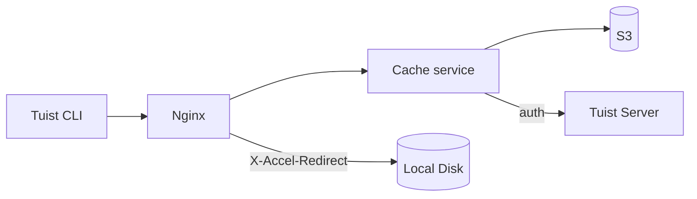
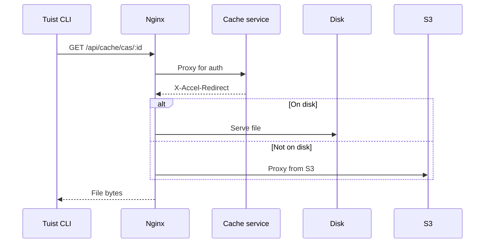
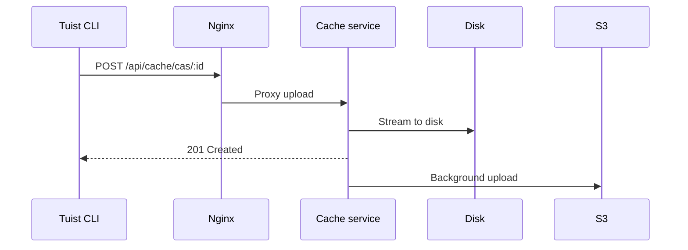

---
{
  "title": "Architecture",
  "titleTemplate": ":title | Cache | Guides | Tuist",
  "description": "Learn about the architecture of the Tuist cache service."
}
---

# Архитектура кэша {#cache-architecture}

::: info
<!-- -->
На этой странице представлен технический обзор архитектуры службы кэширования
Tuist. Она в первую очередь предназначена для пользователей, самостоятельно
размещающих **, участников** и **, а также**, которым необходимо понимать
внутреннее устройство службы. Обычным пользователям, которые хотят только
использовать кэш, читать эту страницу не нужно.
<!-- -->
:::

Служба кэширования Tuist — это автономная служба, которая предоставляет
хранилище с адресацией по контенту (CAS) для артефактов сборки и хранилище
ключей-значений для метаданных кэша.

## Обзор {#overview}

Сервис использует двухуровневую архитектуру хранения:

- **Локальный диск**: основное хранилище для кэш-попаданий с низкой задержкой
- **S3**: долговечное хранилище, которое сохраняет артефакты и позволяет
  восстанавливать данные после удаления.

## Компоненты {#components}

### Nginx {#nginx}

Nginx служит точкой входа и обеспечивает эффективную доставку файлов с помощью
`X-Accel-Redirect`:

- **Загрузки**: Служба кэша проверяет аутентификацию, а затем возвращает
  заголовок `X-Accel-Redirect`. Nginx обслуживает файл напрямую с диска или
  прокси-сервера S3.
- **Загрузки**: Nginx проксирует запросы к службе кэширования, которая передает
  данные на диск.

### Хранилище с адресацией по содержанию {#cas}

Артефакты хранятся на локальном диске в структуре разделенных каталогов:

- **Путь**: `{account}/{project}/cas/{shard1}/{shard2}/{artifact_id}`
- **Шардинг**: Первые четыре символа идентификатора артефакта создают
  двухуровневый шард (например, `ABCD1234` → `AB/CD/ABCD1234`)

### Интеграция S3 {#s3}

S3 обеспечивает долговечное хранение:

- **Фоновая загрузка**: после записи на диск артефакты помещаются в очередь для
  загрузки в S3 с помощью фонового рабочего процесса, который запускается каждую
  минуту.
- **Гидратация по требованию**: когда локальный артефакт отсутствует, запрос
  обслуживается немедленно через заранее подписанный URL S3, а артефакт
  помещается в очередь для фоновой загрузки на локальный диск.

### Изъятие диска {#eviction}

Сервис управляет дисковым пространством с помощью вытеснения LRU:

- Время доступа отслеживается в SQLite.
- Когда использование диска превышает 85%, самые старые артефакты удаляются,
  пока использование не снизится до 70%.
- Артефакты остаются в S3 после локального удаления

### Аутентификация {#authentication}

Кэш делегирует аутентификацию серверу Tuist, вызывая конечную точку
`/api/projects` и кэшируя результаты (10 минут в случае успеха, 3 секунды в
случае неудачи).

## Потоки запросов {#request-flows}

### Скачать {#download-flow}

### Загрузить {#upload-flow}

## Конечные точки API {#api-endpoints}

| Конечная точка                | Метод    | Описание                                 |
| ----------------------------- | -------- | ---------------------------------------- |
| `/up`                         | ПОЛУЧИТЬ | Проверка работоспособности               |
| `/metrics`                    | ПОЛУЧИТЬ | Метрики Prometheus                       |
| `/api/cache/cas/:id`          | ПОЛУЧИТЬ | Скачать артефакт CAS                     |
| `/api/cache/cas/:id`          | POST     | Загрузить артефакт CAS                   |
| `/api/cache/keyvalue/:cas_id` | ПОЛУЧИТЬ | Получить запись ключ-значение            |
| `/api/cache/keyvalue`         | PUT      | Сохраните запись «ключ-значение»         |
| `/api/cache/module/:id`       | HEAD     | Проверьте, существует ли артефакт модуля |
| `/api/cache/module/:id`       | ПОЛУЧИТЬ | Скачать модуль                           |
| `/api/cache/module/start`     | POST     | Начать многочастную загрузку             |
| `/api/cache/module/part`      | POST     | Загрузить часть                          |
| `/api/cache/module/complete`  | POST     | Завершить многочастную загрузку          |
