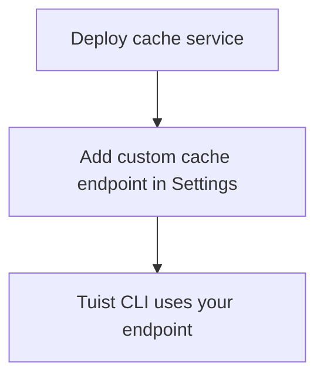

---
{
  "title": "Self-hosting",
  "titleTemplate": ":title | Cache | Guides | Tuist",
  "description": "Learn how to self-host the Tuist cache service."
}
---

# Самостоятельное размещение кэша {#self-host-cache}

Служба кэширования Tuist может быть размещена на собственном хостинге, чтобы
обеспечить частный бинарный кэш для вашей команды. Это наиболее полезно для
организаций с большими артефактами и частыми сборками, где размещение кэша ближе
к вашей инфраструктуре CI снижает задержку и повышает эффективность кэширования.
Минимизируя расстояние между вашими агентами сборки и кэшем, вы гарантируете,
что сетевые накладные расходы не нивелируют преимущества кэширования в скорости.

::: info
<!-- -->
Для самостоятельного хостинга кеш-узлов требуется план **Enterprise**.

Вы можете подключить самостоятельно размещенные узлы кэша к хостируемому серверу
Tuist (`https://tuist.dev`) или к самостоятельно размещенному серверу Tuist. Для
самостоятельного размещения сервера Tuist требуется отдельная серверная
лицензия. См. <LocalizedLink href="/guides/server/self-host/install">руководство
по самостоятельному размещению сервера</LocalizedLink>.
<!-- -->
:::

## Необходимые условия {#prerequisites}

- Docker и Docker Compose
- Хранилище, совместимое с S3
- Работающий экземпляр сервера Tuist (хостинг или самохостинг)

## Развертывание {#deployment}

Служба кэширования распространяется в виде образа Docker по адресу
[ghcr.io/tuist/cache](https://ghcr.io/tuist/cache). Мы предоставляем справочные
файлы конфигурации в [каталоге
cache](https://github.com/tuist/tuist/tree/main/cache).

::: tip
<!-- -->
Мы предоставляем настройку Docker Compose, поскольку она является удобной базой
для оценки и небольших развертываний. Вы можете использовать ее в качестве
ориентира и адаптировать к предпочитаемой модели развертывания (Kubernetes, raw
Docker и т. д.).
<!-- -->
:::

### Файлы конфигурации {#config-files}

```bash
curl -O https://raw.githubusercontent.com/tuist/tuist/main/cache/docker-compose.yml
mkdir -p docker
curl -o docker/nginx.conf https://raw.githubusercontent.com/tuist/tuist/main/cache/docker/nginx.conf
```

### Переменные окружения {#environment-variables}

Создайте файл `.env` с вашей конфигурацией.

::: tip
<!-- -->
Сервис построен на Elixir/Phoenix, поэтому некоторые переменные используют
префикс `PHX_`. Вы можете рассматривать их как стандартную конфигурацию сервиса.
<!-- -->
:::

```env
# Secret key used to sign and encrypt data. Minimum 64 characters.
# Generate with: openssl rand -base64 64
SECRET_KEY_BASE=YOUR_SECRET_KEY_BASE

# Public hostname or IP address where your cache service will be reachable.
PUBLIC_HOST=cache.example.com

# URL of the Tuist server used for authentication (REQUIRED).
# - Hosted: https://tuist.dev
# - Self-hosted: https://your-tuist-server.example.com
SERVER_URL=https://tuist.dev

# S3 Storage configuration
S3_BUCKET=your-cache-bucket
S3_HOST=s3.us-east-1.amazonaws.com
S3_ACCESS_KEY_ID=your-access-key
S3_SECRET_ACCESS_KEY=your-secret-key
S3_REGION=us-east-1

# CAS storage (required for non-compose deployments)
DATA_DIR=/data
```

| Переменная                        | Обязательно | По умолчанию              | Описание                                                                                                             |
| --------------------------------- | ----------- | ------------------------- | -------------------------------------------------------------------------------------------------------------------- |
| `SECRET_KEY_BASE`                 | Да          |                           | Секретный ключ, используемый для подписи и шифрования данных (минимум 64 символа).                                   |
| `PUBLIC_HOST`                     | Да          |                           | Публичное имя хоста или IP-адрес вашего кэш-сервиса. Используется для генерации абсолютных URL-адресов.              |
| `SERVER_URL`                      | Да          |                           | URL вашего сервера Tuist для аутентификации. По умолчанию: `https://tuist.dev`                                       |
| `DATA_DIR`                        | Да          |                           | Каталог, в котором артефакты CAS хранятся на диске. В предоставленной настройке Docker Compose используется `/data`. |
| `S3_BUCKET`                       | Да          |                           | Имя корзины S3.                                                                                                      |
| `S3_HOST`                         | Да          |                           | Имя хоста конечной точки S3.                                                                                         |
| `S3_ACCESS_KEY_ID`                | Да          |                           | Ключ доступа S3.                                                                                                     |
| `S3_SECRET_ACCESS_KEY`            | Да          |                           | Секретный ключ S3.                                                                                                   |
| `S3_REGION`                       | Да          |                           | Регион S3.                                                                                                           |
| `CAS_DISK_HIGH_WATERMARK_PERCENT` | Нет         | `85`                      | Процент использования диска, при котором запускается вытеснение LRU.                                                 |
| `CAS_DISK_TARGET_PERCENT`         | Нет         | `70`                      | Использование целевого диска после выселения.                                                                        |
| `PHX_SOCKET_PATH`                 | Нет         | `/run/cache/cache.sock`   | Путь, по которому служба создает свой сокет Unix (если он включен).                                                  |
| `PHX_SOCKET_LINK`                 | Нет         | `/run/cache/current.sock` | Символьный путь, который Nginx использует для подключения к сервису.                                                 |

### Запустите службу {#start-service}

```bash
docker compose up -d
```

### Проверьте развертывание {#verify}

```bash
curl http://localhost/up
```

## Настройте конечную точку кэша {#configure-endpoint}

После развертывания службы кэширования зарегистрируйте ее в настройках
организации сервера Tuist:

1. Перейдите на страницу «Настройки» ( **) вашей организации**.
2. Найдите раздел « **» (Настройки конфигурации) «Custom cache endpoints»
   (Пользовательские конечные точки кэша) «** » (Пользовательские конечные точки
   кэша
3. Добавьте URL-адрес вашего кэш-сервиса (например, `https://cache.example.com`)

<!-- TODO: Add screenshot of organization settings page showing Custom cache endpoints section -->



После настройки Tuist CLI будет использовать ваш самостоятельно размещенный кэш.

## Том {#volumes}

Конфигурация Docker Compose использует три тома:

| Объем          | Цель                                 |
| -------------- | ------------------------------------ |
| `cas_data`     | Хранение двоичных артефактов         |
| `sqlite_data`  | Доступ к метаданным для удаления LRU |
| `cache_socket` | Сокет Unix для связи Nginx-service   |

## Проверка работоспособности {#health-checks}

- `GET /up` — Возвращает 200, если все в порядке
- `GET /metrics` — метрики Prometheus

## Мониторинг {#monitoring}

Служба кэша предоставляет метрики, совместимые с Prometheus, по адресу
`/metrics`.

Если вы используете Grafana, вы можете импортировать [справочную панель
инструментов](https://raw.githubusercontent.com/tuist/tuist/refs/heads/main/cache/priv/grafana_dashboards/cache_service.json).

## Обновление {#upgrading}

```bash
docker compose pull
docker compose up -d
```

Сервис автоматически запускает миграцию базы данных при запуске.

## Устранение неполадок {#troubleshooting}

### Кэш не используется {#troubleshooting-caching}

Если вы ожидаете кэширования, но наблюдаете постоянные промахи кэша (например,
CLI повторно загружает одни и те же артефакты или загрузки никогда не
происходят), выполните следующие действия:

1. Убедитесь, что пользовательская конечная точка кэша правильно настроена в
   параметрах вашей организации.
2. Убедитесь, что ваш Tuist CLI прошел аутентификацию, запустив `tuist auth
   login`.
3. Проверьте журналы службы кэша на наличие ошибок: `docker compose logs cache`.

### Несоответствие пути сокета {#troubleshooting-socket}

Если вы видите ошибки «Соединение отказано»:

- Убедитесь, что `PHX_SOCKET_LINK` указывает на путь к сокету, настроенный в
  nginx.conf (по умолчанию: `/run/cache/current.sock`)
- Убедитесь, что `PHX_SOCKET_PATH` и `PHX_SOCKET_LINK` правильно указаны в файле
  docker-compose.yml.
- Убедитесь, что том `cache_socket` смонтирован в обоих контейнерах.
