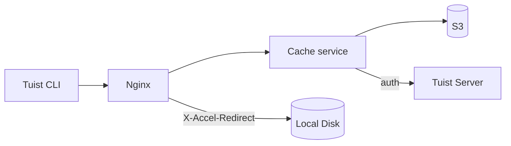
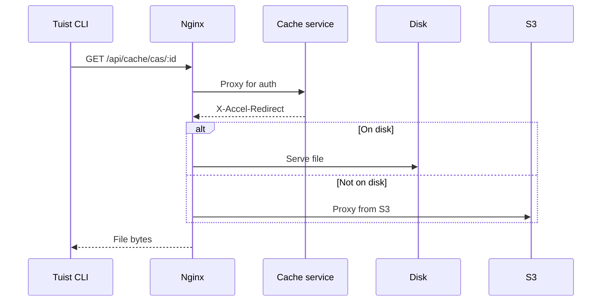
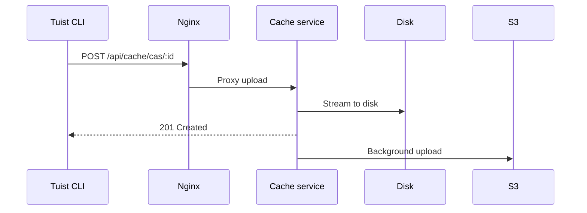

---
{
  "title": "Architecture",
  "titleTemplate": ":title | Cache | Guides | Tuist",
  "description": "Learn about the architecture of the Tuist cache service."
}
---

# Önbellek Mimarisi {#cache-architecture}

::: info
<!-- -->
Bu sayfa, Tuist önbellek hizmeti mimarisinin teknik bir özetini sunar.
Öncelikle, hizmetin iç işleyişini anlaması gereken **kendi sunucusunda
barındıran kullanıcılar** ve **katkıda bulunanlar** için hazırlanmıştır.
Yalnızca önbelleği kullanmak isteyen genel kullanıcıların bu sayfayı okumasına
gerek yoktur.
<!-- -->
:::

Tuist önbellek hizmeti, derleme öğeleri için İçerik Adreslenebilir Depolama
(CAS) ve önbellek meta verileri için anahtar-değer deposu sağlayan bağımsız bir
hizmettir.

## Genel bakış {#overview}

Hizmet, iki katmanlı bir depolama mimarisi kullanır:

- **Yerel disk**: Düşük gecikmeli önbellek isabetleri için birincil depolama
  alanı
- **S3**: Artefaktları kalıcı olarak saklayan ve tahliye sonrasında kurtarmaya
  olanak tanıyan dayanıklı depolama

## Bileşenler {#components}

### Nginx {#nginx}

Nginx giriş noktası olarak hizmet eder ve `X-Accel-Redirect` kullanarak verimli
dosya teslimatını yönetir:

- **İndirmeler**: Önbellek hizmeti kimlik doğrulamasını onaylar, ardından
  `X-Accel-Redirect` başlığını döndürür. Nginx, dosyayı doğrudan diskten veya
  S3'ten proxy'lerden sunar.
- **Yüklemeler**: Nginx, verileri diske aktaran önbellek hizmetine istekleri
  yönlendirir.

### İçerik Adreslenebilir Depolama {#cas}

Artefaktlar, yerel diskte parçalanmış bir dizin yapısında depolanır:

- **Yol**: `{hesap}/{proje}/cas/{shard1}/{shard2}/{artifact_id}`
- **Parçalama**: Artefakt kimliğinin ilk dört karakteri iki seviyeli bir parça
  oluşturur (ör. `ABCD1234` → `AB/CD/ABCD1234`)

### S3 Entegrasyonu {#s3}

S3 dayanıklı depolama sağlar:

- **Arka plan yüklemeleri**: Diske yazıldıktan sonra, artefaktlar her dakika
  çalışan bir arka plan işçisi aracılığıyla S3'e yüklenmek üzere sıraya alınır.
- **İsteğe bağlı hidrasyon**: Yerel bir yapı eksik olduğunda, yapı yerel diske
  arka planda indirilmek üzere kuyruğa alınırken, istek önceden imzalanmış bir
  S3 URL'si aracılığıyla hemen karşılanır.

### Disk Tahliyesi {#eviction}

Hizmet, LRU tahliye yöntemini kullanarak disk alanını yönetir:

- Erişim zamanları SQLite'da izlenir.
- Disk kullanımı %85'i aştığında, kullanım %70'e düşene kadar en eski yapıtlar
  silinir.
- Yerel tahliye sonrasında S3'te kalıntılar kalır

### Kimlik Doğrulama {#authentication}

Önbellek, `/api/projects` uç noktasını çağırarak ve sonuçları önbelleğe alarak
(başarılı ise 10 dakika, başarısız ise 3 saniye) kimlik doğrulamayı Tuist
sunucusuna devreder.

## İstek Akışları {#request-flows}

### İndir {#download-flow}

### Yükle {#upload-flow}

## API Uç Noktaları {#api-endpoints}

| Uç nokta                      | Yöntem | Açıklama                                  |
| ----------------------------- | ------ | ----------------------------------------- |
| `/up`                         | GET    | Sağlık kontrolü                           |
| `/metrics`                    | GET    | Prometheus metrikleri                     |
| `/api/cache/cas/:id`          | GET    | CAS artefaktını indirin                   |
| `/api/cache/cas/:id`          | POST   | CAS eserini yükleyin                      |
| `/api/cache/keyvalue/:cas_id` | GET    | Anahtar-değer girdisini alın              |
| `/api/cache/keyvalue`         | PUT    | Anahtar-değer girişini saklayın           |
| `/api/cache/module/:id`       | HEAD   | Modül artefaktının varlığını kontrol edin |
| `/api/cache/module/:id`       | GET    | Modül artefaktını indirin                 |
| `/api/cache/module/start`     | POST   | Çok parçalı yüklemeyi başlat              |
| `/api/cache/module/part`      | POST   | Yükleme kısmı                             |
| `/api/cache/module/complete`  | POST   | Çok parçalı yüklemeyi tamamlayın          |
