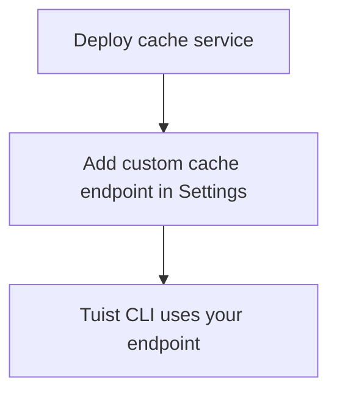

---
{
  "title": "Self-hosting",
  "titleTemplate": ":title | Cache | Guides | Tuist",
  "description": "Learn how to self-host the Tuist cache service."
}
---

# Kendi sunucunuzda önbellek barındırma {#self-host-cache}

Tuist önbellek hizmeti, ekibiniz için özel bir ikili önbellek sağlamak üzere
kendi sunucunuzda barındırılabilir. Bu, büyük yapıtlara ve sık sık derlemelere
sahip kuruluşlar için çok yararlıdır. Bu tür kuruluşlarda, önbelleği CI
altyapınıza daha yakın bir yere yerleştirmek gecikmeyi azaltır ve önbellek
verimliliğini artırır. Derleme aracıları ile önbellek arasındaki mesafeyi en aza
indirerek, ağ yükünün önbelleklemenin hız avantajlarını ortadan kaldırmamasını
sağlarsınız.

::: info
<!-- -->
Önbellek düğümlerini kendi sunucunuzda barındırmak için **Enterprise planı**
gereklidir.

Kendi barındırdığınız önbellek düğümlerini, barındırılan Tuist sunucusuna
(`https://tuist.dev`) veya kendi barındırdığınız Tuist sunucusuna
bağlayabilirsiniz. Tuist sunucusunu kendi barındırmanız için ayrı bir sunucu
lisansı gerekir. <LocalizedLink href="/guides/server/self-host/install">sunucu
kendi barındırma kılavuzuna</LocalizedLink> bakın.
<!-- -->
:::

## Ön Koşullar {#prerequisites}

- Docker ve Docker Compose
- S3 uyumlu depolama kovası
- Çalışan bir Tuist sunucu örneği (barındırılan veya kendi kendine barındırılan)

## Dağıtım {#deployment}

Önbellek hizmeti, [ghcr.io/tuist/cache](https://ghcr.io/tuist/cache) adresinde
Docker görüntüsü olarak dağıtılmaktadır. [cache
dizini](https://github.com/tuist/tuist/tree/main/cache) içinde referans
yapılandırma dosyaları sunuyoruz.

::: tip
<!-- -->
Değerlendirme ve küçük dağıtımlar için uygun bir temel olduğu için Docker
Compose kurulumu sağlıyoruz. Bunu referans olarak kullanabilir ve tercih
ettiğiniz dağıtım modeline (Kubernetes, ham Docker vb.) uyarlayabilirsiniz.
<!-- -->
:::

### Yapılandırma dosyaları {#config-files}

```bash
curl -O https://raw.githubusercontent.com/tuist/tuist/main/cache/docker-compose.yml
mkdir -p docker
curl -o docker/nginx.conf https://raw.githubusercontent.com/tuist/tuist/main/cache/docker/nginx.conf
```

### Ortam değişkenleri {#environment-variables}

`.env` dosyasını yapılandırmanızla birlikte oluşturun.

::: tip
<!-- -->
Hizmet Elixir/Phoenix ile oluşturulmuştur, bu nedenle bazı değişkenler `PHX_`
önekini kullanır. Bunları standart hizmet yapılandırması olarak kabul
edebilirsiniz.
<!-- -->
:::

```env
# Secret key used to sign and encrypt data. Minimum 64 characters.
# Generate with: openssl rand -base64 64
SECRET_KEY_BASE=YOUR_SECRET_KEY_BASE

# Public hostname or IP address where your cache service will be reachable.
PUBLIC_HOST=cache.example.com

# URL of the Tuist server used for authentication (REQUIRED).
# - Hosted: https://tuist.dev
# - Self-hosted: https://your-tuist-server.example.com
SERVER_URL=https://tuist.dev

# S3 Storage configuration
S3_BUCKET=your-cache-bucket
S3_HOST=s3.us-east-1.amazonaws.com
S3_ACCESS_KEY_ID=your-access-key
S3_SECRET_ACCESS_KEY=your-secret-key
S3_REGION=us-east-1

# CAS storage (required for non-compose deployments)
DATA_DIR=/data
```

| Değişken                          | Gerekli | Varsayılan                | Açıklama                                                                                                  |
| --------------------------------- | ------- | ------------------------- | --------------------------------------------------------------------------------------------------------- |
| `SECRET_KEY_BASE`                 | Evet    |                           | Verileri imzalamak ve şifrelemek için kullanılan gizli anahtar (en az 64 karakter).                       |
| `PUBLIC_HOST`                     | Evet    |                           | Önbellek hizmetinizin genel ana bilgisayar adı veya IP adresi. Mutlak URL'ler oluşturmak için kullanılır. |
| `SERVER_URL`                      | Evet    |                           | Kimlik doğrulama için Tuist sunucunuzun URL'si. Varsayılan değer `https://tuist.dev`                      |
| `DATA_DIR`                        | Evet    |                           | CAS artefaktlarının diskte depolandığı dizin. Sağlanan Docker Compose kurulumu `/data` kullanır.          |
| `S3_BUCKET`                       | Evet    |                           | S3 kova adı.                                                                                              |
| `S3_HOST`                         | Evet    |                           | S3 uç noktası ana bilgisayar adı.                                                                         |
| `S3_ACCESS_KEY_ID`                | Evet    |                           | S3 erişim anahtarı.                                                                                       |
| `S3_SECRET_ACCESS_KEY`            | Evet    |                           | S3 gizli anahtarı.                                                                                        |
| `S3_REGION`                       | Evet    |                           | S3 bölgesi.                                                                                               |
| `CAS_DISK_HIGH_WATERMARK_PERCENT` | Hayır   | `85`                      | LRU tahliyesini tetikleyen disk kullanım yüzdesi.                                                         |
| `CAS_DISK_TARGET_PERCENT`         | Hayır   | `70`                      | Tahliye sonrası hedef disk kullanımı.                                                                     |
| `PHX_SOCKET_PATH`                 | Hayır   | `/run/cache/cache.sock`   | Hizmetin Unix soketini oluşturduğu yol (etkinleştirildiğinde).                                            |
| `PHX_SOCKET_LINK`                 | Hayır   | `/run/cache/current.sock` | Nginx'in hizmete bağlanmak için kullandığı sembolik bağlantı yolu.                                        |

### Hizmeti başlatın {#start-service}

```bash
docker compose up -d
```

### Dağıtımı doğrulayın {#verify}

```bash
curl http://localhost/up
```

## Önbellek uç noktasını yapılandırın {#configure-endpoint}

Önbellek hizmetini dağıttıktan sonra, Tuist sunucu organizasyon ayarlarınızda
kaydettirin:

1. Kuruluşunuzun **Ayarlar** sayfasına gidin.
2. **'yi bulun Özel önbellek uç noktaları** bölümü
3. Önbellek hizmeti URL'nizi ekleyin (örneğin, `https://cache.example.com`)

<!-- TODO: Add screenshot of organization settings page showing Custom cache endpoints section -->



Yapılandırıldıktan sonra, Tuist CLI kendi barındırdığınız önbelleği
kullanacaktır.

## Ciltler {#volumes}

Docker Compose yapılandırması üç birim kullanır:

| Cilt           | Amaç                                     |
| -------------- | ---------------------------------------- |
| `cas_data`     | İkili yapay nesne depolama               |
| `sqlite_data`  | LRU tahliyesi için meta verilere erişin  |
| `cache_socket` | Nginx hizmeti iletişimi için Unix soketi |

## Sağlık kontrolleri {#health-checks}

- `GET /up` — Sorunsuz olduğunda 200 döndürür
- `GET /metrics` — Prometheus metrikleri

## İzleme {#monitoring}

Önbellek hizmeti, Prometheus uyumlu metrikleri `/metrics` adresinde gösterir.

Grafana kullanıyorsanız, [referans
panosunu](https://raw.githubusercontent.com/tuist/tuist/refs/heads/main/cache/priv/grafana_dashboards/cache_service.json)
içe aktarabilirsiniz.

## Yükseltme {#upgrading}

```bash
docker compose pull
docker compose up -d
```

Hizmet, başlangıçta veritabanı geçişleri otomatik olarak çalıştırır.

## Sorun Giderme {#troubleshooting}

### Önbellek kullanılmıyor {#troubleshooting-caching}

Önbellekleme bekliyorsanız ancak sürekli önbellek hataları görüyorsanız
(örneğin, CLI aynı öğeleri tekrar tekrar yüklüyor veya indirme hiç
gerçekleşmiyor), şu adımları izleyin:

1. Özel önbellek uç noktasının kuruluş ayarlarınızda doğru şekilde
   yapılandırıldığını doğrulayın.
2. `tuist auth login` komutunu çalıştırarak Tuist CLI'nizin kimlik
   doğrulamasının yapıldığından emin olun.
3. Önbellek hizmeti günlüklerinde hata olup olmadığını kontrol edin: `docker
   compose logs cache`.

### Soket yolu uyuşmazlığı {#troubleshooting-socket}

Bağlantı reddedildi hatası görürseniz:

- `PHX_SOCKET_LINK` nginx.conf dosyasında yapılandırılan soket yolunu işaret
  ettiğinden emin olun (varsayılan: `/run/cache/current.sock`)
- `'nin PHX_SOCKET_PATH` ve `'nin PHX_SOCKET_LINK` docker-compose.yml dosyasında
  doğru şekilde ayarlandığını doğrulayın.
- `cache_socket` biriminin her iki konteynere de takılı olduğunu doğrulayın.
