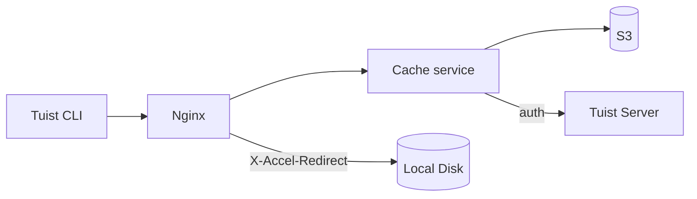
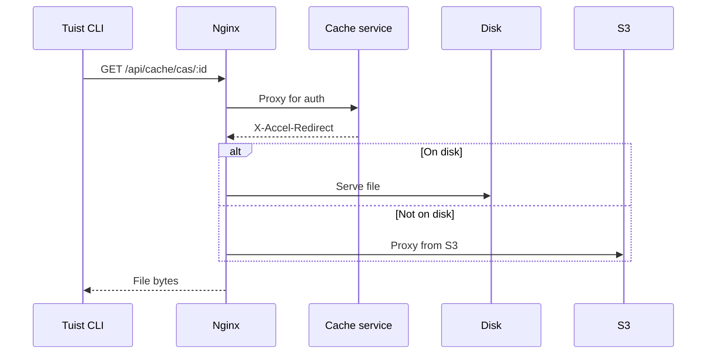
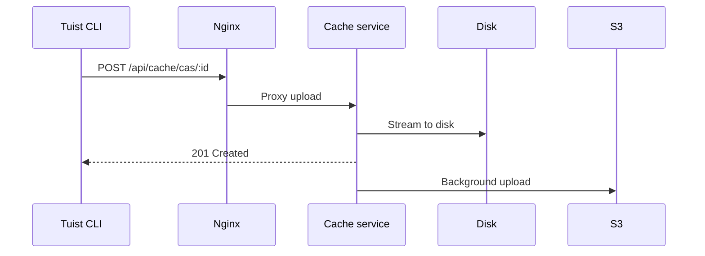

---
{
  "title": "Architecture",
  "titleTemplate": ":title | Cache | Guides | Tuist",
  "description": "Learn about the architecture of the Tuist cache service."
}
---

# 缓存架构{#cache-architecture}

信息
<!-- -->
本页面提供 Tuist 缓存服务架构的技术概述。主要面向需要理解服务内部运作机制的**自托管用户** 及**贡献者**
。仅需使用缓存功能的普通用户无需阅读此内容。
<!-- -->
:::

Tuist缓存服务是一个独立服务，为构建工件提供内容可寻址存储（CAS），并为缓存元数据提供键值存储。

## 概述{#overview}

该服务采用两级存储架构：

- **本地磁盘**: 低延迟缓存命中的一级存储
- **S3 持久化存储（** ）：持久化存储数据，支持在数据被清除后恢复

## 组件{#components}

### Nginx{#nginx}

Nginx作为入口点，通过`X-Accel-Redirect` 实现高效文件交付：

- **下载** ：缓存服务验证身份认证后，返回`的X-Accel-Redirect` 标头。Nginx直接从磁盘提供文件或从S3代理。
- **上传**: Nginx 将请求代理至缓存服务，该服务将数据流式传输至磁盘。

### 内容可寻址存储{#cas}

工件存储在本地磁盘的分片目录结构中：

- **路径**:`{account}/{project}/cas/{shard1}/{shard2}/{artifact_id}`
- **分片规则：**- 取工件ID前四位字符生成两级分片（例如：`→` ，ABCD1234 →`，AB/CD/ABCD1234 →` ）

### S3 集成{#s3}

S3提供持久化存储：

- **后台上传**: 写入磁盘后，数据将通过每分钟运行的后台进程排队上传至S3
- **按需加载** ：当本地工件缺失时，请求将立即通过预签名的S3 URL响应，同时该工件会被排队至后台下载至本地磁盘

### 磁盘驱逐{#eviction}

该服务采用最近最少使用（LRU）策略管理磁盘空间：

- 访问时间通过SQLite进行追踪
- 当磁盘使用率超过85%时，将删除最旧的工件直至使用率降至70%
- 本地清除后，S3中仍保留的残留数据

### 认证{#authentication}

缓存通过调用`/api/projects` 接口将认证委托给Tuist服务器，并将结果缓存（成功缓存10分钟，失败缓存3秒）。

## 请求流程{#request-flows}

### 下载{#download-flow}

### 上传{#upload-flow}

## API 端点{#api-endpoints}

| 终端点                           | 方法   | 描述         |
| ----------------------------- | ---- | ---------- |
| `/up`                         | GET  | 健康检查       |
| `/metrics`                    | GET  | 普罗米修斯指标    |
| `/api/cache/cas/:id`          | GET  | 下载CAS工件    |
| `/api/cache/cas/:id`          | POST | 上传CAS成果    |
| `/api/cache/keyvalue/:cas_id` | GET  | 获取键值条目     |
| `/api/cache/keyvalue`         | PUT  | 存储键值对      |
| `/api/cache/module/:id`       | HEAD | 检查模块工件是否存在 |
| `/api/cache/module/:id`       | GET  | 下载模块工件     |
| `/api/cache/module/start`     | POST | 开始多部分上传    |
| `/api/cache/module/part`      | POST | 上传部分       |
| `/api/cache/module/complete`  | POST | 完成多部分上传    |
