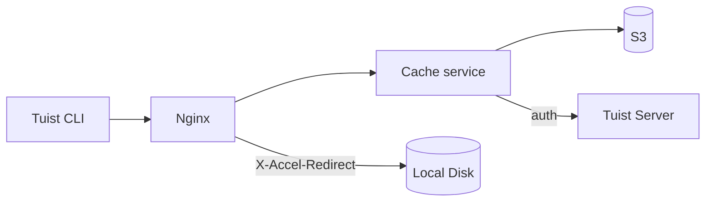
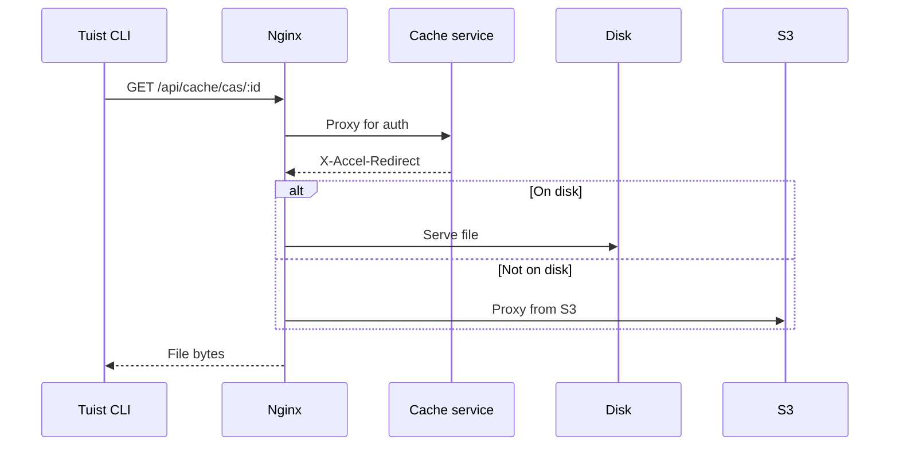
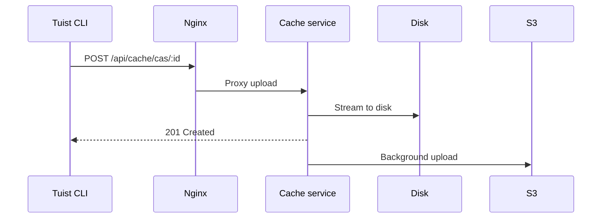

---
{
  "title": "Architecture",
  "titleTemplate": ":title | Cache | Guides | Tuist",
  "description": "Learn about the architecture of the Tuist cache service."
}
---

# 缓存架构{#cache-architecture}

信息
<!-- -->
本页面提供了关于 Tuist 缓存服务架构的技术概述。它主要面向需要了解该服务内部运作机制的**自托管用户** 以及**贡献者**
。仅希望使用缓存的一般用户无需阅读此内容。
<!-- -->
:::

Tuist 缓存服务是一个独立服务，为构建产物提供内容可寻址存储（CAS），并为缓存元数据提供键值存储。

## 概述{#overview}

该服务采用两层存储架构：

- **本地磁盘**: 用于低延迟缓存命中的一级存储
- **S3**: 持久化存储，可保存数据并支持在数据被清除后进行恢复

```mermaid
flowchart LR
    CLI[Tuist CLI] --> NGINX[Nginx]
    NGINX --> APP[Cache service]
    NGINX -->|X-Accel-Redirect| DISK[(Local Disk)]
    APP --> S3[(S3)]
    APP -->|auth| SERVER[Tuist Server]
```

## 组件{#components}

### Nginx{#nginx}

Nginx 作为入口点，通过`X-Accel-Redirect` 实现高效的文件传输：

- **下载** ：缓存服务验证身份后，会返回包含`X-Accel-Redirect` 标头的响应。Nginx 直接从磁盘提供文件，或通过 S3 代理提供。
- **上传**: Nginx 将请求代理到缓存服务，该服务将数据流式传输到磁盘。

### 内容可寻址存储{#cas}

Artifacts 存储在本地磁盘的分片目录结构中：

- **路径**:`{account}/{project}/cas/{shard1}/{shard2}/{artifact_id}`
- **分片**: 工件 ID 的前四个字符将生成一个两级分片（例如，`ABCD1234` →`AB/CD/ABCD1234` ）

### S3 集成{#s3}

S3 提供持久性存储：

- **后台上传**: 写入磁盘后，构建产物将通过每分钟运行一次的后台任务排队上传至 S3
- **按需加载**: 当本地资源缺失时，系统会立即通过预签名的 S3 链接响应请求，同时将该资源加入队列，在后台下载至本地磁盘

### 磁盘驱逐{#eviction}

该服务使用 LRU 淘汰机制管理磁盘空间：

- 访问时间由 SQLite 记录
- 当磁盘使用率超过 85% 时，系统将删除最旧的构建产物，直至使用率降至 70%
- 本地清除后，资源仍保留在 S3 中

### 认证{#authentication}

缓存通过调用`/api/projects` 端点将身份验证委托给 Tuist 服务器，并缓存结果（成功时缓存 10 分钟，失败时缓存 3 秒）。

## 请求流程{#request-flows}

### 下载{#download-flow}

```mermaid
sequenceDiagram
    participant CLI as Tuist CLI
    participant N as Nginx
    participant A as Cache service
    participant D as Disk
    participant S as S3

    CLI->>N: GET /api/cache/cas/:id
    N->>A: Proxy for auth
    A-->>N: X-Accel-Redirect
    alt On disk
        N->>D: Serve file
    else Not on disk
        N->>S: Proxy from S3
    end
    N-->>CLI: File bytes
```

### 上传{#upload-flow}

```mermaid
sequenceDiagram
    participant CLI as Tuist CLI
    participant N as Nginx
    participant A as Cache service
    participant D as Disk
    participant S as S3

    CLI->>N: POST /api/cache/cas/:id
    N->>A: Proxy upload
    A->>D: Stream to disk
    A-->>CLI: 201 Created
    A->>S: Background upload
```

## API 端点{#api-endpoints}

| Endpoint                      | 方法   | 描述            |
| ----------------------------- | ---- | ------------- |
| `/up`                         | GET  | 健康检查          |
| `/metrics`                    | GET  | Prometheus 指标 |
| `/api/cache/cas/:id`          | GET  | 下载 CAS 成果     |
| `/api/cache/cas/:id`          | POST | 上传 CAS 成果     |
| `/api/cache/keyvalue/:cas_id` | GET  | 获取键值对         |
| `/api/cache/keyvalue`         | PUT  | 存储键值对         |
| `/api/cache/module/:id`       | HEAD | 检查模块构建产物是否存在  |
| `/api/cache/module/:id`       | GET  | 下载模块构建产物      |
| `/api/cache/module/start`     | POST | 开始分段上传        |
| `/api/cache/module/part`      | POST | 上传部分          |
| `/api/cache/module/complete`  | POST | 完成多部分上传       |
