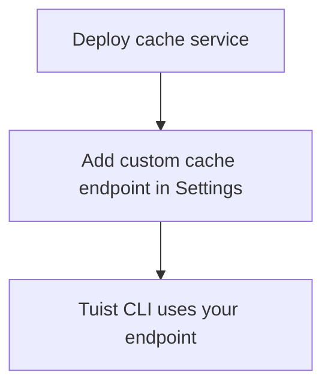

---
{
  "title": "Self-hosting",
  "titleTemplate": ":title | Cache | Guides | Tuist",
  "description": "Learn how to self-host the Tuist cache service."
}
---

# 自托管缓存{#self-host-cache}

Tuist缓存服务支持自托管，可为团队提供私有二进制缓存。此方案尤其适用于大型构建产物和高频构建的组织——将缓存部署在CI基础设施附近可降低延迟并提升缓存效率。通过缩短构建代理与缓存之间的距离，可确保网络开销不会抵消缓存带来的速度优势。

信息
<!-- -->
自托管缓存节点需订阅**企业版计划** 。

您可将自托管缓存节点连接至托管版Tuist服务器（`https://tuist.dev`
）或自托管版Tuist服务器。若需自托管Tuist服务器本身，则需单独购买服务器许可证。详见<LocalizedLink href="/guides/server/self-host/install">服务器自托管指南</LocalizedLink>。
<!-- -->
:::

## 前提条件{#prerequisites}

- Docker 和 Docker Compose
- S3兼容存储桶
- 正在运行的 Tuist 服务器实例（托管或自托管）

## 部署{#deployment}

缓存服务以 Docker 镜像形式发布于
[ghcr.io/tuist/cache](https://ghcr.io/tuist/cache)。参考配置文件存放于 [cache
目录](https://github.com/tuist/tuist/tree/main/cache)。

::: tip
<!-- -->
我们提供 Docker Compose 配置方案，因其作为评估和小型部署的便捷基准。您可将其作为参考，并根据自身偏好的部署模式（Kubernetes、原生
Docker 等）进行适配。
<!-- -->
:::

### 配置文件{#config-files}

```bash
curl -O https://raw.githubusercontent.com/tuist/tuist/main/cache/docker-compose.yml
mkdir -p docker
curl -o docker/nginx.conf https://raw.githubusercontent.com/tuist/tuist/main/cache/docker/nginx.conf
```

### 环境变量{#environment-variables}

创建`.env文件，并配置` 文件。

::: tip
<!-- -->
该服务基于Elixir/Phoenix构建，部分变量使用`的PHX_` 前缀。可将其视为标准服务配置。
<!-- -->
:::

```env
# Secret key used to sign and encrypt data. Minimum 64 characters.
# Generate with: openssl rand -base64 64
SECRET_KEY_BASE=YOUR_SECRET_KEY_BASE

# Public hostname or IP address where your cache service will be reachable.
PUBLIC_HOST=cache.example.com

# URL of the Tuist server used for authentication (REQUIRED).
# - Hosted: https://tuist.dev
# - Self-hosted: https://your-tuist-server.example.com
SERVER_URL=https://tuist.dev

# S3 Storage configuration
S3_BUCKET=your-cache-bucket
S3_HOST=s3.us-east-1.amazonaws.com
S3_ACCESS_KEY_ID=your-access-key
S3_SECRET_ACCESS_KEY=your-secret-key
S3_REGION=us-east-1

# CAS storage (required for non-compose deployments)
DATA_DIR=/data
```

| 变量                                | 必需  | 默认值                       | 描述                                            |
| --------------------------------- | --- | ------------------------- | --------------------------------------------- |
| `SECRET_KEY_BASE`                 | 是   |                           | 用于签名和加密数据的密钥（至少64个字符）。                        |
| `PUBLIC_HOST`                     | 是   |                           | 缓存服务的公共主机名或IP地址。用于生成绝对URL。                    |
| `SERVER_URL`                      | 是   |                           | 用于身份验证的 Tuist 服务器 URL。默认值为`https://tuist.dev` |
| `DATA_DIR`                        | 是   |                           | CAS工件存储在磁盘上的目录。提供的Docker Compose配置使用`/data` 。 |
| `S3_BUCKET`                       | 是   |                           | S3存储桶名称。                                      |
| `S3_HOST`                         | 是   |                           | S3 端点主机名。                                     |
| `S3_ACCESS_KEY_ID`                | 是   |                           | S3访问密钥。                                       |
| `S3_SECRET_ACCESS_KEY`            | 是   |                           | S3 密钥。                                        |
| `S3_REGION`                       | 是   |                           | S3区域。                                         |
| `CAS_DISK_HIGH_WATERMARK_PERCENT` | 不   | `85`                      | 触发LRU淘汰的磁盘使用率阈值。                              |
| `CAS_DISK_TARGET_PERCENT`         | 不   | `70`                      | 驱逐后的目标磁盘使用量。                                  |
| `PHX_SOCKET_PATH`                 | 不   | `/run/cache/cache.sock`   | 服务创建其Unix套接字的路径（当启用时）。                        |
| `PHX_SOCKET_LINK`                 | 不   | `/run/cache/current.sock` | Nginx用于连接服务的符号链接路径。                           |

### 启动服务{#start-service}

```bash
docker compose up -d
```

### 验证部署{#verify}

```bash
curl http://localhost/up
```

## 配置缓存端点{#configure-endpoint}

部署缓存服务后，请在 Tuist 服务器组织设置中注册该服务：

1. 前往您组织的**设置页面：**
2. 查找**自定义缓存端点** 部分
3. 添加您的缓存服务网址（例如：`https://cache.example.com` ）

<!-- TODO: Add screenshot of organization settings page showing Custom cache endpoints section -->



配置完成后，Tuist CLI 将使用您自托管的缓存。

## 卷{#volumes}

Docker Compose 配置使用三个卷：

| 卷              | 目的                       |
| -------------- | ------------------------ |
| `cas_data`     | 二进制工件存储                  |
| `sqlite_data`  | 访问LRU淘汰的元数据              |
| `cache_socket` | 用于 Nginx 与服务通信的 Unix 套接字 |

## 健康检查{#health-checks}

- `GET /up` — 系统正常时返回200状态码
- `GET /metrics` — Prometheus 指标

## 监控{#monitoring}

缓存服务通过`/metrics 提供与 Prometheus 兼容的指标，详见` 。

若使用Grafana，可导入[参考仪表板](https://raw.githubusercontent.com/tuist/tuist/refs/heads/main/cache/priv/grafana_dashboards/cache_service.json)。

## 升级{#upgrading}

```bash
docker compose pull
docker compose up -d
```

该服务在启动时会自动运行数据库迁移。

## 故障排除 {#troubleshooting}

### 缓存未被使用{#troubleshooting-caching}

若预期存在缓存却持续出现缓存未命中（例如 CLI 反复上传相同工件，或下载操作始终未发生），请按以下步骤操作：

1. 请在组织设置中验证自定义缓存端点是否配置正确。
2. 通过运行`tuist auth login` 确保您的Tuist CLI已完成身份验证。
3. 检查缓存服务日志是否有错误：`docker compose logs cache`.

### 套接字路径不匹配{#troubleshooting-socket}

若出现连接被拒绝错误：

- 确保`PHX_SOCKET_LINK` 指向 nginx.conf 中配置的套接字路径（默认值：`/run/cache/current.sock` ）
- 请确认 docker-compose.yml 文件中`PHX_SOCKET_PATH` 及`PHX_SOCKET_LINK` 均设置正确
- 验证`、cache_socket和` 卷在两个容器中均已挂载
