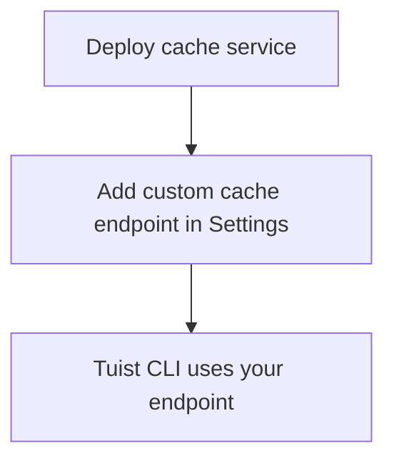

---
{
  "title": "Self-hosting",
  "titleTemplate": ":title | Cache | Guides | Tuist",
  "description": "Learn how to self-host the Tuist cache service."
}
---

# 自托管缓存{#self-host-cache}

Tuist 缓存服务支持自主托管，可为您的团队提供私有二进制缓存。这对于拥有大型构建产物且构建频率较高的组织尤为有用，将缓存部署在更接近 CI
基础设施的位置，可以降低延迟并提高缓存效率。通过缩短构建代理与缓存之间的距离，您可以确保网络开销不会抵消缓存带来的速度优势。

信息
<!-- -->
自建缓存节点需要**企业版计划** 。

您可以将自托管的缓存节点连接到托管版 Tuist 服务器（`https://tuist.dev` ）或自托管的 Tuist 服务器。若要自托管 Tuist
服务器本身，则需要单独的服务器许可证。请参阅
<LocalizedLink href="/guides/server/self-host/install">服务器自托管指南</LocalizedLink>。
<!-- -->
:::

## 先决条件{#prerequisites}

- Docker 和 Docker Compose
- 兼容 S3 的存储桶
- 正在运行的 Tuist 服务器实例（托管或自托管）

## 部署{#deployment}

缓存服务以 Docker 镜像的形式发布在 [ghcr.io/tuist/cache](https://ghcr.io/tuist/cache)。我们在
[cache 目录](https://github.com/tuist/tuist/tree/main/cache) 中提供了参考配置文件。

::: tip
<!-- -->
我们提供了一个 Docker Compose
配置，因为它为评估和小型部署提供了一个便捷的基准。您可以将其作为参考，并根据您偏好的部署模型（Kubernetes、原生 Docker 等）进行调整。
<!-- -->
:::

### 配置文件{#config-files}

```bash
curl -O https://raw.githubusercontent.com/tuist/tuist/main/cache/docker-compose.yml
mkdir -p docker
curl -o docker/nginx.conf https://raw.githubusercontent.com/tuist/tuist/main/cache/docker/nginx.conf
```

### 环境变量{#environment-variables}

创建一个包含您配置的 ``.env` 文件。`

::: tip
<!-- -->
该服务基于 Elixir/Phoenix 构建，因此部分变量使用了`PHX_` 前缀。您可以将这些视为标准的服务配置。
<!-- -->
:::

```env
# Secret key used to sign and encrypt data. Minimum 64 characters.
# Generate with: openssl rand -base64 64
SECRET_KEY_BASE=YOUR_SECRET_KEY_BASE

# Public hostname or IP address where your cache service will be reachable.
PUBLIC_HOST=cache.example.com

# URL of the Tuist server used for authentication (REQUIRED).
# - Hosted: https://tuist.dev
# - Self-hosted: https://your-tuist-server.example.com
SERVER_URL=https://tuist.dev

# S3 Storage configuration
S3_BUCKET=your-cache-bucket
S3_HOST=s3.us-east-1.amazonaws.com
S3_ACCESS_KEY_ID=your-access-key
S3_SECRET_ACCESS_KEY=your-secret-key
S3_REGION=us-east-1

# CAS storage (required for non-compose deployments)
DATA_DIR=/data
```

| 变量                                | 必需  | 默认值                       | 描述                                                 |
| --------------------------------- | --- | ------------------------- | -------------------------------------------------- |
| `SECRET_KEY_BASE`                 | 是   |                           | 用于对数据进行签名和加密的密钥（至少 64 个字符）。                        |
| `PUBLIC_HOST`                     | 是   |                           | 缓存服务的公共主机名或 IP 地址。用于生成绝对 URL。                      |
| `SERVER_URL`                      | 是   |                           | 用于身份验证的 Tuist 服务器 URL。默认值为`https://tuist.dev`      |
| `DATA_DIR`                        | 是   |                           | 磁盘上存储 CAS 构建产物的目录。提供的 Docker Compose 配置使用`/data` 。 |
| `S3_BUCKET`                       | 是   |                           | S3 存储桶名称。                                          |
| `S3_HOST`                         | 是   |                           | S3 端点主机名。                                          |
| `S3_ACCESS_KEY_ID`                | 是   |                           | S3 访问密钥。                                           |
| `S3_SECRET_ACCESS_KEY`            | 是   |                           | S3 密钥。                                             |
| `S3_REGION`                       | 是   |                           | S3 区域。                                             |
| `CAS_DISK_HIGH_WATERMARK_PERCENT` | 不   | `85`                      | 触发 LRU 淘汰的磁盘使用百分比。                                 |
| `CAS_DISK_TARGET_PERCENT`         | 不   | `70`                      | 被驱逐后的目标磁盘使用情况。                                     |
| `PHX_SOCKET_PATH`                 | 不   | `/run/cache/cache.sock`   | 服务创建 Unix 套接字的路径（当启用该功能时）。                         |
| `PHX_SOCKET_LINK`                 | 不   | `/run/cache/current.sock` | Nginx 用于连接该服务的符号链接路径。                              |

### 启动服务{#start-service}

```bash
docker compose up -d
```

### 验证部署{#verify}

```bash
curl http://localhost/up
```

## 配置缓存端点{#configure-endpoint}

部署缓存服务后，请在您的 Tuist 服务器组织设置中注册该服务：

1. 请访问您组织的“**设置”页面：**
2. 请查阅**中的“自定义缓存端点”部分：**
3. 添加您的缓存服务 URL（例如：`、https://cache.example.com、` ）

<!-- TODO: Add screenshot of organization settings page showing Custom cache endpoints section -->


```mermaid
graph TD
  A[Deploy cache service] --> B[Add custom cache endpoint in Settings]
  B --> C[Tuist CLI uses your endpoint]
```

配置完成后，Tuist CLI 将使用您自托管的缓存。

## 卷{#volumes}

该 Docker Compose 配置使用了三个卷：

| 卷              | 目的                       |
| -------------- | ------------------------ |
| `cas_data`     | 二进制数据存储                  |
| `sqlite_data`  | 访问 LRU 淘汰的元数据            |
| `cache_socket` | 用于 Nginx 与服务通信的 Unix 套接字 |

## 健康检查{#health-checks}

- `GET /up` — 状态正常时返回 200
- `GET /metrics` — Prometheus 指标

## 监控{#monitoring}

缓存服务在`/metrics` 处提供与 Prometheus 兼容的指标。

如果您使用 Grafana，可以导入
[参考仪表盘](https://raw.githubusercontent.com/tuist/tuist/refs/heads/main/cache/priv/grafana_dashboards/cache_service.json)。

## 升级{#upgrading}

```bash
docker compose pull
docker compose up -d
```

该服务会在启动时自动运行数据库迁移。

## 故障排除 {#troubleshooting}

### 未启用缓存{#troubleshooting-caching}

如果您预期会进行缓存，但发现缓存始终未命中（例如，CLI 反复上传相同的构建产物，或者下载从未发生），请按照以下步骤操作：

1. 请确认自定义缓存端点已在您的组织设置中正确配置。
2. 请运行`tuist auth login` 确保您的 Tuist CLI 已通过身份验证。
3. 检查缓存服务日志以查找错误：`docker compose logs cache` 。

### 套接字路径不匹配{#troubleshooting-socket}

若遇到连接被拒绝的错误：

- 确保`PHX_SOCKET_LINK` 指向 nginx.conf 中配置的套接字路径（默认：`/run/cache/current.sock` ）
- 请确认 docker-compose.yml 文件中`PHX_SOCKET_PATH` 和`PHX_SOCKET_LINK` 均已正确设置
- 请确认两个容器中均已挂载`/cache_socket/` 分区
