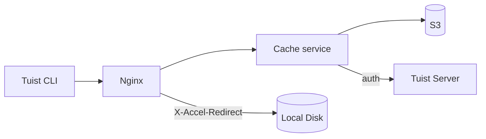
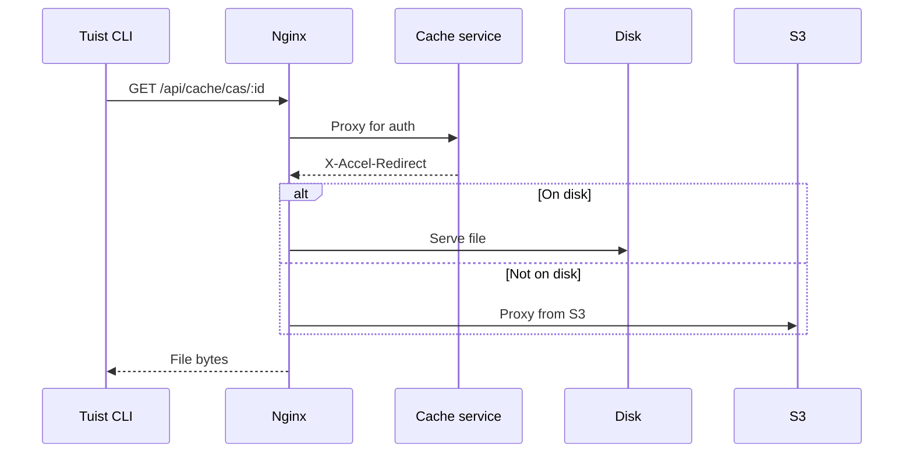
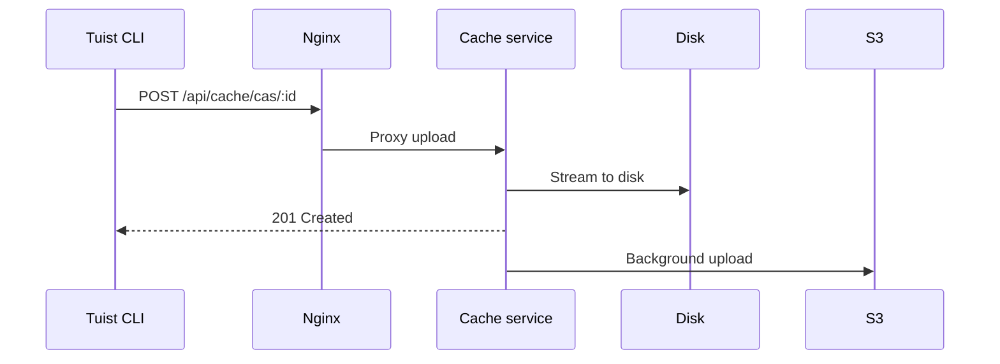

---
{
  "title": "Architecture",
  "titleTemplate": ":title | Cache | Guides | Tuist",
  "description": "Learn about the architecture of the Tuist cache service."
}
---

# 快取架構{#cache-architecture}

::: info
<!-- -->
本頁面提供 Tuist 快取服務架構的技術概述。主要針對需理解服務內部運作的**自架使用者** 及**貢獻者** 。僅需使用快取功能的一般使用者無需閱讀此內容。
<!-- -->
:::

Tuist 快取服務為獨立運作的服務，提供建置成果的內容可尋址儲存（CAS）功能，並以鍵值儲存方式管理快取元資料。

## 概述{#overview}

本服務採用雙層儲存架構：

- **本地磁碟機**: 低延遲快取命中之主要儲存裝置
- **S3 持久化儲存（** ）：可持久化儲存物件並在物件被清除後恢復的儲存服務

## 元件{#components}

### Nginx{#nginx}

Nginx 作為入口點，透過`X-Accel-Redirect` 機制實現高效檔案傳輸：

- **下載**: 快取服務驗證認證後，會返回`X-Accel-Redirect` 標頭。Nginx 會直接從磁碟提供檔案，或從 S3 進行代理傳輸。
- **上傳**: Nginx 將請求代理至快取服務，該服務將資料串流至磁碟。

### 內容可尋址儲存{#cas}

人工製品儲存在本地磁碟的分片目錄結構中：

- **路徑**:`{account}/{project}/cas/{shard1}/{shard2}/{artifact_id}`
- **分片規則**: 藝術品ID的前四個字元將建立兩級分片結構（例如：`ABCD1234` →`AB/CD/ABCD1234` ）

### S3 整合{#s3}

S3 提供持久性儲存：

- **背景上傳**: 寫入磁碟後，工件會排入佇列，透過每分鐘執行的背景工作程序上傳至 S3
- **按需加載** ：當本地工件缺失時，系統將立即透過預簽署的 S3 網址提供請求服務，同時將工件排入後台下載至本地磁碟的隊列

### 磁碟驅逐{#eviction}

本服務採用最近最少使用（LRU）策略管理磁碟空間：

- 存取時間透過 SQLite 進行追蹤
- 當磁碟使用率超過 85% 時，系統將刪除最舊的工件，直至使用率降至 70%
- 本地清除後，S3 中仍保留存留物

### 驗證{#authentication}

快取機制透過呼叫`/api/projects` 端點，將驗證作業委派給 Tuist 伺服器，並將結果快取（成功結果保留 10 分鐘，失敗結果保留 3 秒）。

## 請求流程{#request-flows}

### 下載{#download-flow}

### 上傳{#upload-flow}

## API 端點{#api-endpoints}

| 終點                            | 方法   | 說明          |
| ----------------------------- | ---- | ----------- |
| `/up`                         | GET  | 健康檢查        |
| `/metrics`                    | GET  | 普羅米修斯指標     |
| `/api/cache/cas/:id`          | GET  | 下載 CAS 人工製品 |
| `/api/cache/cas/:id`          | POST | 上傳 CAS 成果物  |
| `/api/cache/keyvalue/:cas_id` | GET  | 取得鍵值項目      |
| `/api/cache/keyvalue`         | PUT  | 儲存鍵值項目      |
| `/api/cache/module/:id`       | HEAD | 檢查模組工件是否存在  |
| `/api/cache/module/:id`       | GET  | 下載模組工件      |
| `/api/cache/module/start`     | POST | 開始多部分上傳     |
| `/api/cache/module/part`      | POST | 上傳部分        |
| `/api/cache/module/complete`  | POST | 完成多部分上傳     |
