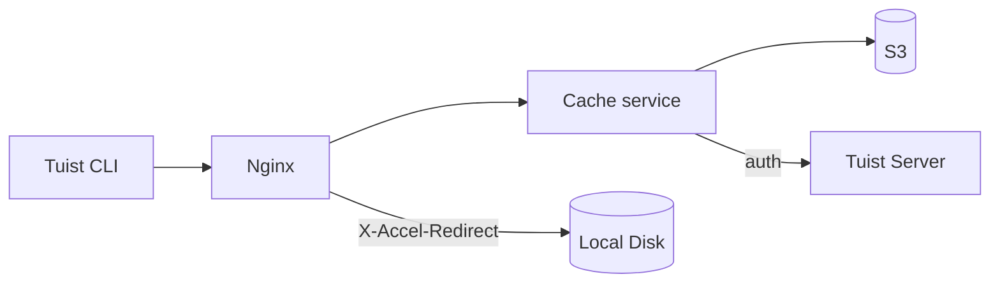
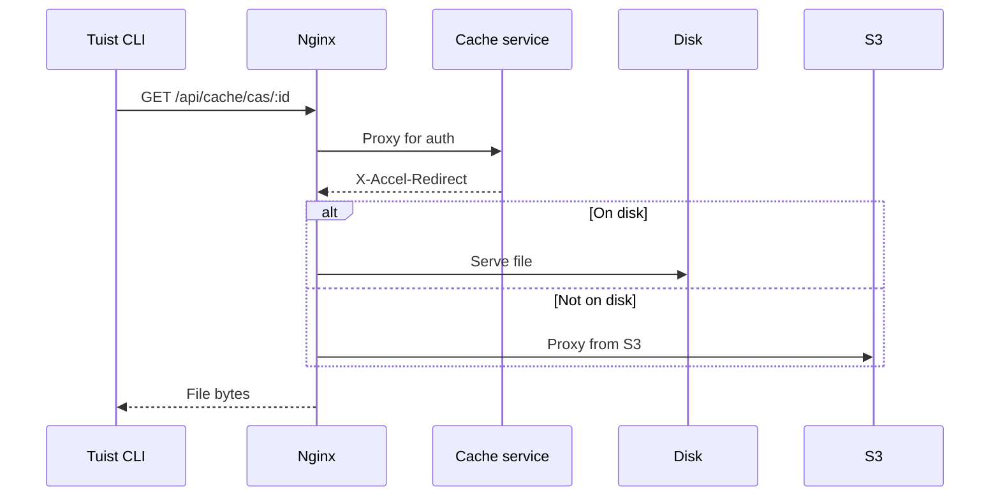
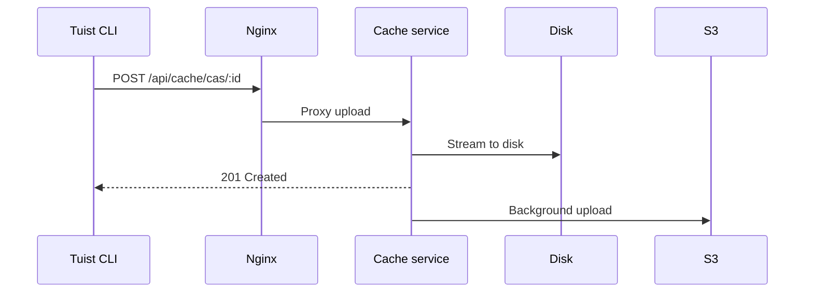

---
{
  "title": "Architecture",
  "titleTemplate": ":title | Cache | Guides | Tuist",
  "description": "Learn about the architecture of the Tuist cache service."
}
---

# 快取架構{#cache-architecture}

::: info
<!-- -->
本頁面提供 Tuist 快取服務架構的技術概述。主要對象為**的自建伺服器使用者** 以及**的貢獻者**
，這些人需要了解該服務的內部運作機制。僅需使用快取功能的一般使用者無需閱讀此內容。
<!-- -->
:::

Tuist 快取服務是一項獨立服務，為建置產出提供內容可尋址儲存 (CAS)，並為快取元資料提供鍵值儲存庫。

## 概述{#overview}

本服務採用兩層式儲存架構：

- **本地磁碟**: 用於低延遲快取命中的一級儲存空間
- **S3**: 持久儲存服務，可長期保存資料並在資料被移除後進行復原

```mermaid
flowchart LR
    CLI[Tuist CLI] --> NGINX[Nginx]
    NGINX --> APP[Cache service]
    NGINX -->|X-Accel-Redirect| DISK[(Local Disk)]
    APP --> S3[(S3)]
    APP -->|auth| SERVER[Tuist Server]
```

## 元件{#components}

### Nginx{#nginx}

Nginx 作為入口點，並透過`X-Accel-Redirect` 處理高效的檔案傳輸：

- **下載** ：快取服務會驗證身分，然後傳回包含`X-Accel-Redirect` 標頭的回應。Nginx 會直接從磁碟提供檔案，或透過 S3
  進行代理傳輸。
- **上傳**: Nginx 將請求代理至快取服務，該服務會將資料串流至磁碟。

### 內容可尋址儲存{#cas}

Artifacts 儲存於本機磁碟中，採用分片式目錄結構：

- **路徑**:`{account}/{project}/cas/{shard1}/{shard2}/{artifact_id}`
- **分片**: 組件 ID 的前四個字元會形成一個兩層級的分片（例如：`ABCD1234` →`AB/CD/ABCD1234` ）

### S3 整合{#s3}

S3 提供持久性儲存空間：

- **背景上傳**: 寫入磁碟後，建構產出檔會排入佇列，由每分鐘執行一次的背景工作程序上傳至 S3
- **按需載入**: 當本地資源缺失時，系統會立即透過預簽名的 S3 連結處理請求，同時將該資源排入佇列，在背景中下載至本地磁碟

### 磁碟驅逐{#eviction}

此服務採用 LRU 淘汰機制來管理磁碟空間：

- 存取時間會記錄在 SQLite 中
- 當磁碟使用率超過 85% 時，系統會刪除最舊的檔案，直到使用率降至 70% 為止
- 本地清除後，物件仍保留在 S3 中

### 驗證{#authentication}

快取會透過呼叫`/api/projects` 端點，將驗證工作委派給 Tuist 伺服器，並將結果快取（成功時快取 10 分鐘，失敗時快取 3 秒）。

## 請求流程{#request-flows}

### 下載{#download-flow}

```mermaid
sequenceDiagram
    participant CLI as Tuist CLI
    participant N as Nginx
    participant A as Cache service
    participant D as Disk
    participant S as S3

    CLI->>N: GET /api/cache/cas/:id
    N->>A: Proxy for auth
    A-->>N: X-Accel-Redirect
    alt On disk
        N->>D: Serve file
    else Not on disk
        N->>S: Proxy from S3
    end
    N-->>CLI: File bytes
```

### 上傳{#upload-flow}

```mermaid
sequenceDiagram
    participant CLI as Tuist CLI
    participant N as Nginx
    participant A as Cache service
    participant D as Disk
    participant S as S3

    CLI->>N: POST /api/cache/cas/:id
    N->>A: Proxy upload
    A->>D: Stream to disk
    A-->>CLI: 201 Created
    A->>S: Background upload
```

## API 端點{#api-endpoints}

| Endpoint                      | 方法   | 說明            |
| ----------------------------- | ---- | ------------- |
| `/up`                         | GET  | 健康檢查          |
| `/metrics`                    | GET  | Prometheus 指標 |
| `/api/cache/cas/:id`          | GET  | 下載 CAS 成果     |
| `/api/cache/cas/:id`          | POST | 上傳 CAS 成果     |
| `/api/cache/keyvalue/:cas_id` | GET  | 取得鍵值對         |
| `/api/cache/keyvalue`         | PUT  | 儲存鍵值對         |
| `/api/cache/module/:id`       | HEAD | 檢查模組產物是否存在    |
| `/api/cache/module/:id`       | GET  | 下載模組產物        |
| `/api/cache/module/start`     | POST | 開始多部分上傳       |
| `/api/cache/module/part`      | POST | 上傳部分          |
| `/api/cache/module/complete`  | POST | 完成多部分上傳       |
