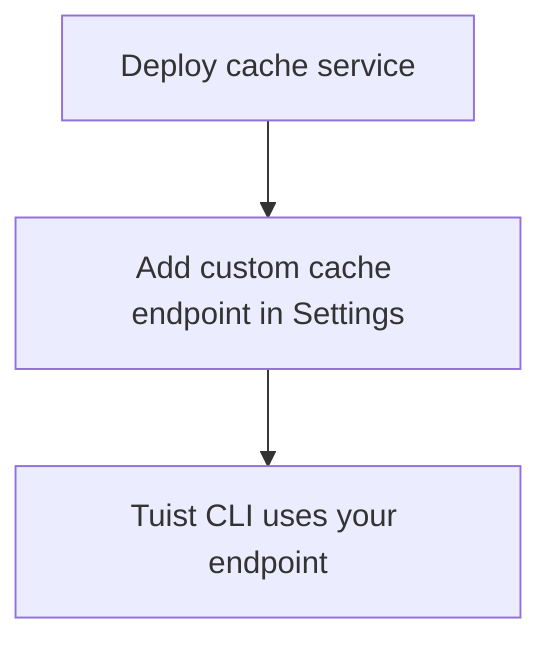

---
{
  "title": "Self-hosting",
  "titleTemplate": ":title | Cache | Guides | Tuist",
  "description": "Learn how to self-host the Tuist cache service."
}
---

# 自建伺服器快取{#self-host-cache}

Tuist 快取服務可自行架設，為團隊提供專屬二進位快取。此功能對擁有大型建置產物且頻繁建置的組織尤為實用，將快取部署於 CI
基礎架構附近可降低延遲並提升快取效能。透過縮短建置代理程式與快取之間的距離，可確保網路開銷不會抵銷快取帶來的速度優勢。

::: info
<!-- -->
自行託管快取節點需具備**企業方案** 。

您可將自建快取節點連接至託管式 Tuist 伺服器（`https://tuist.dev` ）或自建的 Tuist 伺服器。若需自行架設 Tuist
伺服器，則需另行取得伺服器授權。詳見
<LocalizedLink href="/guides/server/self-host/install">伺服器自建指南</LocalizedLink>。
<!-- -->
:::

## 先決條件{#prerequisites}

- Docker 與 Docker Compose
- S3相容儲存桶
- 一個正在運行的 Tuist 伺服器實例（託管或自託管）

## 部署{#deployment}

快取服務以 Docker 映像檔形式發佈於 [ghcr.io/tuist/cache](https://ghcr.io/tuist/cache)。我們在
[快取目錄](https://github.com/tuist/tuist/tree/main/cache) 提供參考設定檔。

::: tip
<!-- -->
我們提供 Docker Compose 設定檔，因其作為評估與小型部署的便捷基準。您可參照此設定並調整為偏好的部署模式（如 Kubernetes、原始
Docker 等）。
<!-- -->
:::

### 設定檔{#config-files}

```bash
curl -O https://raw.githubusercontent.com/tuist/tuist/main/cache/docker-compose.yml
mkdir -p docker
curl -o docker/nginx.conf https://raw.githubusercontent.com/tuist/tuist/main/cache/docker/nginx.conf
```

### 環境變數{#environment-variables}

建立`.env` 檔案並輸入您的設定。

::: tip
<!-- -->
本服務採用Elixir/Phoenix架構，部分變數使用`前綴（如PHX_` ）。此類設定可視為標準服務配置處理。
<!-- -->
:::

```env
# Secret key used to sign and encrypt data. Minimum 64 characters.
# Generate with: openssl rand -base64 64
SECRET_KEY_BASE=YOUR_SECRET_KEY_BASE

# Public hostname or IP address where your cache service will be reachable.
PUBLIC_HOST=cache.example.com

# URL of the Tuist server used for authentication (REQUIRED).
# - Hosted: https://tuist.dev
# - Self-hosted: https://your-tuist-server.example.com
SERVER_URL=https://tuist.dev

# S3 Storage configuration
S3_BUCKET=your-cache-bucket
S3_HOST=s3.us-east-1.amazonaws.com
S3_ACCESS_KEY_ID=your-access-key
S3_SECRET_ACCESS_KEY=your-secret-key
S3_REGION=us-east-1

# CAS storage (required for non-compose deployments)
DATA_DIR=/data
```

| 變數                                | 必填  | 預設                        | 說明                                              |
| --------------------------------- | --- | ------------------------- | ----------------------------------------------- |
| `SECRET_KEY_BASE`                 | 是   |                           | 用於簽署及加密資料的密鑰（至少 64 個字元）。                        |
| `PUBLIC_HOST`                     | 是   |                           | 快取服務的公開主機名稱或 IP 位址。用於產生絕對網址。                    |
| `SERVER_URL`                      | 是   |                           | 用於驗證的 Tuist 伺服器網址。預設為`https://tuist.dev`        |
| `DATA_DIR`                        | 是   |                           | 儲存 CAS 成果的磁碟目錄。提供的 Docker Compose 設定使用`/data` 。 |
| `S3_BUCKET`                       | 是   |                           | S3儲存桶名稱。                                        |
| `S3_HOST`                         | 是   |                           | S3 端點主機名稱。                                      |
| `S3_ACCESS_KEY_ID`                | 是   |                           | S3 存取金鑰。                                        |
| `S3_SECRET_ACCESS_KEY`            | 是   |                           | S3 密鑰。                                          |
| `S3_REGION`                       | 是   |                           | S3 區域。                                          |
| `CAS_DISK_HIGH_WATERMARK_PERCENT` | 不   | `85`                      | 觸發 LRU 淘汰的磁碟使用百分比。                              |
| `CAS_DISK_TARGET_PERCENT`         | 不   | `70`                      | 驅逐後目標磁碟使用量。                                     |
| `PHX_SOCKET_PATH`                 | 不   | `/run/cache/cache.sock`   | 服務建立其 Unix 套接字的路徑（當啟用時）。                        |
| `PHX_SOCKET_LINK`                 | 不   | `/run/cache/current.sock` | Nginx 用於連接服務的符號連結路徑。                            |

### 啟動服務{#start-service}

```bash
docker compose up -d
```

### 驗證部署{#verify}

```bash
curl http://localhost/up
```

## 設定快取端點{#configure-endpoint}

部署快取服務後，請於 Tuist 伺服器組織設定中註冊該服務：

1. 前往您組織的**設定頁面**
2. 請參閱**自訂快取端點** 區段
3. 請添加您的快取服務網址（例如：`https://cache.example.com` ）

<!-- TODO: Add screenshot of organization settings page showing Custom cache endpoints section -->



設定完成後，Tuist CLI 將使用您自行架設的快取服務。

## 卷數{#volumes}

Docker Compose 配置使用三個卷宗：

| 卷              | 目的                   |
| -------------- | -------------------- |
| `cas_data`     | 二進位工件儲存              |
| `sqlite_data`  | 存取 LRU 淘汰的元資料        |
| `cache_socket` | Nginx 服務通訊的 Unix 套接字 |

## 健康檢查{#health-checks}

- `GET /up` — 系統正常時返回 200 狀態碼
- `GET /metrics` — Prometheus 指標

## 監控{#monitoring}

快取服務於`/metrics 及` 提供 Prometheus 相容的計量資料。

若您使用 Grafana，可匯入
[參考儀表板](https://raw.githubusercontent.com/tuist/tuist/refs/heads/main/cache/priv/grafana_dashboards/cache_service.json)。

## 升級{#upgrading}

```bash
docker compose pull
docker compose up -d
```

此服務在啟動時會自動執行資料庫遷移。

## 疑難排解{#troubleshooting}

### 快取未被使用{#troubleshooting-caching}

若預期會產生快取卻持續發生快取未命中（例如：命令列介面反覆上傳相同工件，或下載從未發生），請依循以下步驟：

1. 請確認自訂快取端點已在您的組織設定中正確配置。
2. 請執行以下指令確保您的 Tuist CLI 已完成認證：`tuist auth login`
3. 檢查快取服務日誌是否有錯誤：`docker compose logs cache`

### 插座路徑不匹配{#troubleshooting-socket}

若出現連線遭拒錯誤：

- 請確保以下路徑設定正確：`PHX_SOCKET_LINK` 需指向 nginx.conf
  中設定的套接字路徑（預設值：`/run/cache/current.sock` ）
- 請確認 docker-compose.yml 檔案中：`PHX_SOCKET_PATH` 以及`PHX_SOCKET_LINK` 皆已正確設定。
- 請確認`cache_socket` 卷宗已掛載於兩個容器中
