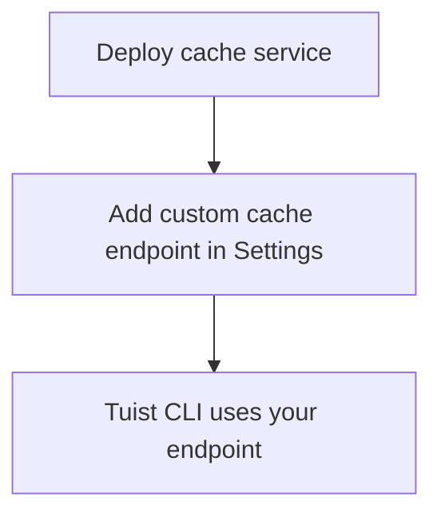

---
{
  "title": "Self-hosting",
  "titleTemplate": ":title | Cache | Guides | Tuist",
  "description": "Learn how to self-host the Tuist cache service."
}
---

# 自建伺服器快取{#self-host-cache}

Tuist 快取服務可自行架設，為您的團隊提供私有二進位快取。此功能對於擁有大型建構產物且建構頻率高的組織特別有用，將快取置於更接近 CI
基礎架構的位置，可降低延遲並提升快取效率。透過縮短建構代理程式與快取之間的距離，您能確保網路開銷不會抵銷快取帶來的速度優勢。

::: info
<!-- -->
自行架設快取節點需訂閱**企業方案** 。

您可以將自建的快取節點連接到託管式的 Tuist 伺服器（`https://tuist.dev` ）或自建的 Tuist 伺服器。若要自行架設 Tuist
伺服器，則需另行取得伺服器授權。請參閱
<LocalizedLink href="/guides/server/self-host/install">伺服器自建指南</LocalizedLink>。
<!-- -->
:::

## 先決條件{#prerequisites}

- Docker 與 Docker Compose
- 相容於 S3 的儲存桶
- 一個正在運行的 Tuist 伺服器實例（託管或自建）

## 部署{#deployment}

快取服務以 Docker 映像檔的形式發佈於 [ghcr.io/tuist/cache](https://ghcr.io/tuist/cache)。我們在
[cache 目錄](https://github.com/tuist/tuist/tree/main/cache) 中提供了參考設定檔。

::: tip
<!-- -->
我們提供 Docker Compose 設定檔，因為它作為評估和小型部署的基準非常方便。您可以將其作為參考，並根據您偏好的部署模式（Kubernetes、原生
Docker 等）進行調整。
<!-- -->
:::

### 設定檔{#config-files}

```bash
curl -O https://raw.githubusercontent.com/tuist/tuist/main/cache/docker-compose.yml
mkdir -p docker
curl -o docker/nginx.conf https://raw.githubusercontent.com/tuist/tuist/main/cache/docker/nginx.conf
```

### 環境變數{#environment-variables}

` 建立一個包含您設定的 ``.env` 檔案。

::: tip
<!-- -->
本服務採用 Elixir/Phoenix 建構，因此部分變數會使用`PHX_` 前綴。您可以將這些視為標準的服務設定。
<!-- -->
:::

```env
# Secret key used to sign and encrypt data. Minimum 64 characters.
# Generate with: openssl rand -base64 64
SECRET_KEY_BASE=YOUR_SECRET_KEY_BASE

# Public hostname or IP address where your cache service will be reachable.
PUBLIC_HOST=cache.example.com

# URL of the Tuist server used for authentication (REQUIRED).
# - Hosted: https://tuist.dev
# - Self-hosted: https://your-tuist-server.example.com
SERVER_URL=https://tuist.dev

# S3 Storage configuration
S3_BUCKET=your-cache-bucket
S3_HOST=s3.us-east-1.amazonaws.com
S3_ACCESS_KEY_ID=your-access-key
S3_SECRET_ACCESS_KEY=your-secret-key
S3_REGION=us-east-1

# CAS storage (required for non-compose deployments)
DATA_DIR=/data
```

| 變數                                | 必填  | 預設                        | 說明                                                 |
| --------------------------------- | --- | ------------------------- | -------------------------------------------------- |
| `SECRET_KEY_BASE`                 | 是   |                           | 用於簽署和加密資料的密鑰（至少 64 個字元）。                           |
| `PUBLIC_HOST`                     | 是   |                           | 您的快取服務的公開主機名稱或 IP 位址。用於產生絕對網址。                     |
| `SERVER_URL`                      | 是   |                           | 用於驗證的 Tuist 伺服器網址。預設為`https://tuist.dev`           |
| `DATA_DIR`                        | 是   |                           | 磁碟上儲存 CAS 相關檔案的目錄。提供的 Docker Compose 設定使用`/data` 。 |
| `S3_BUCKET`                       | 是   |                           | S3 儲存桶名稱。                                          |
| `S3_HOST`                         | 是   |                           | S3 端點主機名稱。                                         |
| `S3_ACCESS_KEY_ID`                | 是   |                           | S3 存取金鑰。                                           |
| `S3_SECRET_ACCESS_KEY`            | 是   |                           | S3 秘密金鑰。                                           |
| `S3_REGION`                       | 是   |                           | S3 區域。                                             |
| `CAS_DISK_HIGH_WATERMARK_PERCENT` | 不   | `85`                      | 觸發 LRU 淘汰的磁碟使用率百分比。                                |
| `CAS_DISK_TARGET_PERCENT`         | 不   | `70`                      | 驅逐後目標磁碟的使用量。                                       |
| `PHX_SOCKET_PATH`                 | 不   | `/run/cache/cache.sock`   | 服務建立其 Unix 套接字的路徑（若已啟用）。                           |
| `PHX_SOCKET_LINK`                 | 不   | `/run/cache/current.sock` | Nginx 用於連線至該服務的符號連結路徑。                             |

### 啟動服務{#start-service}

```bash
docker compose up -d
```

### 驗證部署{#verify}

```bash
curl http://localhost/up
```

## 設定快取端點{#configure-endpoint}

部署快取服務後，請在您的 Tuist 伺服器組織設定中進行註冊：

1. 前往貴組織的「**設定」頁面：**
2. 請參閱**中的「自訂快取端點」** 區段
3. 請輸入您的快取服務網址（例如：`、https://cache.example.com、` ）

<!-- TODO: Add screenshot of organization settings page showing Custom cache endpoints section -->


```mermaid
graph TD
  A[Deploy cache service] --> B[Add custom cache endpoint in Settings]
  B --> C[Tuist CLI uses your endpoint]
```

設定完成後，Tuist CLI 將使用您自行架設的快取。

## 卷數{#volumes}

此 Docker Compose 配置使用三個卷：

| 卷              | 目的                       |
| -------------- | ------------------------ |
| `cas_data`     | 二進位資料儲存                  |
| `sqlite_data`  | 存取 LRU 淘汰的元資料            |
| `cache_socket` | 用於 Nginx 與服務通訊的 Unix 套接字 |

## 健康檢查{#health-checks}

- `GET /up` — 狀態正常時返回 200
- `GET /metrics` — Prometheus 指標

## 監控{#monitoring}

快取服務在`/metrics` 提供與 Prometheus 相容的指標。

若您使用 Grafana，可匯入
[參考儀表板](https://raw.githubusercontent.com/tuist/tuist/refs/heads/main/cache/priv/grafana_dashboards/cache_service.json)。

## 升級{#upgrading}

```bash
docker compose pull
docker compose up -d
```

此服務會在啟動時自動執行資料庫遷移。

## 疑難排解{#troubleshooting}

### 未使用快取{#troubleshooting-caching}

若預期會進行快取，卻持續發生快取未命中（例如 CLI 反覆上傳相同的構建產物，或下載始終無法進行），請依照以下步驟操作：

1. 請確認自訂快取端點已在您的組織設定中正確配置。
2. 請執行`tuist auth login` 來確認您的 Tuist CLI 已通過驗證。
3. 請檢查快取服務日誌是否有任何錯誤：`docker compose logs cache` 。

### 套接字路徑不符{#troubleshooting-socket}

若您遇到「連線遭拒」錯誤：

- 請確保`PHX_SOCKET_LINK` 指向 nginx.conf 中設定的套接字路徑（預設：`/run/cache/current.sock` ）
- 請確認 docker-compose.yml 中的`PHX_SOCKET_PATH` 以及`PHX_SOCKET_LINK` 是否均已正確設定
- 請確認`cache_socket` 卷已同時掛載於兩個容器中
