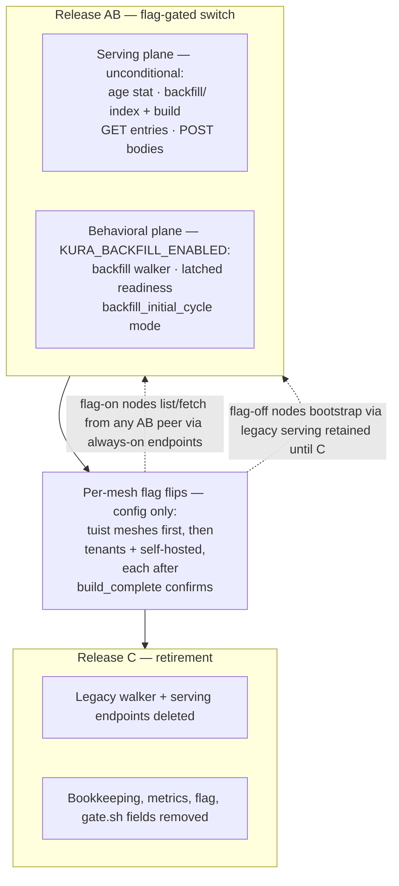
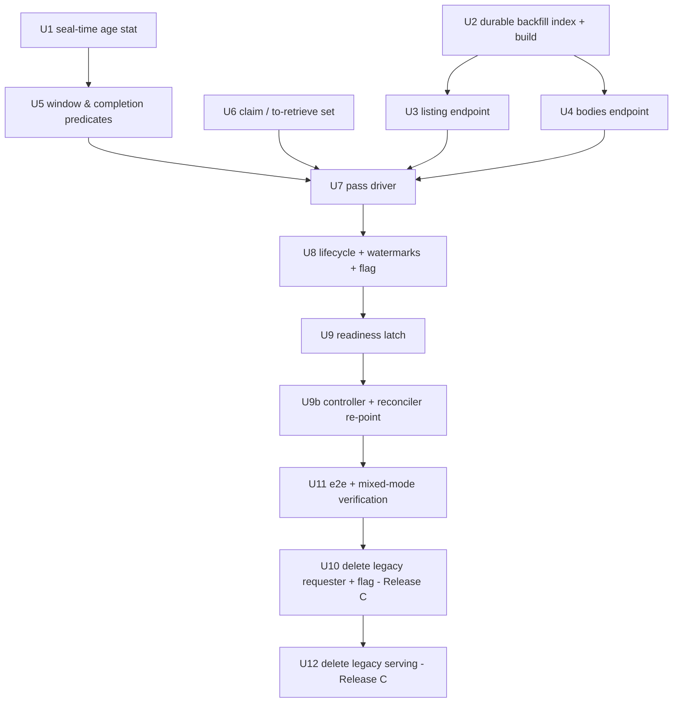

# refactor(kura): Replace bootstrap with recency-first backfill

## Overview

Replace Kura's bootstrap subsystem — the machinery behind every major mesh
outage to date — with **backfill**: a recency-first catch-up process whose
contract is *recent entries are guaranteed, completeness is best-effort*.
The work ships as **two binary releases with a per-mesh flag stage
between them** (one-version-skew rule, `kura/AGENTS.md`): Release AB
carries everything — the serving plane (per-segment age stat, durable
`version_ms` index, two new endpoints) unconditionally, and the
behavioral plane (backfill walker, latched readiness) gated behind
`KURA_BACKFILL_ENABLED`, default off, enabled first on the tuist
account's meshes. Meshes then flip per-config (no release) once their
index builds are confirmed. Release C retires the legacy walker, the
legacy serving endpoints, and the flag itself. The durable index lives
under a reserved key prefix in the existing `key_value` column family —
the PR #12152 pattern — so no release ever creates a RocksDB column
family an older binary can't open; rolling back the behavioral switch is
an env flip, not a version rollback. Readiness semantics change when the
flag turns on, so the kura-controller and the server-side reconciler —
which consume readiness for move promotion — are re-pointed before or
with Release AB.

## Problem Frame

Bootstrap's interlocking mechanisms (per-peer bootstrapped bookkeeping,
bootstrap epochs, digest anti-entropy, fetch-gate stripes, no-progress
watchdog, readiness gated on completing a pass against every peer) patch
each other's races and have produced four incident classes: a
readiness-gated rolling update killing a just-Ready pod (2026-07-24), a
node losing ~93% of a multi-hour pass to a restart, CAS eviction thrash
under two-peer bootstrap that never converged (2026-07-23, #12047), and
silent completion-discard loops (2026-07-16/17). The origin document
(`docs/brainstorms/2026-07-30-kura-backfill-requirements.md`) is the
planning-ready distillation of the resolved design; the per-decision
rationale record is `kura/docs/bootstrap-simplification.md`. Product
decisions there are settled and are not re-litigated here.

Affected: mesh operators (rollouts, incident load) and cache users (node
availability and hit rate during joins/recovery).

## Requirements Trace

From the origin document (see it for full text):

- R1–R3: backfill lifecycle — per-peer newest→oldest passes over every
  replicated record kind, level-triggered from the membership loop, node-level
  backfilling state → Units 7, 8
- R4–R5: age-based window (per-segment max `version_ms` horizon at margin
  percentile + per-peer watermark), no cursor persistence → Units 1, 5
- R6–R7: completion (bound / exhausted / marginal-trade capacity test),
  drain-aware, monotonic skew-slacked watermark → Units 5, 6, 8
- R8: latched readiness (initial-cycle-only backfilling clause, ring-fullness
  X%, failure budget, both existing discovery gates kept) → Unit 9
- R9: two-phase transfer protocol backed by a durable per-entry
  `version_ms`-ordered index over all record kinds → Units 2, 3, 4
- R10: concurrent per-peer listing, shared claimed dedup set, LWW-aware
  presence check → Units 6, 7
- R11: byte-bounded file-spooled batches, oversized routing to the
  per-artifact endpoint, tmp-budget accounting → Units 4, 7
- R12: apply into the live active segment via unchanged paths → Unit 7
- R13: absent-body never fails a batch or pass → Units 4, 6, 7
- Success criterion "retired machinery is deleted, not bypassed" → Units 10, 12

## Scope Boundaries

Carried verbatim from the origin document:

- Replication (outbox, write-time targets, stale-target drops) unchanged.
- LWW/apply semantics unchanged — backfill reuses live apply paths.
- Completeness is best-effort; entries older than the margin's span may never
  arrive (accepted drawback).
- No age-correct eviction ordering for backfilled data (active-segment
  placement; read-path promotion compensates; the age stat keeps ring rules
  correct despite the divergence).
- Not in scope: segment file format, 1:2:2 band structure, eviction order,
  client-facing cache protocols.

## Context & Research

### Relevant Code and Patterns

- **Legacy walker (deletion surface)**: `kura/src/replication/mod.rs` —
  `membership_task_loop`, `maybe_spawn_bootstrap_task`,
  `bootstrap_from_peer_with_watchdog`, `bootstrap_no_progress_watchdog`,
  `bootstrap_manifests_from_peer`, digest branch, backpressure retry
  helpers, module-local `BOOTSTRAP_*` constants.
- **Bookkeeping (deletion surface)**: `kura/src/state.rs` —
  `ReadinessState.{bootstrapped_peers,bootstrap_inflight_peers,bootstrap_epoch}`,
  `note_bootstrap_{started,succeeded,failed}`, `reset_bootstrap_progress`,
  `peers_needing_bootstrap`; `AppState.{bootstrap_semaphore,bootstrap_staging_budget,bootstrap_fetch_locks}`.
- **Membership hook point**: `kura/src/state.rs` `apply_membership` /
  `AppState::apply_membership_view`; consumed in `membership_task_loop`
  (2s cadence, `MembershipUpdate` carries `discovered_peers`/`lost_peers`).
- **Legacy endpoints**: `kura/src/http.rs` —
  `internal_bootstrap_{manifests,manifests_digest,namespace_tombstones,artifact}`;
  `Store::{manifests_page_scoped,manifests_digest,namespace_tombstones_page}`
  in `kura/src/store.rs`.
- **Segment ring**: `kura/src/segment/reference.rs` (`SegmentReference`:
  `segment_id` + `created_at_ms` only — verified), `kura/src/segment/state.rs`
  (`SegmentState`, `push_new` cascade, evictions pop from `old` front);
  seal = rotation in `Store::active_segment` (`kura/src/store.rs`); ring
  persisted as JSON in RocksDB CF `segment_state` key `"shared"`;
  `resolve_segment_ring_limits` gives the desired-total denominator for R8.
- **Apply paths / presence**: `kura/src/store.rs` —
  `apply_replicated_artifact_from_{path,bytes}`,
  `apply_replicated_inline_artifact_from_bytes`,
  `apply_replicated_namespace_delete`, `artifact_apply_outcome` (exactly
  R10's present-test), `ArtifactApplyOutcome::IgnoredMissing` (R13's
  contract). Action-cache entries are inline artifacts
  (`producer == Reapi`) plus a row in CF `action_cache_index` maintained in
  the same WriteBatch — the additive-index precedent to mirror.
- **Index shape reference**: `kura/src/reapi/snapshot.rs`
  (`NamespaceSnapshotIndex`) — newest-first via the `!version_ms`
  big-endian key inversion; capped and in-memory, hence the new durable index.
- **Readiness**: `kura/src/state.rs` `maybe_mark_serving` (discovery gate,
  `runtime.peer_view_pending()`, settle window, all-peers-bootstrapped
  check); anti-latch = `reset_bootstrap_progress` → `runtime.clear_serving()`
  called from `kura/src/mesh_heartbeat.rs` recovery re-enrollment.
- **Transfer plumbing to reuse**: `kura/src/bandwidth.rs`
  (`BandwidthLimiter`), `kura/src/utils.rs` (`TmpBudget`, index-key
  helpers), idle-based `read_timeout` semantics in `kura/src/peer_tls.rs`,
  `ResponseStreamClass::Bootstrap` admission in `kura/src/http.rs`,
  `after`/`limit` cursor-pagination pattern (`ManifestPage`).
- **Config/metrics conventions**: `kura/src/config.rs` (`KURA_*` consts +
  `optional_parsed_value`), `kura/src/constants.rs` (defaults with
  rationale), `kura/src/metrics.rs` (prometheus_client families, `record_*`
  / `update_*` / `clear_*` naming, per-pass gauge Drop guards); Helm mirror
  in `kura/ops/helm/kura/values.yaml` + `templates/statefulset.yaml`.
- **Rollout gate contract**: `kura/ops/rollout/gate.sh` reads
  `bootstrap_inflight_peers` from `RolloutStatusReport` — an external
  consumer of fields this plan retires.
- **Tests**: inline `#[cfg(test)]` per module with
  `test_support::test_context`; HTTP tests build the real axum router; stub
  peers on `TcpListener`; `ReadinessState` state-machine tests
  (`kura/src/state.rs` tests) are the template for lifecycle tests;
  failpoints in `kura/src/failpoints.rs`; e2e shellspec in `kura/spec/e2e/`
  (`discovery_spec.sh`, `faults_spec.sh`, `rollout_spec.sh`,
  `tmp_budget_spec.sh`); mixed-version harness
  `kura/test/e2e/kura_compatibility_rollout.sh`.

### Institutional Learnings

No `docs/solutions/` exists; the institutional record is incident memory,
which maps 1:1 onto the origin's success criteria (each becomes an e2e
verification target in Unit 11):

- 2026-07-24 rollout-kill: the kill loop threatens *this migration's own
  rollouts* — a version bump onto a cold mesh restarts the catch-up. The
  release ladder below sequences the readiness latch before the riskiest
  rollouts and keeps each stage's cold-window short.
- 2026-07-23 CAS thrash (#12047): reproduction shape is *cold node, ring
  smaller than dataset, two concurrent source peers*; success signature is
  `kura_segment_evicted_artifacts_total` ≈ 0 during a capacity-completing
  backfill. Eviction deletes manifests, so the presence pre-check inherits
  manifest/body coupling.
- 2026-07-16/17 outage: silence is the enemy — pass start/completion/failure
  logs and per-pass progress metrics are scope, not polish; unready pods are
  unscraped, so the *source peer's* route-labeled counters are the only live
  probe (new endpoints must be route-labeled and timed — `/_internal/`
  routes are currently structurally un-timed).
- Inline-413 wedge: sender and receiver limits on the two new endpoints must
  be pinned to shared constants and boundary-tested.
- Large-artifact livelock (#11297): the fix landed as an idle-based
  `read_timeout` on the peer client (`kura/src/peer_tls.rs` — explicitly
  not a total request timeout). The new batch-transfer paths must inherit
  that client (or its semantics) and must not reintroduce a fixed total
  timeout.
- Reconciler deadlock memory: each behavioral stage needs a **version bump**
  to reach provisioned instances; manifest-only changes don't self-heal.

## Key Technical Decisions

Decisions inherited from the origin document (age-based ring rules,
level-triggered lifecycle, latched readiness, durable per-entry index,
emergent recency, drain-aware claimed dedup, no cursor persistence,
active-segment placement, file-spooled byte-bounded batches) are adopted
as-is. New decisions made in planning:

- **Flag-gated single switch release (AB) + retirement release (C)**,
  with the release's contents split by *plane*, not by flag:
  - *Unconditional on every node, every tenant*: the age stat, the
    `backfill/` index + background build, and both serving endpoints —
    all additive, zero behavior change (what a standalone Release A would
    have been).
  - *Gated behind `KURA_BACKFILL_ENABLED` (boot-time selection)*: the
    backfill walker, latched readiness, and the `backfill_initial_cycle`
    mode field. Flag off → the legacy bootstrap walker and today's
    readiness, unchanged.

  Because the serving plane is always on, a mesh flips modes smoothly: by
  flip time every peer already serves the endpoints and has a built
  index. Mixed modes inside one mesh interop in both directions — legacy
  pods bootstrap from backfill pods via retained legacy serving; backfill
  pods list/fetch from legacy pods via the always-on endpoints. The
  old→AB rollout itself is one-version-skew safe (old peers briefly lack
  the endpoints → the capped not-capable retry class). The flag is an
  **explicit env, not a `tenant_id == "tuist"` comparison** — no account
  name hardcoded in the binary; the server provisioner sets it per mesh
  (`extension_env/2` in
  `server/lib/tuist/kura/provisioner/kubernetes_controller.ex` is the
  established per-instance `extraEnv` path, and env-only changes converge
  by rolling exactly the pods whose env is wrong). Tuist's own meshes
  flip first (blast radius = the dogfood account); other tenants and
  self-hosted follow as config changes. **Rolling back the behavioral
  switch is an env flip + pod restart** — watermarks and index rows sit
  inert while legacy bootstrap resumes — instead of a fleet version
  rollback. Cost: the legacy walker lives dormant in the binary until C,
  so "deleted, not bypassed" is satisfied at C rather than at the
  switch; both walker paths must stay disjoint (selection happens once at
  startup). Earlier drafts used a three-release A→B→C ladder (and before
  that a preparatory "A0" release + versioned data-dir marker for a
  dedicated CF, deleted by the prefix decision below); the flag collapses
  A and B into one release and turns the riskiest transition into
  configuration.
- **Reserved key prefix in the existing `key_value` CF — not a new column
  family.** `DB::open_cf_descriptors` rejects an on-disk CF it was not
  asked to open, and `Store::open` hardcodes the CF list
  (`kura/src/store.rs`) — a new CF would crash-loop every rolled-back pod
  until a manual data-dir intervention. The `action_cache_index` addition
  (#11816) silently accepted that; **PR #12152 named the hazard and set
  the repo pattern**: its blob-refs index lives in `key_value` under a
  reserved `blob_ref/` prefix precisely so a rolled-back binary "simply
  never point-reads these prefixed keys". Backfill state follows the same
  pattern: three keyspaces under one reserved prefix —
  `backfill/idx/` (the per-entry index), `backfill/meta/`
  (build/maintenance markers), `backfill/wm/` (per-peer watermarks). The
  prefix contains `/`, so it cannot collide with inline-artifact rows
  (64-char hex ids) and coexists with `blob_ref/`. Accepted costs: shared
  compaction with inline bodies and blob-ref rows (a cardinality #12152
  already accepted in this CF) and no per-CF tuning; a full index rebuild
  is a range-delete over the prefix instead of `drop_cf`. Index key:
  `backfill/idx/ ++ !version_ms BE ++ record_kind ++ record_id`
  (descending scan = newest-first; the `action_cache_index` inversion
  trick), value carries `size`. The kind is a fixed single-byte
  discriminant — unambiguous parsing with variable-length ids, and its
  ordering is part of the cursor contract (renumbering later means an
  index rebuild). All puts *and* deletes go through one shared key helper
  (next to `action_cache_index_key` / `action_cache_blob_ref_key` in
  `kura/src/utils.rs`; #12152 is not on this branch yet — rebase onto
  main to inherit the `blob_ref/` precedent); old-row deletes derive the
  key entirely from the *previous* manifest (old kind + old effective
  version — a record can flip inline↔segment across versions, so the
  guard is "old key ≠ new key", not a version-only inequality). Cursor =
  last returned key, opaque to the peer, stable across mutations.
- **Index build**: one-off background scan (CFs `manifests` +
  `namespace_tombstones`) at startup when `meta/build_complete` is absent;
  stamps `meta/build_complete` when done. The scan uses short-lived
  per-chunk iterators resumed by key cursor — one long-lived iterator
  would pin a RocksDB snapshot for hours on multi-million-entry nodes
  (compaction blockage, maximal staleness window). Serving is not gated;
  the listing endpoint returns a retryable "index building" response until
  complete; requesters treat that as retry-with-backoff that does not
  consume the R8 failure budget (see the budget-cap decision below).
  Chosen over gating serving (availability cost) and over building in the
  upgrade path (blocks boot on large nodes).
- **Index staleness detection across rollback windows**: while A runs it
  periodically stamps `meta/last_maintained_seq` with the DB's latest
  sequence number, and stamps **synchronously on clean shutdown**. At
  startup: after a clean-shutdown stamp, *any* sequence gap means a
  foreign (pre-AB) binary wrote in between → clear `meta/build_complete`
  and re-run the idempotent build — this fully covers the common rollback
  shape (drain, roll back, roll forward). After an unclean shutdown the
  gap-beyond-stamping-slack heuristic applies; a crash immediately
  followed by a light-traffic pre-AB window below the slack is the
  residual undetected band (documented as a known limitation — sized by
  the slack, which must exceed per-interval write bursts or busy crashes
  trigger spurious multi-hour rebuilds; the slack value is a
  deferred-to-implementation measurement like batch sizing). Without any
  of this, a rollback→rollforward cycle leaves `build_complete` stamped
  over an index silently missing every entry written during the window —
  violating "recent entries guaranteed" with no signal.
- **Index invariant is *eventually exact*, not exact**: writers maintain
  the index best-effort in their WriteBatches — persist-with-version (LWW
  overwrite deletes the old-key row), `delete_artifact_metadata`,
  `evict_segment`, `expire_stale_action_cache_entries`,
  `delete_namespace_with_version` (including deleting the previous
  tombstone row on re-delete, and the `version_ms == 0` purge branch) —
  but exactness is unachievable: the build races live deletes (a manifest
  deleted after the scan read it but before the build writes its row
  leaves a row nothing will ever delete), and the delete paths don't hold
  the per-artifact write lock the persist paths hold (the codebase already
  acknowledges this class via `delete_stale_action_cache_rows`). So
  **readers tolerate and retire**: the bodies endpoint recomputes the
  expected current key from the manifest at serve time and retires rows
  that don't match. Retirement is what makes R13 self-healing rather than
  a permanent per-pass listing tax. Read-path promotion
  (`maybe_refresh_manifest`) leaves key and value unchanged and is
  deliberately not instrumented.
- **Record kinds on the wire**: `segment_artifact`, `inline_artifact`,
  `namespace_tombstone`. Action-cache entries ride as `inline_artifact`
  (that is what they are in the store); the requirement "action-cache
  entries are covered" is satisfied structurally, not by a fourth kind.
- **Wire shape**: listing = `GET /_internal/backfill/entries?after&limit`
  returning a JSON tuple page + `next_after` (the `ManifestPage` pattern).
  Bodies = `POST /_internal/backfill/bodies` with an explicit id list
  (composed byte-bounded by the requester from listed `size`s); response is
  a length-prefixed record stream (kind, id, version_ms, absent flag, body)
  spooled through temp files on both ends. The frame's `version_ms` is
  read from the **current manifest at body-read time** (manifest and body
  resolved together), never echoed from the requested tuple — echoing
  would let a mid-flight LWW overwrite persist v2 bytes under a v1 stamp
  on the requester, and the presence check would then suppress the
  correcting re-fetch. Claim resolution accordingly handles an apply whose
  version differs from the listed version. Sender/receiver byte ceilings
  pinned to one shared constant (inline-413 lesson). Serving side rides
  `ResponseStreamClass::Bootstrap` admission and the bandwidth limiter;
  client uses idle-based timeouts, never total (livelock lesson).
- **Watermark lifecycle**: keyed by peer node URL (`wm/{node_url}`),
  written on completion (including a completion racing peer removal — the
  monotonic max guard makes stale writes harmless and rediscovery
  benefits). No wipe-detection heuristic: a wiped-and-refilled peer's
  regressed dataset is covered by the overlapping-datasets assumption. GC
  is deliberately minimal for a keyspace of tens of tiny rows: each `wm/`
  row carries a local-clock `refreshed_at` written **on completion only**
  (no periodic touching — that would add a recurring write path and race
  surface for negligible benefit), and rows are removed when
  `refreshed_at` is older than a long compiled retention (~90 days) by
  the local clock. A live peer that completes no pass for 90 days is
  pathological; the cost of a GC'd row is one unbounded-window re-walk of
  listing pages, not a correctness loss. A GC delete racing a late
  completion write is benign (row resurrects, GC'd again). Chosen over
  identity-churn detection and over periodic-touch schemes (complexity
  without a demonstrated failure mode).
- **Horizon wall-clock floor: not built in this work.** The origin
  deferred *whether* a floor is needed; the answer is the same standard
  applied to identity-churn detection — no demonstrated failure mode, so
  no knob. The churn-denominated-slack limitation is instead made
  observable: a gauge for the horizon's age span (`now −
  horizon_version_ms`) so churn collapse shows up in monitoring; a floor
  is a revisit-on-observed-incident follow-up with that metric as its
  trigger.
- **Seam mitigation**: implemented cheaply — after the first completed pass
  for a *newly discovered* peer, the peer is marked dirty once (one
  follow-up pass) after a delay of ~2× the membership cadence. Cost is one
  listing re-walk of the slack window; closes most of the bilateral
  discovery seam. Residual sub-tick flaps remain accepted (see Resolved
  Questions).
- **Tunables classification** (origin deferred item): env-exposed —
  `KURA_BACKFILL_ENABLED` (default off; the behavioral-plane switch, set
  per mesh by the provisioner — deleted in Release C),
  `KURA_BACKFILL_MARGIN_PERCENT` (default 40),
  `KURA_BACKFILL_READY_RING_PERCENT` (default margin/2),
  `KURA_BACKFILL_BATCH_BYTES` (default TBD in implementation, initial
  32 MiB; also the oversized cutoff — entries larger than the batch bound
  route to the per-artifact endpoint, no separate knob). Compiled constants —
  batch flush interval, watermark clock-skew allowance, retry backoff
  bounds, initial-cycle failure budget, listing page limits, watermark GC
  retention. Rationale: expose only knobs with per-mesh geometry/capacity
  tuning need; timing internals stay compiled with rationale comments in
  `kura/src/constants.rs`.
- **Legacy per-artifact endpoint survives**: `/_internal/bootstrap/artifacts/{id}`
  is kept through C (re-homed to `/_internal/backfill/artifacts/{id}` with
  the old route aliased in AB, alias deleted in C) as R11's oversized-entry
  path.
- **Readiness consumers are re-pointed, not just gate.sh**: two consumers
  the origin never named act on readiness. The kura-controller's
  routability check
  (`infra/kura-controller/controllers/kurainstance_controller.go`,
  `runtimeStatusRoutable`: `Ready && State == "serving" &&
  WriterLockOwned`) deploys on its own cadence — B preserves the `state`
  vocabulary and every field the controller reads, and adds an explicit
  `backfill_initial_cycle` mode field (`pending` / `complete` /
  `degraded`). The server reconciler's
  region-move promotion (`Provisioner.caught_up?` →
  `promote_when_caught_up` in `server/lib/tuist/kura/reconciler.ex`,
  which **destroys the move source ~120s after promotion**) must not
  treat latched-cold Ready as caught-up — under B a move target latches
  ready at ~X% fullness and the source could be destroyed with the bulk
  of the dataset untransferred: permanent loss, not best-effort. The
  controller surfaces the new field and the reconciler's caught-up chain
  is re-pointed at it, deployed **before or with** Release AB and in any
  case before the first flag flip (controller/server first — the #12002
  half-shipped-rollout lesson).
- **Self-hosted laggard policy**: customer-run self-hosted nodes join
  account meshes at customer-controlled versions
  (`server/lib/tuist/kura/registered_endpoint.ex` tracks `version`), so
  "fleet convergence" gates cannot be inferred from `kura_deployments`
  alone, and flag-on nodes can meet pre-AB self-hosted peers. Policy: requester
  treats endpoint-absent (404) responses as a *not-capable* retry class
  (same handling as index-building, below); Release C ships only when
  every mesh — managed and self-hosted — is flag-on and every active
  registered endpoint reports ≥ AB (query
  `registered_endpoint.version`), with operator outreach for stragglers —
  C is delayed rather than shipping a break. No in-band minimum-version
  enforcement is built in this work.
- **Every budget-exempt retry class is wall-clock-capped**:
  index-building, not-capable (endpoint-absent), backpressure, and
  tmp-budget responses retry without consuming the R8 failure budget —
  but uncapped, a cold node whose in-cycle peers are all stuck in any of
  those classes (a peer under sustained Critical memory pressure sheds
  bodies responses for hours — the documented REAPI-budget class) never
  charges budget and never fills its ring, recreating the never-ready
  livelock through the politeness exemption. After a compiled per-peer
  wall-clock deadline, all budget-exempt retryables convert to
  budget-charged failures.
- **Cancellation/claim-release ordering has an owner**: the invariant
  "claim release strictly precedes successor re-claim" spans three units,
  so it is pinned mechanically — Unit 6 exposes a pass-scoped claim guard
  whose `Drop` releases (release unconditional on any termination path),
  and Unit 8 cancels cooperatively (token) then **awaits the pass task's
  join handle before clearing the per-peer slot**. Peer-loss cancellation
  is new behavior with nothing to inherit from the legacy walker.

## Open Questions

### Resolved During Planning

State-machine gaps found by flow analysis, pinned here (each consistent
with the design's principles — level-triggered, monotonic watermarks, no
leaked claims, monotonic latch):

- **Peer loss with a pass in flight**: loss *cancels* the pass.
  Cancellation counts as failure for claim accounting (all claims released
  promptly) but not for the failure budget and not for the watermark.
  Rediscovery re-triggers through the discovered path with a fresh window.
- **Slot serialization across cancellation**: the per-peer in-flight slot is
  held until the cancelled pass has fully terminated and released its
  claims; the level trigger re-fires afterward. Claim release strictly
  precedes any successor re-claim.
- **Failure budget is not reset by flap**: during the initial join cycle the
  budget is keyed by peer identity and survives removal/rediscovery; only
  backoff state resets. Otherwise a flapping peer resets its budget forever
  and a small-dataset node never latches ready — the exact livelock class
  this redesign kills. Dirty-requeues and cancellations do not consume
  budget.
- **Absent-resolution is per-peer, not global**: a claim resolved *absent*
  resolves only the fetching pass; the claim is released so each waiter
  re-claims through its own peer (the same path as failure-released
  claims). Only *applied* resolves all waiters. Prevents a watermark
  advancing over an entry the waiter's own peer still serves.
- **Re-claim arbitration**: re-claims go through the same exclusive claim
  set; one winner, other waiters wait on the new claim.
- **To-retrieve set entry lifetime**: entries are reference-counted by the
  in-flight passes that listed them and removed at zero. A duplicate
  discard always transfers drain-responsibility to the discarding pass (the
  tuple joins its drain set), so no tuple can be silently dropped through
  the set rather than a claim.
- **Capacity-skip is a fourth resolution state**: after a pass's
  marginal-trade completion fires, segmented-artifact tuples it lists are
  neither added to the set nor claimed — they resolve as *capacity-skipped*,
  which satisfies drain and does not block the watermark (consistent with
  the success criteria narrowing the segmented guarantee to the newest
  ring-worth). Released segmented claims resolve as capacity-skipped for
  capacity-completed waiters; only non-capacity-completed waiters re-claim.
  Batches already in flight when the test fires run to completion; only new
  composition stops — and the firing pass **releases every segmented
  claim it holds that is not in an in-flight batch**, resolving them
  capacity-skipped for itself and released for non-capacity waiters.
  Without that release the pass deadlocks on its own now-unfetchable
  claims (drain-aware completion requires every drain-set tuple resolved)
  and blocks every waiter on them.
- **Initial join cycle membership is fixed** at (initial discovery ∪ first
  control-plane peer view). Peers discovered after that point are ordinary
  re-join backfills that never gate first readiness. Dirty-requeues on
  in-cycle peers extend the cycle (bounded by the non-resetting failure
  budget).
- **Ready-but-cold is intended**: if every in-cycle peer exhausts its budget
  and the ring never reaches X%, the node latches ready (background retries
  continue, surfaced by metric). Zero discovered peers ⇒ ready after the
  two discovery gates. For a cache this is the correct availability call;
  the alternative recreates the never-ready failure class.
- **"Pass start point" (R7)** = requester wall-clock at window computation
  time. The max guard is retained as defense-in-depth (passes over a peer
  are serialized, so the cited interleaving cannot occur; the guard stays
  because it is one comparison and protects against future lifecycle
  changes) — documented as such so nobody "simplifies" it away.
- **Completion racing peer removal** writes the watermark unconditionally
  (monotonic, harmless if stale, beneficial on rediscovery).
- **Sub-tick flap** (peer dies and returns between membership evaluations,
  producing neither lost nor discovered): accepted residual seam, bounded
  by heartbeat cadence, repaired by the next re-join pass and narrowed by
  the follow-up-pass mitigation. Noted in code where the dirty flag is set.
- **Mixed-depth capacity churn**: two passes at different cursor depths can
  partially evict each other's just-applied segments at the capacity
  boundary; each pass individually honors the marginal trade, so this
  converges to the newest ring-worth. Accepted, documented at the
  completion predicate.
- **Shutdown with claims outstanding**: safe by construction (no completion
  ⇒ no watermark advance ⇒ restart re-lists). Boot clears the backfill
  spool directory (existing tmp staging-dir clearing pattern in
  `kura/src/config.rs`).

Origin "Deferred to Planning" items are resolved in Key Technical
Decisions above (index build, index maintenance, wire format, retirement
path, tunables, watermark lifecycle, wall-clock floor, seam mitigation) —
except batch sizing, deferred below.

### Deferred to Implementation

- **Batch byte-threshold and flush-interval values** against real Bazel
  small-artifact/action-cache profiles (origin flagged "needs research"):
  ship env-tunable threshold + compiled interval with initial defaults;
  measure in the e2e throughput check (Unit 11) and against a staging mesh
  before the tuist flag flip finalizes the defaults.
- **Exact frame encoding** of the bodies stream (field widths, compression
  on/off per record kind) — directional shape is decided; bytes are an
  implementation detail behind the shared-constants rule.
- **Presence-check micro-shape**: whether the pre-check consults
  `artifact_apply_outcome` per tuple or a batched manifest lookup — same
  semantics, chosen by profiling during Unit 7.
- **Index build throughput bound** (whether the background build needs
  pacing against foreground traffic on multi-million-entry nodes) —
  measured on a staging node during Unit 2.

## High-Level Technical Design

> *This illustrates the intended approach and is directional guidance for
> review, not implementation specification. The implementing agent should
> treat it as context, not code to reproduce.*

Release ladder and version-skew compatibility:

Per-peer pass state machine (the shape Units 6–8 implement):

```mermaid
stateDiagram-v2
    [*] --> Needed: discovered / dirty / failed-retry
    Needed --> InFlight: slot free, window computed
    InFlight --> Complete: bound reached / peer exhausted /\nmarginal-trade (segmented only)
    InFlight --> Failed: request errors (budget--, backoff)
    InFlight --> Cancelled: peer lost (claims released,\nno budget hit, no watermark)
    InFlight --> InFlight: rediscovered mid-pass → dirty flag set
    Complete --> Needed: dirty was set / follow-up seam pass
    Failed --> Needed: backoff elapsed (level re-fires)
    Cancelled --> [*]: state cleared; rediscovery starts fresh
    Complete --> [*]: watermark = max(old, start − skew)
```

Unit dependency graph:

## Implementation Units

### Release AB — serving plane (unconditional on every node)

- [x] **Unit 1: Seal-time max `version_ms` segment stat**

**Goal:** Each sealed segment records the max `version_ms` of its contents,
so ring rules can be computed from data age rather than ring position.

**Requirements:** R4, R6

**Dependencies:** None

**Files:**
- Modify: `kura/src/segment/reference.rs` (additive `max_version_ms`
  field, serde-default both directions), `kura/src/store.rs`
  (accumulate the running max on the in-flight active segment at the
  append/manifest-commit sites; write it into the outgoing
  `SegmentReference` at rotation in `Store::active_segment`)
- Test: inline `#[cfg(test)]` in `kura/src/segment/reference.rs` and
  `kura/src/store.rs`

**Approach:** Accumulate on the open segment (appends already know the
manifest's `version_ms`); record at the single seal point (rotation).
The running max is in-memory, so a restart mid-active-segment would
under-report it: **re-derive at startup** by scanning the active
segment's `segment_artifacts` rows (bounded by one segment's entries,
runs once at boot). Segments sealed pre-upgrade read the stat as absent
and fall back to `created_at_ms` (the origin's accepted conservative
proxy). JSON ring state tolerates the field in both skew directions
(`serde` default + unknown-field tolerance) — verify explicitly, this is
a skew gate.

**Test scenarios:**
- Happy path: appends with mixed `version_ms` values → sealed reference
  carries the max.
- Edge: promotion-driven append of an old entry does not raise the max
  above the true max (max-only semantics hold trivially) and never lowers it.
- Edge: segment sealed with zero-version manifests (legacy `version_ms == 0`
  falls back to `created_at_ms` per `manifest_version_ms`) → stat is sane.
- Edge: restart mid-active-segment → the startup re-derivation restores
  the running max; the eventual sealed stat equals the no-restart value.
- Integration: ring state JSON round-trips with and without the field;
  a reference serialized by new code deserializes under the old struct
  shape (skew simulation) and vice versa.

**Verification:** Sealed references on a fresh node carry the stat; a ring
persisted by the previous release loads cleanly and reports fallback ages.

- [x] **Unit 2: Durable `backfill/` index keyspace, write-path maintenance, background build**

**Goal:** A persistent `version_ms`-ordered per-entry index over all record
kinds — prefixed rows in the existing `key_value` CF, maintained by every
mutation path (eventually exact, read-retired), built once in the
background for pre-existing datasets; plus the `backfill/meta/` and
`backfill/wm/` keyspaces and rollback-window staleness detection.

**Requirements:** R9 (and R7's persistence home)

**Dependencies:** None (parallel with Unit 1)

**Files:**
- Modify: `kura/src/utils.rs` (reserved `backfill/` prefix constants +
  single shared key codec helper, next to `action_cache_index_key` and
  the `blob_ref/` precedent from PR #12152 — rebase onto main to inherit
  it), `kura/src/store.rs` (index writes/deletes inside the existing
  WriteBatches of: persist-with-version segmented + inline paths,
  `delete_artifact_metadata`, `evict_segment`,
  `expire_stale_action_cache_entries`, `delete_namespace_with_version` —
  including previous-tombstone-row deletion on re-delete and the
  `version_ms == 0` purge branch; background build task;
  `backfill/meta/build_complete` + `backfill/meta/last_maintained_seq`)
- Test: inline `#[cfg(test)]` in `kura/src/store.rs`

**Approach:** All rows live in the existing `key_value` CF under the
reserved `backfill/` prefix — **no new column family** (see Key Technical
Decisions; a rolled-back binary simply never reads the prefixed keys, so
rollback needs no preparation). Key
`backfill/idx/ ++ !version_ms BE ++ kind ++ record_id` (kind = a fixed
single-byte discriminant), value = size (tombstones sizeless). Mirror
the `action_cache_index` maintenance pattern: delete-old-row +
put-new-row in the writer's batch, with the old key derived entirely
from the previous manifest (old kind + old effective version; guard "old
key ≠ new key"). The build scans with short-lived per-chunk iterators
resumed by key cursor and is idempotent (re-runnable after a crash
mid-build); a full rebuild starts with a range-delete over
`backfill/idx/`. The invariant is *eventually exact*: build/live races
and unlocked delete paths can dangle rows (see Key Technical Decisions);
readers retire mismatched rows (Unit 4). Staleness detection: periodic
`meta/last_maintained_seq` stamp plus a **synchronous stamp on clean
shutdown**; on startup after a clean-shutdown stamp, *any* sequence gap
means foreign (pre-AB) writes → rebuild; after an unclean shutdown the
gap-beyond-slack heuristic applies, and the residual crash+rollback
band below the slack is documented as a known limitation.
`maybe_refresh_manifest` (promotion) is deliberately not instrumented —
key and value are unchanged; leave a comment saying so.

**Execution note:** Characterization coverage first on the mutation paths
being extended (`evict_segment`, expiry, tombstone apply) — they are
legacy, incident-adjacent code.

**Test scenarios:**
- Happy path: writing segmented, inline, and tombstone records produces
  index rows scanning newest-first with correct kinds and sizes.
- Happy path: LWW overwrite leaves exactly one row (new version); the
  old-version row is gone.
- Error/lifecycle: `evict_segment` removes rows for every evicted
  artifact; action-cache expiry removes rows; namespace tombstone apply
  removes rows for deleted manifests and adds the tombstone row.
- Edge: `version_ms == 0` records index under their effective version
  (`manifest_version_ms` fallback), consistent with the presence check.
- Edge: re-delete of an already-tombstoned namespace leaves exactly one
  tombstone idx row (newest version).
- Edge: `version_ms == 0` namespace purge removes idx rows for every
  removed manifest and leaves tombstone state consistent.
- Edge: a record flipping inline↔segment across versions leaves exactly
  one row (old-kind old-key deleted).
- Integration: build over a *quiescent* pre-populated store yields an
  index identical to one maintained live from empty (equivalence check —
  scoped to quiescence; under concurrency the invariant is eventual).
- Integration: crash mid-build (failpoint) → restart completes the build;
  no duplicate or missing rows.
- Integration: simulated rollback window after a clean shutdown (writes
  applied with maintenance disabled, `build_complete` stamped) → startup
  detects *any* sequence gap and rebuilds; the missing rows reappear.
- Integration: unclean-shutdown variant — a gap beyond the slack rebuilds;
  a clean restart with no foreign writes does not.
- Edge: `backfill/`-prefixed rows never collide with inline-artifact keys
  (hex ids) or `blob_ref/` rows; a store populated with all three
  keyspaces round-trips each independently.
- Integration: a data dir containing `backfill/` rows opens and serves
  correctly under the previous release's binary (downgrade check in the
  compatibility harness — the rows are inert dead keys to it).

**Verification:** Equivalence holds on a quiescent store exercised by
mixed writes/evictions/expiries; the staleness rebuild fires on a
simulated unmaintained window and not on a clean restart;
`backfill/meta/build_complete` gates nothing but the listing endpoint;
the downgrade check confirms rollback needs no preparation.

- [x] **Unit 3: Backfill listing endpoint (phase 1)**

**Goal:** Paginated newest-first tuple listing
(`record_kind, record_id, version_ms, size`) over the index, with stable
cursors and an index-building retry response.

**Requirements:** R9, R10 (server half)

**Dependencies:** Unit 2

**Files:**
- Modify: `kura/src/http.rs` (route `GET /_internal/backfill/entries`,
  handler, cursor validation), `kura/src/store.rs` (page scan over the
  `backfill/idx/` prefix),
  `kura/src/metrics.rs` (route-labeled request counter + duration — new
  `/_internal/backfill/*` routes are timed from day one)
- Test: inline `#[cfg(test)]` in `kura/src/http.rs`

**Approach:** `after` = opaque last-key cursor, `limit` capped like
`MAX_BOOTSTRAP_PAGE_ITEMS`. Before `meta/build_complete`, return a
distinct retryable status (503 + typed body) that requesters treat as
"peer not yet capable" (no failure-budget charge until the wall-clock cap
— Unit 8 consumes this contract). Pages are plain JSON (`ManifestPage`
shape precedent). Listed rows may dangle (eventually-exact index); the
requester's fetch resolves them absent (R13) and the serving side retires
them at body-read time (Unit 4), so a dangling row costs one absent
round-trip, not a permanent per-pass tax. The route registers on the
**internal (mTLS) router only** — the `/_internal/` prefix carries no
auth by itself; mounting is the access control.

**Test scenarios:**
- Happy path: full pagination walks every record newest-first, terminates,
  and `next_after` cursors are stable across interleaved writes.
- Edge: entries evicted/overwritten between pages — cursor (a key
  position, not a snapshot) never repeats or skips surviving rows;
  pagination still terminates (the 2026-07-16 non-termination lesson).
- Edge: empty index → empty page, no cursor.
- Error path: malformed cursor → 400; over-limit `limit` → clamped.
- Error path: index building → 503 typed response.
- Error path: the public router returns 404 for
  `/_internal/backfill/entries` (mirror
  `public_router_does_not_serve_internal_routes`).
- Integration: axum-router test exercising the handler against a real
  temp-dir store.

**Verification:** Pagination over a mutating store is loss-free for
surviving rows and always terminates; route metrics render.

- [x] **Unit 4: Bulk bodies endpoint (phase 2) + absent/oversized contracts**

**Goal:** Byte-bounded, file-spooled bulk body transfer with absent-body
annotation; oversized entries routed to the (re-homed) per-artifact
endpoint.

**Requirements:** R9, R11, R13 (server half)

**Dependencies:** Unit 2

**Files:**
- Modify: `kura/src/http.rs` (route `POST /_internal/backfill/bodies`;
  alias `GET /_internal/backfill/artifacts/{id}` →
  existing `internal_bootstrap_artifact` handler), `kura/src/store.rs`
  (record reader), `kura/src/constants.rs` (shared request/response byte
  ceilings — one constant used by both sides), `kura/src/config.rs`
  (spool subdir `tmp/backfill`, boot-time clearing),
  `kura/src/metrics.rs` (route metrics)
- Test: inline `#[cfg(test)]` in `kura/src/http.rs`

**Approach:** Request = explicit tuple list (requester composed it
byte-bounded from listed sizes). Sender spools frames (kind, id,
version_ms, absent flag, body) to a temp file under `TmpBudget`
(`bootstrap_staging_budget` pattern), then streams it under
`ResponseStreamClass::Bootstrap` admission + the bandwidth limiter. Frame
`version_ms` comes from the current manifest at body-read time (never
echoed from the request — see Key Technical Decisions). While resolving
each requested tuple, the sender recomputes the expected `idx/` key from
the current manifest and **retires rows that don't match**
(`delete_stale_action_cache_rows` pattern) — the read-side half of the
eventually-exact index. Entries whose body is gone are framed absent,
never an error. Entries
larger than the batch bound are rejected per-entry with a
"fetch-individually" marker (requester routes them to the per-artifact
endpoint up front using `size`, so this is a defensive backstop). Both
routes register on the **internal (mTLS) router only** — mounting is the
access control for `/_internal/` paths. The bodies endpoint additionally
enforces a **serving-side per-peer-identity concurrency cap** (client
cert identity): the "one in-flight body request per peer" bound is
otherwise requester-side politeness, and self-hosted peers hold
account-CA certs on customer infrastructure — a hostile or buggy peer
must not be able to pin the shared tmp budget and bandwidth limiter.
Per-peer request metrics make abuse observable.

**Test scenarios:**
- Happy path: mixed segmented + inline batch round-trips; bodies match.
- Happy path: tombstones are metadata-only (never requested here —
  request validation rejects tombstone kinds).
- Error path: entry evicted between listing and fetch → absent frame,
  batch still succeeds (R13).
- Happy path: entry LWW-overwritten between listing and fetch → frame
  carries the *current* version with the current body.
- Edge: a dangling idx row (key mismatch vs current manifest) is retired
  during serve and framed absent.
- Edge: batch at exactly the byte ceiling; entry one byte over the
  oversized cutoff (the inline-413 boundary lesson).
- Error path: tmp budget exhausted → typed backpressure response
  compatible with retry (`is_retryable`-style), not a hard failure.
- Error path: the public router returns 404 for
  `/_internal/backfill/bodies` and the re-homed
  `/_internal/backfill/artifacts/{id}` alias.
- Error path: a second concurrent bodies request from the same peer
  identity is rejected/queued by the serving-side cap; a different peer
  identity proceeds.
- Integration: response stream admission under memory pressure sheds like
  the existing bootstrap class (compose against
  `docker-compose.memory-pressure.yml` in Unit 11).

**Verification:** Byte-identical bodies across the wire; absent frames
counted, never failing; spool files reclaimed on completion and swept at
boot.

### Release AB — behavioral plane (gated behind `KURA_BACKFILL_ENABLED`)

- [x] **Unit 5: Window and completion predicates**

**Goal:** Pure, unit-testable logic: age-based horizon (margin percentile
over per-segment max stats with `created_at_ms` fallback), per-peer
watermark term, skew-slacked monotonic watermark update, the
marginal-trade capacity test, and a horizon-age-span gauge (the
churn-collapse observability that stands in for a wall-clock floor).

**Requirements:** R4, R6, R7

**Dependencies:** Unit 1

**Files:**
- Create: `kura/src/backfill/window.rs` (new `kura/src/backfill/` module)
- Modify: `kura/src/segment/state.rs` (expose age-ordered segment view +
  next-evictee stat), `kura/src/config.rs` + `kura/src/constants.rs`
  (margin knob), `kura/src/metrics.rs` (horizon age-span gauge),
  `kura/ops/helm/kura/values.yaml` +
  `kura/ops/helm/kura/templates/statefulset.yaml` (mirrored values)
- Test: inline `#[cfg(test)]` in `kura/src/backfill/window.rs`

**Approach:** Horizon = stat of the segment at the margin boundary when
segments are ordered by the age stat (not ring position). Marginal-trade
test compares next evictee's max stat (`old.first()`, fallback
`created_at_ms`) against the pass cursor. Watermark update =
`max(existing, pass_start_wallclock − skew)`. Export the horizon age
span (`now − horizon`) as a gauge — churn collapse must be observable
since no wall-clock floor ships. Document the mixed-depth-churn
acceptance and the max-guard defense-in-depth status here.

**Test scenarios:**
- Happy path: warm ordered ring → horizon equals the ring-position answer
  (parity with the origin's "identical on warm rings" claim).
- Edge: backfill-inverted ring (age-scrambled) → horizon tracks data age.
- Edge: all-fallback ring (pre-upgrade) → conservative horizon.
- Edge: cold node (no segments, no watermark) → unbounded window.
- Happy path: capacity test fires the moment the ring fills on an
  age-inverted cold ring; on a warm ring fires when cursor < oldest
  retained stat.
- Edge: watermark monotonicity under out-of-order completion attempts.
- Happy path: the horizon age-span gauge tracks `now − horizon` across
  synthetic ring shapes.

**Verification:** Property tests over synthetic rings; behavior matches
the origin's R4/R6 examples verbatim.

- [x] **Unit 6: To-retrieve set and claim protocol**

**Goal:** The shared cross-peer dedup set with claims — the
correctness-critical core. Reference-counted entries, exclusive claims,
per-peer absent resolution, capacity-skip resolution, release/re-claim,
drain accounting per pass.

**Requirements:** R6 (drain-aware completion), R10, R13

**Dependencies:** None (pure data structure; consumed by Unit 7)

**Files:**
- Create: `kura/src/backfill/claims.rs`
- Test: inline `#[cfg(test)]` in `kura/src/backfill/claims.rs`

**Approach:** Entries keyed by (`record_kind`, `record_id`, `version_ms`),
ref-counted by listing passes; duplicate discard transfers
drain-responsibility to the discarding pass. Claim outcomes: *applied*
(resolves all waiters — including when the applied version differs from
the listed one, the frame-provenance case), *absent* (resolves the
fetcher only; releases for per-peer re-claim), *released* (batch
failure/cancellation; waiters re-claim through their own peers),
*capacity-skipped* (resolves capacity-completed waiters). Claims are held
through a pass-scoped guard whose `Drop` releases them — release is
unconditional on every termination path (panic, cancellation, error),
making the no-leaked-claims invariant structural rather than
cooperative. Completion for a pass = every tuple in its drain set
resolved. All in-memory (R5).

**Execution note:** Implement test-first — the no-leaked-claims invariant
is named correctness-critical in the origin; encode it as a property test
before the implementation exists (every listed tuple eventually reaches a
terminal resolution for every listing pass, under arbitrary interleavings
of batch failure, cancellation, absent, and capacity completion).

**Test scenarios:**
- Happy path: two passes list the same tuple; one claims and applies;
  both drain.
- Happy path: claim released by batch failure → waiter re-claims; winner
  arbitration with ≥2 waiters (exactly one re-claim).
- Error path: fetcher's peer reports absent → fetcher drains; waiter
  re-claims through its own peer (per-peer absent scoping).
- Error path: pass cancelled (peer loss) mid-claim → claims released, no
  leak; successor pass over the same peer re-lists cleanly.
- Edge: entry listed only by a cancelled pass → refcount zero, entry
  removed from the set (no orphan growth).
- Edge: capacity-completed pass encounters a released segmented claim →
  capacity-skipped, drains without fetching; a non-capacity waiter on the
  same tuple still re-claims.
- Edge: capacity completion fires while the pass holds unfetched
  segmented claims (composed but not in flight) → those claims are
  released, the pass drains (capacity-skipped for itself), waiters
  re-claim; no self-deadlock.
- Edge: duplicate discard while the set already holds the tuple →
  discarding pass still drains on the tuple's resolution.
- Property/integration: randomized interleaving harness asserting no
  leaked claims and no stuck completions.

**Verification:** Property test green over randomized schedules; the set
is empty when no passes are in flight.

- [x] **Unit 7: Per-peer pass driver**

**Goal:** One pass = concurrent listing walk (newest-first, presence
pre-check, accumulation into the claim set) + batch composer/flusher
(byte/time bounded, one body request in flight per peer, oversized
routing) + apply via the unchanged live paths into the active segment.

**Requirements:** R1, R9–R13

**Dependencies:** Units 3, 4, 5, 6

**Files:**
- Create: `kura/src/backfill/pass.rs`
- Modify: `kura/src/store.rs` (batch-apply entry point that spools from
  the received file through `apply_replicated_*` per record),
  `kura/src/config.rs` + `kura/src/constants.rs` (batch bytes knob, flush
  interval), Helm values mirror
- Test: inline `#[cfg(test)]` in `kura/src/backfill/pass.rs` (stub peers
  on `TcpListener` + axum router, the `replication/mod.rs` test pattern)

**Approach:** Presence = local version ≥ listed version (via
`artifact_apply_outcome` semantics; older-local entries are fetched and
resolved by LWW — the R10 refresh case). Client requests use idle-based
timeouts; retryable responses (index-building, backpressure) back off
without failing the pass; hard errors fail the pass (budget, Unit 8).
Marginal-trade completion (Unit 5) stops segmented batch composition;
listing continues for non-ring kinds; capacity-skip resolution via Unit 6.
Applies go through the live paths (R12) — no store-format changes.

**Test scenarios:**
- Happy path: cold requester against a stub peer converges; entries land
  via the live apply paths with origin `version_ms` preserved.
- Happy path: re-walk over a warm requester transfers listing pages only
  (presence pre-check short-circuits; assert zero body requests).
- Happy path: stale local version is re-fetched and LWW-refreshed (R10).
- Error path: batch request hard-fails → pass fails; claims released.
- Error path: peer returns absent for some bodies → pass continues and
  completes (R13).
- Edge: oversized entry routed to the per-artifact endpoint up front.
- Edge: flush triggers on byte threshold and on time, whichever first;
  one in-flight body request per peer enforced under concurrent listing.
- Integration: capacity completion mid-pass — segmented fetches stop,
  tombstones/action-cache/inline continue to the window bound, pass
  completes and watermark advances.
- Integration (failpoint): crash after listing before apply → restart
  re-lists; nothing lost, nothing double-applied (LWW absorbs replays).

**Verification:** Stub-peer convergence tests green; a full pass's
network cost on a warm node is listing pages only.

- [x] **Unit 8: Lifecycle, watermarks, and membership integration**

**Goal:** The level-triggered node-side state machine: needs-backfill
evaluation in the membership loop, dirty flag, cancellation on peer loss,
bounded-backoff retries, initial-cycle failure budget, follow-up seam
pass, watermark persistence + GC — selected at boot by
`KURA_BACKFILL_ENABLED`: flag off runs the legacy bootstrap walker
untouched.

**Requirements:** R2, R3, R5, R7

**Dependencies:** Unit 7

**Files:**
- Create: `kura/src/backfill/lifecycle.rs`
- Modify: `kura/src/state.rs` (backfill state on `AppState`/readiness
  state; `apply_membership` consumers), `kura/src/replication/mod.rs`
  (membership loop spawns backfill passes instead of bootstrap tasks),
  `kura/src/mesh_heartbeat.rs` (recovery re-enrollment: watermarks stand;
  no progress reset), `kura/src/store.rs` (`wm/` read/write/GC),
  `kura/src/metrics.rs` (pass gauges/counters: started, completed, failed,
  cancelled, budget-exhausted, watermark age; per-pass progress with
  Drop-guard clearing), `kura/src/test_support.rs` (AppState wiring)
- Test: inline `#[cfg(test)]` in `kura/src/backfill/lifecycle.rs` and
  state-machine tests in `kura/src/state.rs` (the `ReadinessState` test
  template)

**Approach:** Per the Resolved Questions: cancellation ≡ claim-failure but
budget/watermark-neutral, implemented as cooperative cancel (token) then
**awaiting the pass task's join handle before clearing the per-peer
slot** (with Unit 6's Drop-guard, the release-before-re-claim ordering is
structural); budget keyed by peer identity, survives flap within the
initial cycle; dirty during in-flight queues one fresh pass; removal
clears dirty/failed (not budget); follow-up dirty mark once after
first-discovery pass completion (~2× membership cadence), **validated
against the current membership view at fire time** — dropped if the peer
has left, never resurrecting cleared state (otherwise a completed-then-
removed peer leaves a ghost dirty flag that wedges the backfilling
predicate); watermark
written on completion (even racing removal) with a local-clock
`refreshed_at` stamped at completion time only, GC'd by local clock
after a long compiled retention (~90 days). Pass
start/completion/failure/cancellation logged with window bounds (the
silence lesson). Index-building, endpoint-absent (pre-AB peer),
backpressure, and tmp-budget responses retry without budget charge,
capped by a compiled per-peer wall-clock deadline after which they
convert to budget-charged failures (livelock backstop — the cap covers
*every* budget-exempt class, not just not-capable). Walker selection
happens **once at process start** from `KURA_BACKFILL_ENABLED` — the two
paths share no state and never run together; a flag flip is an env
change + pod restart, and a flipped-off node resumes legacy bootstrap
cleanly (bootstrap bookkeeping is in-memory; `backfill/` rows sit
inert).

**Test scenarios:**
- Happy path: initial discovery triggers a pass per peer; completions
  advance watermarks; node reaches not-backfilling.
- Happy path: rediscovery-while-in-flight sets dirty; fresh pass with a
  new window top runs after the current one ends (flap never swallowed).
- Error path: failed pass retries with backoff; claims released and
  re-fetched by surviving passes.
- Edge: peer lost mid-pass → cancelled, claims released, no budget
  charge, no watermark; rediscovery starts fresh.
- Edge: flapping peer exhausts its (non-resetting) budget within the
  initial cycle → stops counting toward backfilling; background retries
  continue and are metered.
- Edge: dirty set, then peer lost before the queued pass starts → state
  cleared.
- Edge: peer completes its first pass, is removed, then the seam
  follow-up timer fires → no dirty state is created, the node is not
  backfilling, rediscovery starts fresh.
- Edge: watermark monotonic when a retried pass completes after a
  dirty-triggered newer pass (guard test).
- Edge: a peer stuck in the not-capable class past the wall-clock cap
  starts charging budget and can exhaust it (initial readiness cannot be
  livelocked by building/pre-AB peers) — and its exhaustion resolves as
  *capability-excluded*, not a real failure: it stops gating readiness
  without degrading the cycle mode (Unit 9).
- Edge: a peer shedding under memory pressure (backpressure/tmp-budget
  retryables) past the cap likewise charges budget — no budget-exempt
  class can livelock initial readiness.
- Integration: watermark rows survive restart; GC removes only rows whose
  completion-time `refreshed_at` exceeds the retention; a GC'd row's only
  cost is a fresh unbounded-window listing re-walk on the next pass.
- Happy path: flag off → legacy bootstrap runs exactly as today (no
  backfill state created beyond the always-on index).
- Integration: flip off → restart → legacy bootstrap converges with
  `backfill/` rows present but unread; flip back on → watermarks still
  hold and shallow the next windows.

**Verification:** State-machine tests cover every transition in the
lifecycle diagram; logs and metrics enumerate pass outcomes.

- [x] **Unit 9: Latched readiness (R8)**

**Goal:** Readiness = both existing discovery gates + (ring ≥ X% full OR
not backfilling, initial cycle only), latched for the process lifetime;
the recovery anti-latch removed; rollout report gains backfill fields.

**Requirements:** R8

**Dependencies:** Unit 8

**Files:**
- Modify: `kura/src/state.rs` (`maybe_mark_serving`: replace the
  all-peers-bootstrapped clause; fixed initial-cycle set; latch),
  `kura/src/mesh_heartbeat.rs` (delete the `clear_serving` call on
  recovery), `kura/src/http.rs` (`/ready` + rollout-status JSON: add
  `backfill_*` fields, keep emitting `bootstrap_*` fields with
  terminal-compatible values until Release C), `kura/ops/rollout/gate.sh`
  (consume the new fields), `kura/src/config.rs` + `kura/src/constants.rs`
  (`KURA_BACKFILL_READY_RING_PERCENT`), Helm values mirror
- Test: inline `#[cfg(test)]` in `kura/src/state.rs` and router-level
  `/ready` tests in `kura/src/http.rs`

**Approach:** Flag-gated with the walker: flag off keeps today's
readiness untouched and reports the legacy field family only. Flag on:
ring fullness = segment count vs
`segment_ring_limits.total_segments()`. Initial-cycle set fixed at
(initial discovery ∪ first control-plane view); later discoveries never
gate. Ready-but-cold on all-budget-exhaustion is intended and metered.
Writer-lock and draining inputs unchanged. `gate.sh` ships in the same
release as the fields it reads (chart-coupled). The rollout/status JSON
preserves the `state` vocabulary (`"serving"`) and every field the
kura-controller reads (`Ready`, `State`, `RingMembers`,
`WriterLockOwned`) and adds `backfill_initial_cycle` — a **mode**, not a
boolean: `pending` (cycle still running), `complete` (every in-cycle
peer's pass completed — cleanly, via capacity, or resolved
*capability-excluded*), or `degraded` (at least one in-cycle peer
exhausted its budget through real failures). **Capability-excluded** is
the resolution for a peer whose budget was consumed purely by the
not-capable class (pre-AB endpoint-absent, index-building): a
never-capable bystander must not degrade the cycle, or one pre-AB
self-hosted peer would deterministically degrade every managed B node in
its mesh and block all region moves for that account until the customer
upgrades — and a managed move *source* is ≥ A once B ships, so it can
never be capability-excluded, which is what keeps the exclusion safe for
promotion. `degraded` is **not terminal**: when background retries later
complete the pass for every real-failure peer, the mode advances to
`complete` (the readiness latch itself never regresses; only the mode
moves forward). Unit 9b re-points move promotion at this field; a
boolean would let a budget-exhausted cycle read as caught-up.

**Test scenarios:**
- Happy path: cold node latches ready at X% fullness while still
  backfilling; small-dataset node latches on not-backfilling below X%.
- Happy path (the 2026-07-24 class): peer flap / recovery re-enrollment
  after latch → readiness never regresses (router-level assertion).
- Edge: peer discovered mid-initial-cycle after the set was fixed → does
  not gate readiness.
- Edge: all in-cycle peers exhaust budgets, ring below X% → latches ready;
  budget-exhausted metric set.
- Edge: zero peers discovered → ready after the two discovery gates.
- Error path: draining / writer-lock loss still reported not-ready after
  the latch (orthogonal inputs survive).
- Integration: rollout-status JSON carries both field families (legacy
  values while the flag is off); `gate.sh` passes against flag-on and
  flag-off nodes alike.

**Verification:** The readiness-regression e2e (Unit 11) plus router
tests; `gate.sh` runs green against a mixed A/B mesh.

- [x] **Unit 9b: Re-point the controller and reconciler readiness consumers**

**Goal:** Region-move promotion must not treat latched-cold Ready as
caught-up — under B a move target latches ready at ~X% fullness, and the
reconciler destroys the move source ~120s after promotion. Without this
unit, a move during backfill converts "completeness is best-effort" into
permanent dataset loss. Promotion accepts only
`backfill_initial_cycle: complete`; a `degraded` cycle (real-failure
budget exhaustion — which fires exactly when the source peer is
unhealthy) must alarm and hold, never silently promote and never
silently wedge. The hold has defined exits: the mode advances
`degraded → complete` when background retries finish (Unit 9), and an
explicit operator abort path releases a held move (the target is
discarded, the source returns to service — the reconciler must not pin
other work on the instance while holding; test this against the
open-`:running`-deployment blocking behavior the reconciler-deadlock
memory records).

**Requirements:** R8 (safety of its consumers)

**Dependencies:** Unit 9 (field exists); deploys **before or with**
Release AB, and in any case before the first flag flip (controller/server
first — the #12002 half-shipped lesson)

**Files:**
- Modify: `infra/kura-controller/controllers/kurainstance_controller.go`
  (parse and surface the `backfill_initial_cycle` mode into instance
  status; keep `runtimeStatusRoutable` semantics for routing),
  `infra/kura-controller/api/v1alpha1/kurainstance_types.go` (status
  field + regenerated `zz_generated.deepcopy.go`),
  `infra/helm/tuist/crds/kura.tuist.dev_kurainstances.yaml` (declare the
  field in the structural status schema — without it the apiserver prunes
  the field and the promotion gate silently never engages, looking
  exactly like a pre-B node),
  `server/lib/tuist/kura/provisioner/kubernetes_controller.ex` +
  `server/lib/tuist/kura/reconciler.ex` (`caught_up?` /
  `promote_when_caught_up` require the new field, falling back to today's
  behavior for pre-B instances that don't report it)
- Test: controller unit tests alongside the controller code;
  `server/test/tuist/kura/reconciler_test.exs`

**Deployment prerequisite:** the updated CRD must be `kubectl apply`d to
each cluster before/with the controller rollout — Helm never upgrades
`crds/` (the #12002 failure mode this unit cites).

**Approach:** Additive field threading: controller tolerates the field's
absence (pre-B nodes), server treats absence as today's semantics and
presence as the promotion gate. Routing/readiness for traffic continues
to use `Ready && serving && WriterLockOwned` — only *move promotion*
tightens.

**Test scenarios:**
- Happy path: B instance reporting `backfill_initial_cycle: complete`
  promotes; `pending` does not, even when Ready.
- Error path: `backfill_initial_cycle: degraded` (real-failure budget
  exhaustion) never promotes — it raises an operator alarm and holds; the
  reconciler test asserts the move source survives.
- Happy path: a mesh containing one pre-ABB self-hosted peer — the peer
  resolves capability-excluded, the managed move target still reaches
  `complete` against its ≥ A source, and the move promotes.
- Happy path: a degraded target whose failed peer later completes via
  background retry advances to `complete` and the held move promotes.
- Error path: operator abort of a held move discards the target and
  returns the source to service; a held move does not block other
  reconciler work on the instance.
- Edge: pre-B instance (field absent) promotes under today's rules
  (mixed-fleet compatibility).
- Error path: controller status fetch failing leaves promotion ungated
  changes out — promotion never proceeds on missing status.
- Integration: reconciler test — move source is not destroyed while the
  target reports an incomplete initial cycle.
- Integration: the field round-trips through a real apiserver schema
  (envtest or the helm/kind harness), not only a fake client — a
  schema-pruned field must fail this test, not pass silently.

**Verification:** Reconciler tests green; a staged move against a
backfilling target holds promotion until the cycle completes.

- [x] **Unit 11: E2E and mixed-version verification**

**Goal:** Each origin success criterion becomes a reproducible check tied
to its incident shape.

**Requirements:** All success criteria

**Dependencies:** Units 9, 9b

**Files:**
- Modify: `kura/spec/e2e/discovery_spec.sh` (bootstrap wording →
  backfill; new-node convergence), `kura/spec/e2e/faults_spec.sh`
  (tombstone non-resurrection through backfill; rejoin race), 
  `kura/spec/e2e/rollout_spec.sh` (readiness-latch flap case)
- Create: `kura/spec/e2e/backfill_spec.sh` (restart-mid-backfill;
  two-peer undersized-ring capacity completion; absent-body between
  phases; throughput sanity for batch sizing)
- Modify: `kura/test/e2e/kura_compatibility_rollout.sh` (three stages:
  old→AB rolling update with the flag on — AB pods retry not-capable
  until old peers upgrade, old pods bootstrap from AB via legacy
  serving; **mixed-flag mesh** — flag-on and flag-off AB pods converge
  in both directions; AB→C — C peers serve flag-on AB peers via the new
  endpoints; gate.sh green throughout)
- Modify: `.github/workflows/kura.yml` (the e2e shard matrix is
  explicitly enumerated — add `backfill_spec.sh` to a shard, and decide
  whether `rollout_spec.sh` joins one; without this the new specs never
  run in CI. State where the compatibility harness runs: today no
  workflow references it, so either add a CI job or pin it as a
  documented manual pre-release gate)
- Test: the specs are the tests

**Approach:** Map criteria → checks: (1) restart during backfill — made
point-in-time deterministic with a failpoint (restart after a known set
of batches applied); assert the re-walk's bodies-route byte counter is
bounded by the known-unapplied tail, and that no body applied before the
restart is requested again (a raw "listing pages only" assertion is
false at almost every arbitrary restart point and would flake or be
weakened into meaninglessness); (2) peer flap after latch → readiness
never regresses; (3)
cold node + undersized ring + **two** source peers →
`kura_segment_evicted_artifacts_total` ≈ 0 and newest ring-worth retained
(#12047 shape); (4) ready at X% fullness → time-to-ready bounded by byte
volume; (5) post-completion recency guarantee spot-check; (6) memory
pressure: bodies endpoint sheds under
`docker-compose.memory-pressure.yml` without wedging a pass.

**Test scenarios:** (this unit *is* scenarios — listed above)

**Verification:** All shellspec shards green in `.github/workflows/kura.yml`;
compatibility harness exercises both ladder overlaps.

### Phase C — Release C (retirement)

- [ ] **Unit 10: Delete the legacy requester side and the flag**

**Goal:** With every mesh flag-on, the dormant bootstrap walker, its
requester-side machinery, and `KURA_BACKFILL_ENABLED` itself are deleted
— backfill becomes the only path.

**Requirements:** Success criterion "deleted, not bypassed"

**Dependencies:** Unit 11 verified; every mesh (managed + self-hosted)
confirmed flag-on and ≥ AB

**Files:**
- Modify: `kura/src/replication/mod.rs` (delete
  `maybe_spawn_bootstrap_task`, watchdog, `bootstrap_*_from_peer` walk +
  digest client + fetch helpers + backpressure retry + module constants;
  keep the serving-side handlers' store surface), `kura/src/state.rs`
  (delete `bootstrapped_peers`/`bootstrap_inflight_peers`/`bootstrap_epoch`
  bookkeeping, `note_bootstrap_*`, `peers_needing_bootstrap`,
  `bootstrap_semaphore`, `bootstrap_fetch_locks`; re-justify or retire
  `ever_discovered_only_peers` and `local_data_available_at_join`),
  `kura/src/config.rs` (delete `KURA_BACKFILL_ENABLED` — backfill becomes
  unconditional), `kura/src/app.rs` + `kura/src/test_support.rs` (wiring),
  `kura/src/failpoints.rs` (replace bootstrap failpoints with backfill
  equivalents), `kura/src/metrics.rs` (requester-side pass metrics retired;
  serving-side counters stay until Unit 12 lands),
  `server/lib/tuist/kura/provisioner/kubernetes_controller.ex` (stop
  rendering the flag env)
- Test: compilation + existing suites; deleted-path tests removed with
  their code

**Approach:** Keep everything a flag-off-era peer needed: the four
`/_internal/bootstrap/*` handlers, their `Store` methods, digest serving,
and `ResponseStreamClass::Bootstrap` (Unit 12 deletes those).
`local_data_available_at_join`'s warm-data readiness bypass is superseded
by the ring-fullness clause — retire it with a note.
`ever_discovered_only_peers` (outbox-pruning exemption) predates
backfill; keep it unless Unit 8's level state subsumes it — decide at
implementation with a comment either way.

**Test scenarios:**
- Test expectation: none beyond compilation and the surviving suites —
  this unit is deletion; behavior coverage lives in Units 8, 9, 11.
  Assert specifically: serving-side legacy endpoint tests in
  `kura/src/http.rs` still pass (AB flag-off-peer compatibility intact
  until Unit 12).

**Verification:** `mise run clippy` clean (no dead code); grep for
`bootstrap` in `kura/src/` leaves only serving-side surfaces + the
per-artifact alias; mixed-version harness green (Unit 11).

- [ ] **Unit 12: Delete legacy serving surface and bookkeeping remnants**

**Goal:** Retire everything only flag-off peers needed, after every mesh
is flag-on.

**Requirements:** Success criterion "deleted, not bypassed"

**Dependencies:** Unit 10 (same release); every mesh confirmed flag-on
and ≥ AB

**Files:**
- Modify: `kura/src/http.rs` (delete
  `/_internal/bootstrap/{manifests,digest,namespace_tombstones}` routes +
  handlers and the `/_internal/bootstrap/artifacts/{id}` alias — the
  backfill-homed route stays), `kura/src/store.rs` (delete
  `manifests_digest`, `namespace_tombstones_page` + digest/page types;
  **keep `manifests_page_scoped`** — `expire_stale_action_cache_entries`
  pages through it; rewriting expiry over the new index would silently
  change retention semantics inside a pure-deletion release),
  `kura/src/metrics.rs` (delete `kura_bootstrap_*` series),
  `kura/src/config.rs` + `kura/src/constants.rs` (delete `KURA_BOOTSTRAP_*`
  knobs + defaults; rename the staging subdir/budget), `kura/src/http.rs`
  + `kura/ops/rollout/gate.sh` (drop `bootstrap_*` report fields),
  Helm values cleanup, `kura/docs/architecture.md` +
  `kura/README.md` (final state)
- Test: compilation + full suites; `kura/test/e2e/kura_compatibility_rollout.sh`
  B→C stage

**Approach:** Straight deletion; `ResponseStreamClass::Bootstrap` renamed
to its backfill role. Ship gate: every mesh flag-on, managed-fleet
convergence on AB confirmed via `kura_deployments` rows (reconciler
lesson: not just image tags) **and** every active self-hosted endpoint
reporting ≥ AB (`registered_endpoint.version` query — note this is
customer-asserted data, so pair it with a behavioral signal where
practical: heartbeat recency plus a capability probe against the new
endpoints), with operator outreach for stragglers — C is delayed rather
than shipped as a break.

**Test scenarios:**
- Test expectation: none beyond compilation, surviving suites, and the
  B→C compatibility stage — deletion-only unit.

**Verification:** grep for `bootstrap` in `kura/` returns only historical
docs; B→C mixed-version stage green; `mise run clippy` clean.

## System-Wide Impact

- **Interaction graph:** membership loop (`kura/src/replication/mod.rs`) →
  backfill lifecycle → claim set → pass driver → live apply paths; mesh
  heartbeat recovery path loses its progress-reset/readiness-clear side
  effects; `/ready` and `/_internal/rollout` change shape (with a B-window
  compat layer). External readiness consumers: `kura/ops/rollout/gate.sh`
  (chart-coupled), the kura-controller's routability check
  (`infra/kura-controller/`, own deploy cadence), and the server
  reconciler's move promotion (`server/lib/tuist/kura/reconciler.ex`) —
  the latter two are re-pointed in Unit 9b. Self-hosted peers
  (customer-controlled versions) participate in account meshes and bound
  the retirement schedule (Unit 12's ship gate).
- **Error propagation:** request-level retryables (index-building,
  backpressure, tmp-budget) back off inside a pass; hard errors fail the
  pass → bounded backoff + budget; batch failure releases claims to
  waiting passes; absent bodies are data, not errors (R13). Nothing in the
  backfill path can regress readiness after the latch.
- **State lifecycle risks:** the `backfill/` index keyspace is eventually
  exact —
  writer maintenance (Unit 2's quiescent equivalence property) plus
  read-side retirement (Unit 4) plus rollback-window staleness rebuild
  are the three guards; a leaked claim is a silently-never-fetched entry
  (Unit 6's Drop-guard + property test are the guards); spool temp files
  at crash are swept at boot under the existing tmp pattern.
- **API surface parity:** flag-off and pre-AB peers keep working against
  every newer node (legacy serving retained until C); flag-on nodes
  against pre-AB peers rely on the capped not-capable retry class during
  the one rolling update where endpoints don't exist yet. `version_ms`
  comparability across nodes is a stated origin assumption, slacked by
  margin + skew allowance.
- **Integration coverage:** the four incident-shaped e2e checks (Unit 11)
  are cross-layer by construction; mocks alone cannot prove the
  capacity-completion or latch behavior.
- **Unchanged invariants:** replication/outbox, LWW apply semantics,
  segment file format, 1:2:2 bands, eviction order, client-facing
  protocols, writer-lock/draining readiness inputs, the append-only/unlink
  mmap-safety rule (`kura/AGENTS.md`).

## Risk Analysis & Mitigation

| Risk | Likelihood | Impact | Mitigation |
|------|-----------|--------|------------|
| Move promotion destroys a backfilling source (permanent dataset loss) | Med | High | Unit 9b re-points `caught_up?` at `backfill_initial_cycle == complete` (mode field — `degraded` alarms and holds), deployed before/with AB and before any flip; reconciler tests cover pending, degraded, and absent |
| Leaked claim → entry silently never fetched | Med | High | Unit 6 Drop-guard makes release structural; property test over randomized interleavings; drain-responsibility transfer on duplicate discard; Unit 8 awaits pass termination before clearing the slot |
| Rollback window leaves the index silently missing rows | Med | High | Clean-shutdown stamp detects any gap (common rollback shape); slack heuristic after crashes; residual crash+light-traffic band documented (Unit 2) |
| Hostile/compromised self-hosted peer exhausts serving resources (shared tmp budget, bandwidth) via bulk endpoints | Low | Med | Serving-side per-peer-identity concurrency cap on the bodies endpoint (Unit 4) + per-peer request metrics for detection |
| Dangling index rows become a permanent per-pass tax | Med | Med | Read-side retirement at body-serve time (Unit 4); eventually-exact invariant stated, tested |
| Index rows in `key_value` degrade compaction/scan behavior alongside inline bodies | Low | Low | Same cardinality/shape #12152 already accepted for `blob_ref/` rows in this CF; watch compaction metrics during the Release AB bake |
| Self-hosted laggards break at Release C | Med | High | C ship gate: every mesh flag-on and `registered_endpoint.version` ≥ AB for all active endpoints; endpoint-absent = capped not-capable retry class |
| A mesh is flipped before its index builds complete → backfill under-covers silently | Low | Med | Flip gate = the mesh's `build_complete` metric on every node; requesters treat building peers as capped not-capable regardless |
| Dormant dual-walker binary: flag path interaction or drift until C | Low | Med | Boot-time selection only, no shared state between walkers; mixed-flag e2e stage (Unit 11); C deletes the legacy path |
| Not-capable retry class livelocks initial readiness | Low | Med | Wall-clock cap converts to budget-charged failures (Unit 8 scenario) |
| Listing non-termination over a mutating keyspace | Low | High | Key-position cursors (no snapshots); Unit 3 mutation-during-pagination tests; no watchdog that "page fetch = progress" can satisfy |
| Batch transfer livelock (regressing to a total timeout) | Low | Med | Batch paths inherit the peer client's idle-based `read_timeout` (Unit 7); large-batch e2e case |
| Sender/receiver limit mismatch poisons passes | Low | High | Single shared byte-ceiling constants (Unit 4); boundary tests |
| Index build slow on multi-million-entry nodes | Med | Low | Background, non-gating, chunked iterators (no pinned snapshot); requesters retry without budget charge; measured on staging (deferred item) |
| The legacy readiness kill-loop class persists on flag-off meshes | Med | Med | AB deploy itself is behavior-neutral; flip meshes during confirmed-warm windows; each flip removes the class for that mesh permanently |
| gate.sh / report field skew breaks fleet rollouts | Low | Med | Dual field families until C; gate.sh chart-coupled and mode-agnostic; controller tolerates field absence (Unit 9b) |
| Watermark skips entries after peer data wipe | Low | Low | Accepted per overlapping-datasets assumption; watermark GC bounds staleness; revisit only on observed incident |

## Phased Delivery

Each release is a version bump (reconciler converges on image tag only):

1. **Release AB** — Units 1–11, with Unit 9b (controller + server)
   deployed before or alongside. Ships flag-off everywhere: the deploy
   itself is behavior-neutral (serving plane additive, legacy walker and
   readiness untouched), and rollback needs no preparation (prefixed rows
   are inert to older binaries).
2. **Per-mesh flag flips** — config, not releases. The provisioner sets
   `KURA_BACKFILL_ENABLED` on the tuist meshes first, each mesh gated on
   its `build_complete` metric reporting complete on every node; pods
   restart on the env change and come up on the backfill walker + latched
   readiness. Other tenants and self-hosted follow at whatever pace the
   tuist bake supports. **Rollback of a flip is the same config change in
   reverse** — legacy bootstrap resumes, `backfill/` rows sit inert.
3. **Release C** — Units 10 + 12. Pure deletion (legacy walker, legacy
   serving, the flag) after every mesh — managed and self-hosted — is
   confirmed flag-on and ≥ AB.

## Documentation / Operational Notes

- `kura/docs/architecture.md` must be updated **in the same work** as each
  behavioral release (repo maintenance rule): B rewrites the
  bootstrap/anti-entropy/watchdog sections into the backfill model; C
  removes the legacy protocol descriptions. `kura/README.md` protocol
  notes likewise.
- Observability is scope: pass lifecycle logs with window bounds;
  route-labeled + timed metrics on all `/_internal/backfill/*` endpoints
  (source-peer probing is the only live window into an unready node);
  gauges for backfilling-peer count, budget-exhausted peers, watermark age,
  ring fullness; per-pass progress with Drop-guard clearing. Neutral HELP
  text (runbook interpretation stays out of metric registration).
- Helm: every new env knob mirrored in `kura/ops/helm/kura/values.yaml` +
  managed overlays in the same release (rollout-safety rule).
- Incident-memory follow-ups this plan closes: the 2026-07-24 latch fix,
  the #12047 capacity-completion fix, the #11955 observability gap.

## Sources & References

- **Origin document:** [docs/brainstorms/2026-07-30-kura-backfill-requirements.md](../brainstorms/2026-07-30-kura-backfill-requirements.md)
- Design rationale record: `kura/docs/bootstrap-simplification.md`
- Current-state ground truth: `kura/docs/architecture.md`; rollout-safety
  rules: `kura/AGENTS.md`
- Key code: `kura/src/replication/mod.rs`, `kura/src/state.rs`,
  `kura/src/store.rs`, `kura/src/http.rs`, `kura/src/segment/`,
  `kura/src/reapi/snapshot.rs`, `kura/ops/rollout/gate.sh`
- Related issues: #12047 (CAS thrash), #11955 (bootstrap observability),
  #11297 (large-artifact livelock), #12002/#12034 (half-shipped rollout
  lesson)
- Related PRs: #12152 (`blob_ref/` prefix-in-`key_value` pattern the
  backfill keyspace follows — new CFs crash-loop rolled-back pods),
  #11816 (`action_cache_index` CF addition that silently accepted broken
  rollback — the counter-example)
