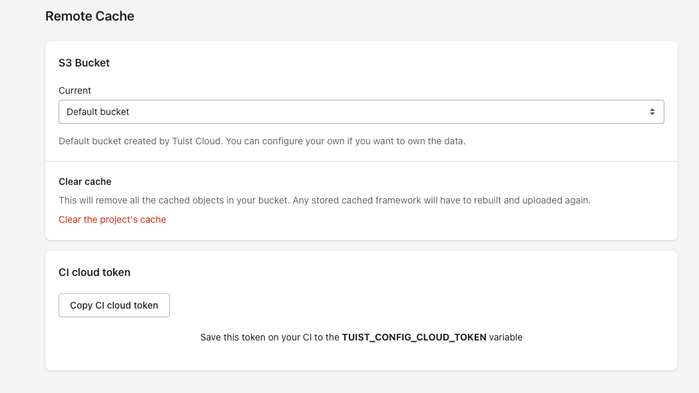

## Motivation

Before we dive into how to set up a project on **Tuist Cloud** we must understand what the tool is in the first place.
While developing Tuist,
we realized **workflows** and **integrations** that we could only enable through a server component.
A server allows storing state in a shared database,
has an [FQDN](https://en.wikipedia.org/wiki/Fully_qualified_domain_name) that other services can reach through webhooks,
and can perform periodic tasks through jobs.
A server opens the door to new practical workflows that significantly **improve the experience of scaling up Xcode projects and collaborating** when building apps.

The project is an [open-source](https://github.com/tuist/tuist/tree/main/projects/cloud) Rails app licensed under MIT.
Teams can self-host it themselves by following [this](./self-hosting.md) guide.
While we document the process to self-host the project and design it for easy hosting,
we **recommend** the usage of the Tuist-hosted solution.
It provides benefits like support, monitoring, and continuous updates,
and you support a project your project depends on.

## Getting started

You can get started with Tuist Cloud by running `tuist cloud init --name my-tuist-cloud-project` (`tuist cloud init` docs can be found [here](./commands/init)). If you are not registered yet at [cloud.tuist.io](https://cloud.tuist.io/), CLI will automatically redirect you to the sign up page. You can learn more about the command [here](commands/init). The `cloud init` command will also give you a snippet you can copy-paste to your `Config.swift`:
```swift
import ProjectDescription

let config = Config(
    cloud: .cloud(projectId: "your-username/your-project", url: "https://cloud.tuist.io") // This will be a part of `tuist cloud init` output
)
```

For the remote cache, we provide you with a default S3 bucket. If you want to own that part of the infrastructure, you can also set up your own S3 bucket following [these](http://docs.tuist.io/cloud/self-hosting#s3) instructions.

Afterwards, you can simply run `tuist cloud auth` - and that's it 🎉  When you now run `tuist generate App`, all available binaries will be automatically downloaded from remote if available. You can also warm all the targets with `tuist cache warm`. At the end of the command, all the binaries will be uploaded to the Tuist Cloud remote cache storage.

If you ever need to remove your Tuist Cloud credentials on your machine, you can run `tuist cloud logout`.

### CI

One of the great benefits of Tuist Cloud is that you can cache your targets on CI. Obtain your project token from the `Remote cache` page in Tuist Cloud:


Afterwards, you can add a step in your CI pipeline configuration for warming all the targets by `TUIST_CONFIG_CLOUD_TOKEN="token-from-tuist-cloud" tuist cache warm`:
