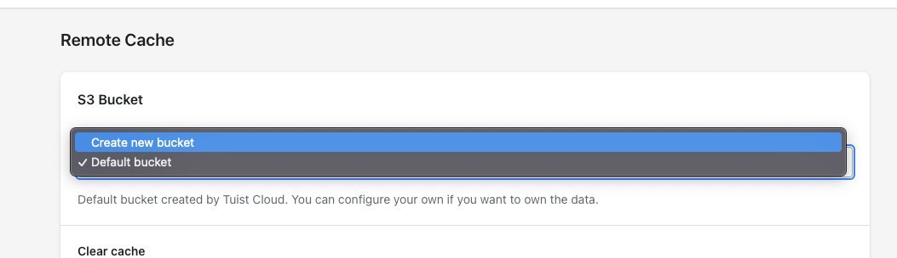

We recommend using the hosted version of Tuist Cloud as that provides the most convenience. The more developers choose to use the hosted version of Tuist Cloud, the better the service becomes as well. That being said, if you need to self-host your app, we don't want to provide any hindrances.

## Getting started

Before trying to host the app on your infrastructure, we recommend setting up Tuist Cloud for local development by following the [instructions here](./contributing.md). All the services mentioned there will be necessary for self-hosting – in other words, all the credentials in the `credentials.example.yml` file present in the repository should be filled in. Once you are done, you can continue further in this guide.

## Self-hosting

The specifics of self-hosting will depend on the infrastructure you choose for self-hosting. The app is currently set up to work with [Fly.io](https://fly.io/) and [Heroku](https://www.heroku.com/). If you use a different service, you will need to configure Tuist Cloud to work with it on your own.

### Fly.io

Since Fly.io is tailored for CLI usage, it's a great option to get yourself up and running quickly.

You can run the following steps to deploy the app:
```bash
# Install fly.io CLI
curl -L https://fly.io/install.sh | sh

# Sign up
fly auth signup
# or log in to fly.io
fly auth login

# Create the app on fly.io
fly launch

# Deploy the app
fly deploy

# Set a RAILS_MASTER_KEY secret (contents of your master.key file)
fly secrets set RAILS_MASTER_KEY=$(cat config/master.key)
```

And that's it! That being said, you might need to upgrade the memory on the provided CPU by:
```bash
fly scale vm shared-cpu-1x --memory 512
```

## S3

You can also own only the remote cache storage – you can head to your project on Tuist Cloud and select the `Create new bucket` option:


You then need to fill in the fields, including the [access key](https://docs.aws.amazon.com/powershell/latest/userguide/pstools-appendix-sign-up.html). The access key needs write and read permissions for the bucket you plan to use with Tuist Cloud.