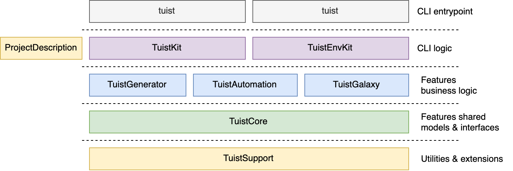

The project is organized in several targets that are defined in the `Package.swift` manifest file:



- **TuistKit:** It contains the commands and Tuist's business logic.
- **TuistEnvKit:** It contains the commands and the logic to manage multiple Tuist versions in the environment.
- **TuistLoader:** Contains models and utilities to load the manifest files from the disk.
- **TuistGenerator:** It contains all the business logic to read the project definition and generate Xcode projects.
- **TuistAutomation:** It contains the business logic for automation command such as build, test, or lint.
- **TuistCore:** Contains the models that are specific to the Tuist domain and protocols to allow doing dependency inversion between the features in the layers above.
- **TuistSupport:** Contains support utilities and extensions that are share across the other targets. They are Tuist-agnostic.
- **ProjectManifest:** Contains the models that the developers can use to declare their projects in the `Project.swift` manifest file.
- **tuist:** It's the actual CLI that exposes the commands defined in `TuistKit`.
- **tuistenv:** It's the CLI of `tuistenv`. It exposes the commands defined in `TuistEnvKit`.

:::note Package.swift

The Package.swift file declares the structure of our project (a Swift package) and the Swift Package Manager uses it to generate the Xcode project and provide us with a set of commands to interact with it, like 'swift build'

:::

:::note Tests

The targets have an associated target that contains the tests. **Unit tests** are located in the test targets prefixed with _Tests_, while integration tests are in the ones prefixed with _IntegrationTests_.

:::

### Utilities

All generic utilities live in the `TuistSupport` framework. This section documents some of the utilities and how to use them.

#### Logger

When printing output for the user, this is the utility that should be used over the global `print` method. The utility provides formatting that varies depending on the terminal the process is run from, and determines whether the standard output or error should be used based on the type of content being output.

If you want to print and do not want any special formatting you can use the normal `swift-log` API for printing. There is a variable in each tuist module called `logger` - any new modules should also adopt this style of logging to fit within the rest of the Tuist system.

```swift
logger.critical("") // Use `critical` for unrecoverable, system errors.
logger.error("") // Use `error` for user errors, particularly problems with their machine, manifest or configuration.
logger.warning("") // Use `warning` to highlight potential issues.
logger.notice("") // Use `notice` to log to console, this is the normal level of logging.
logger.info("") // Use `info` to provide small meta messages, this will be printed but won't be prominent.
logger.debug("") // Use `debug` to print in verbose mode.
logger.pretty("") // Use `pretty` to print a string with formatted interpolations, useful for highlighting certain elements in the string.
```

The `logger.pretty` takes a `PrintableString` as an input. Printable strings support interpolating formatted strings. For instance, if we want to tell users they need to run a command, we can do the following:
