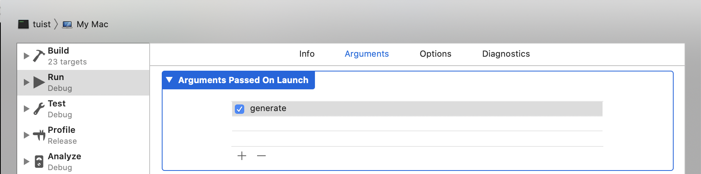

Tuist is a command line interface [(CLI)](https://en.wikipedia.org/wiki/Command-line_interface),
written in [Swift](https://www.apple.com/de/swift/),
that help developers maintain and interact with their Xcode projects.
It also abstracts them from the complexities that Xcode exposes.

If you have experience building apps for Apple platforms,
like iOS,
adding code to Tuist shouldn't be much different.
You already know the most important elements,
[Foundation](https://developer.apple.com/documentation/foundation) and Swift. There are two differences compared to developing apps that are worth mentioning:

- **The interactions with CLIs happen through the terminal.**
  The user executes Tuist,
  which performs the desired task,
  and then returns successfully or with an error code.
  During the execution,
  the user can be notified by sending output information to the standard output and standard error.
  There're no gestures, or graphical interactions,
  just the user intent.
- **There's no runloop** that keeps the process alive waiting for input,
  like it happens in an iOS app when the app receives system or user events.
  CLIs run in its process and finishes when the work is done.
  Asynchronous work can be done using system APIs like `DispatchQueue`,
  but need to make sure the process is running while the asynchronous work is being executed.
  Otherwise,
  the process will terminate the asynchronous work.

If you don't have any experience with Swift,
we recommend [Apple's official book](https://docs.swift.org/swift-book/).
With it you'll also get familiar with the most used elements from the Foundation's API.

### Set up the project locally

To start working on the project, we can follow the steps below:

- Clone the repository by running: `git clone git@github.com:tuist/tuist.git`
- Ensure you have the NodeJS version specified in the `.nvmrc`
- Ensure you have the Ruby version specified in the `.ruby-version`
- Run `bundle install` to automatically install the required dependencies
- Run `./fourier up` to automatically format the code following Tuist's conventions
- Run `./fourier generate tuist --open`

To open the generated project manually, run `open Tuist.xcworkspace` (or using Finder) - _note_ that `xed .` will open the package, and not the project generated by tuist.

:::note Xcode
Xcode needs to be installed in your system. If not, you can install it from the macOS App Store. After the installation, open it once to accept some licenses and install some additional components.
:::

### Edit tuist with tuist

To edit the tuist's manifests, simply run `./fourier edit tuist`.

To run other commands, you can use `swift run tuist command` (tuist with current changes) or `tuist run command` (tuist in your system).
If you have not built `ProjectDescription` and `ProjectAutomation` before (or you have recently changed these frameworks), run `swift build --product ProjectDescription` and `swift build --product ProjectAutomation`.

You can also leverage all the other tuist features that you know and love with the additional benefit of being able to validate your current changes
on a complex project. If _any_ feature does not work as expected, feel free to raise an issue.

### Run Tuist from Xcode

You can run Tuist from Xcode like you'd do from your terminal.

With the project opened in Xcode:

- Build the `ProjectDescription` and `ProjectAutomation` schemes first
- Edit the `tuist` scheme

In the **Arguments** tab inside the **Run** section specify the arguments that you'd like to pass to Tuist as shown in the screenshot below:

- Change the **working directory** in the **options** section to point to the directory that contains the project:

- Run the `tuist` scheme
