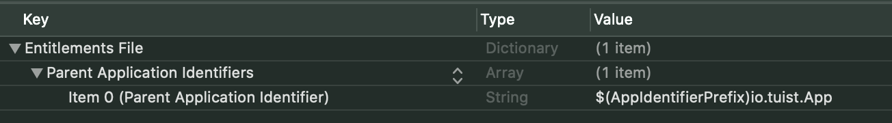

### Product Types

An App Clip is a small part of your app that’s discoverable at the moment it’s needed. App Clips are fast and lightweight so a user can open them quickly.

For example, this is how an AppClip can be declared:

```swift
let project = Project(
    name: "App",
    targets: [
        Target(
            name: "App",
            platform: .iOS,
            product: .app,
            bundleId: "io.tuist.App",
            infoPlist: "App/Configs/Info.plist",
            sources: ["App/Sources/**"],
            dependencies: [
                .target(name: "AppClip"),
            ]
        ),
        Target(
            name: "AppClip",
            platform: .iOS,
            product: .appClip,
            bundleId: "io.tuist.App.Clip",
            infoPlist: "AppClip/Configs/Info.plist",
            sources: ["AppClip/Sources/**",],
            entitlements: "AppClip/Entitlements/AppClip.entitlements",
            dependencies: [
                .sdk(name: "AppClip", type: .framework, status: .required),
            ]
        ),
    ]
)
```

### Parent Application Identifiers Entitlement

The Parent Application Identifiers entitlement establishes a secure association between an App Clip and its corresponding app. Add it only to an App Clip target.

An App Clip is always associated with exactly one app, ensure the parent application entitlement has exactly one entry, the corresponding app’s application identifier as shown below.


