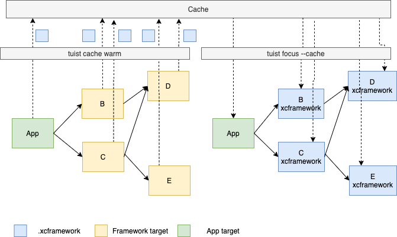

Tuist has support for caching a pre-compiled version of your project targets locally and remotely.
When targets are cached, developers can generate projects where the targets they don't plan to work on are replaced with their pre-compiled version.
In modular apps, this feature yields significant improvements in build times.

Unlike [Bazel](https://bazel.build/) or [Buck](https://buck.build/) that replace Xcode's build system to cache individual build steps,
we do caching at the module level. That means developers can use Xcode and its build system and don't have to develop tooling around alternative build systems to integrate them with developers tooling.



### Warming the cache

Warming the cache is the process of building, hashing, and storing cacheable targets in the cache.
We recommend setting up a continuous integration pipeline that runs on every master commit and executes the following command:

```
tuist cache warm
```

To warm the cache of only specific targets and their dependencies, you can run:

```
tuist cache warm FrameworkA FrameworkB
```

One the cache is warmed, you can use the [focus](commands/focus.md) command to generate a project replacing direct and transitive dependencies with artifacts from the cache.

#### Arguments

| Argument         | Short | Description                                                                                                                    | Default           | Required |
| ---------------- | ----- | ------------------------------------------------------------------------------------------------------------------------------ | ----------------- | -------- |
| `--path`         | `-p`  | The path to the directory that contains the manifest file.                                                                     | Current directory | No       |
| `--xcframeworks` | `-x`  | Cache the targets as .xcframeworks. It requires targets to be enabled for library distribution.                                | False             | No       |
| `--profile`      | `-P`  | The name of the profile to be used when warming up the cache.                                                                  |                   | No       |
| `--targets`      | `-t`  | A list of targets to cache. Those and their dependent targets will be cached. If empty, every cacheable target will be cached. | Empty list        | No       |

#### Caching profile

The caching profile allows users to specify how targets will be cached, for example setting a configuration. Instead of passing the configuration through CLI arguments, developers can define a profile and reference it with `tuist cache warm --profile MyProfile`.
You can define a caching profile in `Config.swift`, for example:

```swift
let config = Config(
    cache: .cache(profiles: [
        .profile(name: "Simulator", configuration: "Debug")
    ])
)
```

You can change the cache directory in `Config.swift`, for example:

```
let config = Config(cache: .cache(path: .relativeToRoot("Cache"))]))
```

### Debugging

#### Print target hashes

Targets are uniquely identified in the cache. The identifier (hash) is obtained by hashing the attributes of the target, its project,
the environment (e.g. Tuist version) and the hashes of its dependencies.
To facilitate debugging, Tuist exposes a command that prints the hash of every target of the dependency tree:

```
tuist cache print-hashes
```

### Unsupported configurations

- **Dynamic Swift Packages and packages with modulemaps:** Due to the approach that Xcode follows for integrating Swift packages, Tuist doesn't have enough details about the SPM dependency graph, and can't ensure the generated project is valid. If you try, you'll likely get `module not found` errors.
