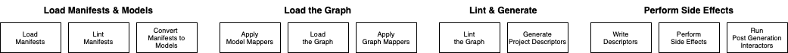
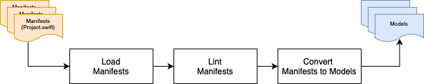
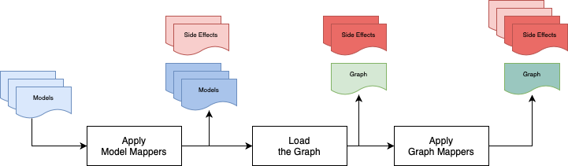
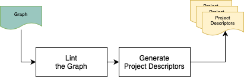
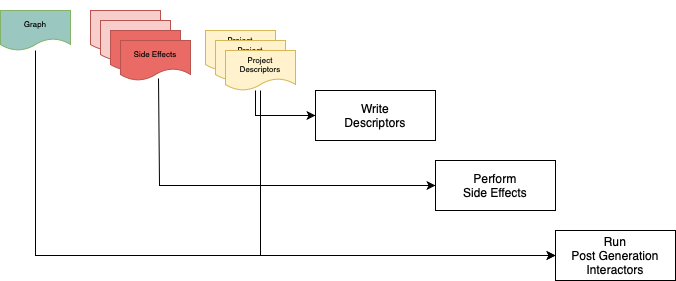

The process of generating projects in Tuist has evolved over time and through several iterations.
It is now more akin to a pipeline that entails several steps each with a particular purpose and responsibility.
The aim is to keep each of those steps simple while still allowing more complex features to be built on top of them.

### Terms

- **Manifest**: Those are the public user facing files used to describe projects. (e.g. `Project.swift`, `Workspace.swift`, `Config.swift`, etc...)
  - The types are declared in the `ProjectDescription` target
  - Those types can't depend on any other targets/modules as the `ProjectDescription` target is shipped as a standalone dynamic library with each Tuist release
- **Model**: Those are the internal model types used to represent various entities of the Tuist Graph and supporting types.
  - The types are declared in the `TuistCore` target
  - Many types are similar to the ones defined in the `ProjectDescription` target
    - Model types however contain more information than their `ProjectDescription` counterpart (e.g. expanded paths)
    - Model types are often optimized for simpler internal usage
- **Graph**: This is a collection of Tuist **Model**s along with all their loaded dependency information in a graph representation
  - This is the primary entity used at the heart of many Tuist features including project generation
- **Model Mapper**: This is a type used to transform individual **Model**s ahead of loading the graph
  - There are 3 different sub-types `WorkspaceMapper`, `ProjectMapper` and `TargetMapper` which can be used to transform the corresponding model type
  - The different sub-types can be composed together using adapters (e.g using `ProjectWorkspaceMapper` and `TargetProjectMapper`)
  - In addition to transforming models, mappers can also declare a set of **Side Effects Descriptors** to perform at the end of the generation pipeline
  - The mappers themselves do not perform the side effects
- **Graph Mapper**: This is a type used to transform the entire **Graph** and declare additional side effect descriptors
- **Side Effects Descriptors**: Those are descriptions of side effects Tuist needs to perform
  - Those are quite low level and basic (e.g. create a directory, file, etc...)
- **Workspace/Project/Scheme Descriptors**: Those are in-memory representations of the low level `XcodeProj` types
- **Interactors**: Those are components that perform specialized side effects at the end of the generation process (e.g. signing / SwiftPM resolution etc...)

### Pipeline

The pipeline consists of the following stages & steps that are performed sequentially. The main orchestration of all of these steps resides within `TuistKit.Generator`.

#### Loading Manifests & Models

- **Load Manifests**: The (`ProjectDescription` types) are loaded from disk using `ManifestLoader`
  - This involves performing `swiftc` calls to compile and parse the contents of the manifests
  - Additionally if `ProjectDescriptionHelpers` are used, those are also compiled and cached
- **Lint Manifests**: Manifests undergo a series of checks that may produce warnings or fail the generation process
  - The lint checks can be found in `ManifestLinter`
- **Convert Manifests to Models**: Manifests (`ProjectDescription` types) are converted to Models (`TuistCore` types) using `ManifestModelConverting` _(implemented by `GeneratorModelLoader`)_
  - This is where the manifest glob patterns (e.g. `Sources/**`) are evaluated and expanded to explicit absolute paths
  - Manifests are converted concurrently

#### Loading the Graph

- **Apply Model Mappers**: Models undergo a few additional transformations via model mappers which modify the models and produce `SideEffectDescriptors`
  - The model mappers are orchestrated in `WorkspaceMapperProvider` and `ProjectMapperProvider`
- **Load the Graph**: The transformed Models are used to load the Graph using `GraphLoader`
- **Apply Graph Mappers**: The Graph undergoes a few additional transformations via graph mappers which modify the graph and produce an additional set of `SideEffectDescriptors`
  - The graph mappers are orchestrated in `GraphMapperProvider`

#### Generation

- **Lint the Graph**: The final Graph undergoes numerous checks that may produce warnings or fail the generation process
  - The lint checks can be found in `GraphLinter`, `ProjectLinter` and `TargetLinter`
- **Generate Project Descriptors**: The final Graph is then used to produce the low level Xcode type descriptions
  - The low level Xcode type descriptions are represented via `SchemeDescriptor`, `ProjectDescriptor` and `WorkspaceDescriptor`
  - The `DescriptorGenerator` is the main component responsible for orchestrating this process
    - Projects are internally processed concurrently
    - The descriptor generator doesn't perform any loading, networking or other side effects

#### Performing Side Effects

- **Write Descriptors**: The workspace, project and scheme descriptors are serialized to disk concurrently via `XcodeProjWriter`
- **Perform Side Effects**: All accumulated side effect descriptors are performed using `SideEffectDescriptorExecutor`
- **Run Post Generation Interactors**: Finally, specialized side effects that can't be represented using descriptors are performed
  - Examples include `SwiftPackageManagerInteractor`, `SigningInteractor`, `CocoaPodsInteractor`
