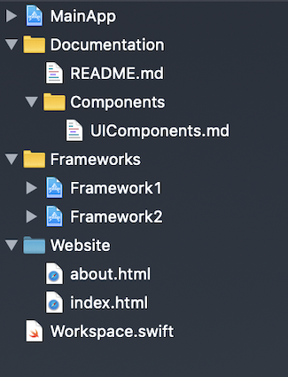
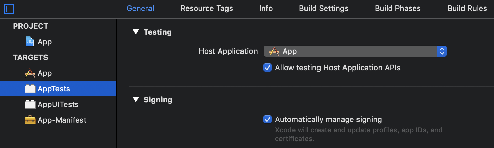
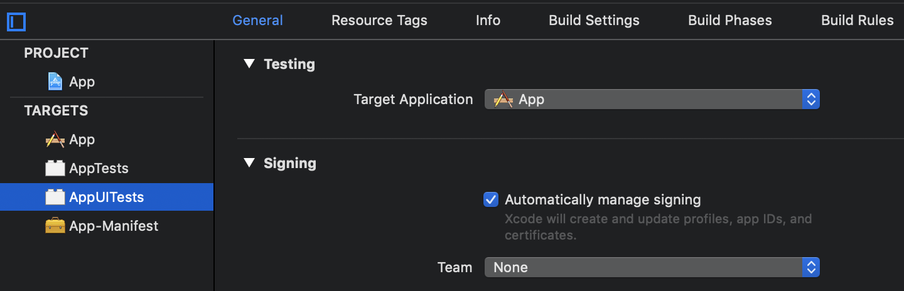

Tuist 0.13.0 has been released! 🎉

We’re taking turns releasing and writing about what’s new in the world of Tuist. I’m Kas and will be your host through this post on the latest developments.

## Contributors

In this release Tuist gained a new contributor! [@BalestraPatrick](https://github.com/BalestraPatrick) fixed a warning in newly generated projects [#291](https://github.com/tuist/tuist/pull/291). Additionally, [@pepibumur](https://github.com/pepibumur) and [@ollieatkinson](https://github.com/ollieatkinson) have been hard at work blitzing through numerous bug fixes and improvements 👏.

Contributions also come in the form of valuable feedback, a huge shout out to [@enhorn](https://github.com/enhorn) for actively reporting [issues and suggestions](https://github.com/tuist/tuist/issues?utf8=✓&q=is%3Aissue+author%3Aenhorn+) to enhance Tuist.

We’re really grateful for all the community contributions to improving Tuist!

## What’s new?

The latest update can be obtained via running:

```sh
tuist update
```

The full changelog can be viewed on the [0.13.0 release page](https://github.com/tuist/tuist/releases/tag/0.13.0). Here are some highlights.

## Homebrew tap support

The `Setup.swift` manifest now supports brew tap!

```swift
import ProjectDescription

let setup = Setup([
	.homebrewTap(repositories: ["peripheryapp/periphery"])
])
```

Calling `tuist up` will ensure the tap is added to Homebrew.

## Workspace Improvements

By default, calling `tuist generate` will create an Xcode workspace containing the current project and all its dependencies.

New in 0.13.0, the generated Xcode workspace structure reflects the file system!

Additionally, the `Workspace.swift` manifest has been enhanced to allow the inclusion of files and folder references that don’t necessarily belong to a particular project - your Documentation files can now be included!

```swift
import ProjectDescription

let workspace = Workspace(
    name: "Workspace",
    projects: [
        "App",
        "Frameworks/**",
    ],
    additionalFiles: [
        "Documentation/**",
        .folderReference(path: "Website")
    ]
)
```



## Host application for unit & ui tests

Tuist now automatically sets the host & target application for test targets that declare they depend on applications.

For example take the following `Project.swift` manifest:

```swift
import ProjectDescription

let project = Project(
    name: "App",
    targets: [
        Target(name: "App",
            platform: .iOS,
            product: .app,
            bundleId: "io.tuist.App",
            infoPlist: "Info.plist",
            sources: "Sources/**"
        ),
        Target(
            name: "AppTests",
            platform: .iOS,
            product: .unitTests,
            bundleId: "io.tuist.AppTests",
            infoPlist: "Tests.plist",
            sources: "Tests/**",
            dependencies: [
                .target(name: "App"),
            ]
        ),
        Target(
            name: "AppUITests",
            platform: .iOS,
            product: .uiTests,
            bundleId: "io.tuist.AppUITests",
            infoPlist: "Tests.plist",
            sources: "UITests/**",
            dependencies: [
               .target(name: "App"),
            ]
        )
    ]
)
```

The generated project will have the host and target application set to **App** for the unit and ui test targets.





## What’s next?

- [#265](https://github.com/tuist/tuist/issues/265) Storyboard enhancements - adding the ability to automatically generate the appropriate storyboard files via `tuist init` as well as explicitly specifying them within the `Project.swift` manifest to include in the generated Xcode project.

- [#160](https://github.com/tuist/tuist/issues/160) Multiple configurations - a few different options are being explored, such as environments or possibly even `include`s to help reduce repeated definitions.

- [#316](https://github.com/tuist/tuist/issues/316) Xcode 10.2 & Swift 5 support.

If you have any ideas or feedback on these items or any others, please feel free to reach out on [GitHub](https://github.com/tuist/tuist) or [Slack](http://slack.tuist.io)!

Happy Xcoding 🛠!
